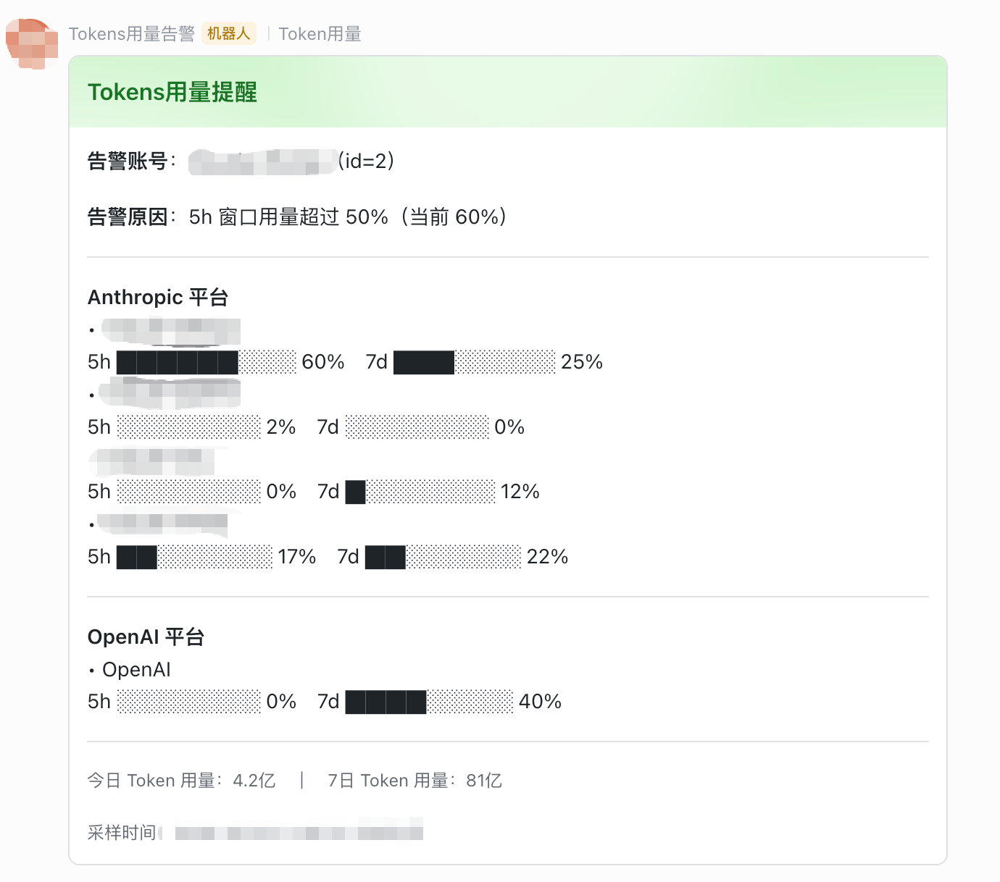

# 飞书用量告警脚本（社区方案）

> 非官方内置功能，回应 [#2414](https://github.com/Wei-Shaw/sub2api/issues/2414)（账号额度用完时通知 / 查看 5h、7d 额度使用情况）的一个外部脚本方案，供有类似需求的用户参考或直接使用。

## 它做什么

一个独立的 bash 脚本，定时（建议用 cron）查询 Sub2API 的 PostgreSQL 数据库，把账号的用量和健康状态变化，以飞书自定义机器人卡片的形式推送出来。不需要改动 Sub2API 本体，也不依赖任何未公开的接口 —— 只读查询 `accounts` 和 `usage_logs` 两张表。

四类告警，各自独立按"状态跳变"触发一次（同一个异常不会每次轮询都重复发，等状态恢复后再次出现才会再发一次）：

| 类型 | 触发条件 | 卡片颜色 |
| --- | --- | --- |
| 用量提醒 | 任意平台订阅账号 5h 或 7d 用量窗口越过 50% | 绿色 |
| 用量告警 | 同上，越过 90% | 橙色 |
| 上游过载 | `accounts.overload_until` 生效中 | 橙色 |
| 账号异常 | `accounts.status = 'error'` | 红色 |
| 限流耗尽 | `accounts.rate_limit_reset_at` 生效中 | 橙色 |

每条告警卡片都会附带一份"各平台订阅账号当前用量"总览（按平台分组、文本进度条 + 百分比，限流中的账号会标注），以及"今日 / 近 7 日 Token 总用量"。



（图中账号名、机器人头像、采样时间已打码；卡片内容为真实运行数据，Anthropic 平台四个账号 + OpenAI 一个账号）

## 为什么按平台读取，而不是只支持 Anthropic

Sub2API 里不同 OAuth 订阅平台，用量百分比存在 `accounts.extra` jsonb 字段里，字段名不一样（见 `backend/internal/service/account_usage_service.go`）：

- **anthropic**（Claude 订阅）：`session_window_utilization`（5h，0-1 小数）/ `passive_usage_7d_utilization`（7d，0-1 小数）
- **openai**（Codex 订阅）：`codex_5h_used_percent`（0-100，注意单位与 anthropic 不同）/ `codex_7d_used_percent`（0-100）

脚本按字段名探测而不是按平台名单硬编码，纯 API 计费账号没有这些字段会被自动跳过，不会出现在用量总览或触发用量告警里。

## 部署

依赖：`bash` `psql`（PostgreSQL 客户端）`jq` `curl` `openssl`。

```bash
# 1. 新建一个目录存放脚本，把下面两个文件保存进去
mkdir -p /opt/sub2api-monitor && cd /opt/sub2api-monitor
# usage_alert.sh 见下方「脚本」一节
# webhook.conf.example 见下方「配置」一节

# 2. 配置飞书 webhook
cp webhook.conf.example webhook.conf
chmod 600 webhook.conf
# 编辑 webhook.conf，填入飞书自定义机器人的 webhook 地址和签名 Secret

# 3. 配置数据库连接（标准 PostgreSQL 环境变量或 ~/.pgpass，
#    使得脚本里裸调用的 `psql` 能不带参数直接连上 Sub2API 的库）
export PGHOST=... PGPORT=5432 PGUSER=... PGPASSWORD=... PGDATABASE=sub2api

# 4. 手动跑一次验证
chmod +x usage_alert.sh
./usage_alert.sh

# 5. 确认无误后加入 crontab，建议每 5~15 分钟一次
crontab -e
# */10 * * * * PGHOST=... PGUSER=... PGPASSWORD=... PGDATABASE=sub2api /opt/sub2api-monitor/usage_alert.sh >> /opt/sub2api-monitor/alert.log 2>&1
```

`state.json` 会在首次运行时自动创建，用于记录每个账号每个维度的"当前是否处于告警状态"，不需要手动初始化。**注意**：新增监控维度或首次部署时，如果账号当时已经处于告警阈值之上，第一次运行会把这个已有状态当作"刚跳变"发一次通知，这是预期行为。

## 局限性

- 只在 PostgreSQL 部署下验证过（Sub2API 目前也只支持 PostgreSQL）
- 依赖的 `accounts.extra` 字段名来自当前版本源码阅读，不是公开稳定的 API，如果未来版本调整了字段名，脚本需要相应更新
- 只做了飞书 webhook 一种通知渠道

## 配置：`webhook.conf.example`

```ini
# 复制为 webhook.conf（不要提交到版本控制），权限建议 chmod 600
#
# 飞书群 -> 群设置 -> 群机器人 -> 添加机器人 -> 自定义机器人
# 创建后复制 webhook 地址；如果开启了"签名校验"，把给出的 Secret 填到下面
FEISHU_WEBHOOK_URL=https://open.feishu.cn/open-apis/bot/v2/hook/xxxxxxxx-xxxx-xxxx-xxxx-xxxxxxxxxxxx
FEISHU_SECRET=xxxxxxxxxxxxxxxxxxxxxx
```

## 脚本：`usage_alert.sh`

```bash
#!/bin/bash
# Sub2API 账号健康监控 → 飞书卡片告警（社区脚本，非官方内置功能）
#
# 用途：响应 issue #2414（账号额度用完/接近用完时的通知需求），
# 用一个外部脚本 + cron 定时查询 Sub2API 的 PostgreSQL 数据库，
# 通过飞书自定义机器人 webhook 推送账号用量/健康状态告警卡片。
#
# 依赖：bash, psql (PostgreSQL client), jq, curl, openssl
#
# 用法见 docs/FEISHU_USAGE_ALERT.md
set -euo pipefail

DIR="${SUB2API_MONITOR_DIR:-$(cd "$(dirname "${BASH_SOURCE[0]}")" && pwd)}"
STATE_FILE="$DIR/state.json"
WEBHOOK_CONF="$DIR/webhook.conf"

if [ ! -f "$WEBHOOK_CONF" ]; then
  echo "缺少 $WEBHOOK_CONF，请先从 webhook.conf.example 复制并填入 FEISHU_WEBHOOK_URL / FEISHU_SECRET" >&2
  exit 1
fi
# shellcheck disable=SC1090
source "$WEBHOOK_CONF"
if [ -z "${FEISHU_WEBHOOK_URL:-}" ] || [ -z "${FEISHU_SECRET:-}" ]; then
  echo "webhook.conf 里 FEISHU_WEBHOOK_URL / FEISHU_SECRET 未配全" >&2
  exit 1
fi

[ -f "$STATE_FILE" ] || echo '{}' > "$STATE_FILE"
state=$(cat "$STATE_FILE")

# 用量字段各平台命名不同（Sub2API 数据库 accounts.extra jsonb 字段）：
#   anthropic (Claude OAuth 订阅): session_window_utilization (5h, 0-1小数) / passive_usage_7d_utilization (7d, 0-1小数)
#   openai   (Codex OAuth 订阅):  codex_5h_used_percent (0-100) / codex_7d_used_percent (0-100)
# 统一换算成 0-1 小数；纯 API 计费账号没有这些字段，win_5h/win_7d 为 NULL，不参与 usage 告警也不出现在总览里
rows=$(psql -t -A -c "
SELECT COALESCE(json_agg(row_to_json(t)), '[]') FROM (
  SELECT id, name, platform, status,
    (overload_until IS NOT NULL AND overload_until > now()) AS is_overloaded,
    (rate_limit_reset_at IS NOT NULL AND rate_limit_reset_at > now()) AS is_rate_limited,
    CASE
      WHEN extra ? 'session_window_utilization' THEN (extra->>'session_window_utilization')::numeric
      WHEN extra ? 'codex_5h_used_percent' THEN (extra->>'codex_5h_used_percent')::numeric / 100
      ELSE NULL
    END AS win_5h,
    CASE
      WHEN extra ? 'passive_usage_7d_utilization' THEN (extra->>'passive_usage_7d_utilization')::numeric
      WHEN extra ? 'codex_7d_used_percent' THEN (extra->>'codex_7d_used_percent')::numeric / 100
      ELSE NULL
    END AS win_7d,
    COALESCE(extra->>'passive_usage_sampled_at', extra->>'codex_usage_updated_at') AS sampled_at
  FROM accounts
  WHERE deleted_at IS NULL
) t;
")

# 今日（北京时间自然日）/ 近7天（滚动）全局 token 总量，卡片底部展示
# 如需改成其他时区，把两处 'Asia/Shanghai' 替换即可
usage_totals=$(psql -t -A -c "
SELECT json_build_object(
  'today', COALESCE(SUM(CASE WHEN created_at >= date_trunc('day', now() AT TIME ZONE 'Asia/Shanghai') AT TIME ZONE 'Asia/Shanghai'
                        THEN input_tokens+output_tokens+cache_creation_tokens+cache_read_tokens ELSE 0 END), 0),
  'last7d', COALESCE(SUM(input_tokens+output_tokens+cache_creation_tokens+cache_read_tokens), 0)
)
FROM usage_logs
WHERE created_at >= now() - interval '7 days';
")

result=$(jq -n --argjson rows "$rows" --argjson state "$state" --argjson totals "$usage_totals" '
  def platform_label:
    if . == "anthropic" then "Anthropic 平台"
    elif . == "openai" then "OpenAI 平台"
    else . + " 平台" end;

  def pct: (. * 100) | round;

  def bar:
    (([., 1] | min) * 10 | round) as $n
    | ([range(0;10)] | map(if . < $n then "█" else "░" end) | join(""));

  def human_count:
    if . == null then "0"
    elif . >= 100000000 then (((. / 100000000 * 10 | round) / 10 | tostring) + "亿")
    elif . >= 10000 then (((. / 10000 * 10 | round) / 10 | tostring) + "万")
    else (. | round | tostring)
    end;

  ($rows) as $all_rows

  # 各平台订阅账号当前用量总览（跟随在每条告警卡片后面），进度条 + 百分比
  | ($all_rows | map(select(.win_5h != null))
      | group_by(.platform)
      | map({
          platform: (.[0].platform | platform_label),
          lines: (map(
              "• " + .name + (if .is_rate_limited then "（限流中）" else "" end)
              + "\n5h " + (.win_5h|bar) + " " + (.win_5h|pct|tostring) + "%　7d " + (.win_7d|bar) + " " + (.win_7d|pct|tostring) + "%"
            ) | join("\n"))
        })
    ) as $groups
  | (if ($groups|length) == 0 then
       [{tag:"div", text:{tag:"lark_md", content:"（暂无订阅类账号用量数据）"}}]
     else
       [$groups[] | {tag:"hr"}, {tag:"div", text:{tag:"lark_md", content: ("**" + .platform + "**\n" + .lines)}}] | .[1:]
     end
    ) as $overview_elements

  | {tag:"note", elements:[{tag:"plain_text", content:
        ("今日 Token 用量：" + ($totals.today|human_count) + "　｜　7日 Token 用量：" + ($totals.last7d|human_count))
      }]} as $totals_element

  # usage 告警：任意平台，只要有 win_5h/win_7d 数据的账号，5h/7d 各自独立判断跳变
  # 两级阈值：50%(绿色，提醒) / 90%(橙色，告警)，各自独立按跳变触发
  | [{th:0.5, tag:"50", color:"green", label:"提醒"}, {th:0.9, tag:"90", color:"orange", label:"告警"}] as $usage_levels
  | ($all_rows | map(select(.win_5h != null)) | [ .[] |
        {id, name, sampled_at, win:"5h", val:.win_5h},
        {id, name, sampled_at, win:"7d", val:.win_7d}
      ]) as $usage_recs
  | ([$usage_recs[] as $r | $usage_levels[] as $lv | {r:$r, lv:$lv}]) as $usage_checks
  | (reduce $usage_checks[] as $c (
      {st: $state, alerts: []};
      (($c.r.id|tostring) + "_usage_" + $c.r.win + "_" + $c.lv.tag) as $key
      | (.st[$key] // false) as $was
      | ($c.r.val >= $c.lv.th) as $now_val
      | .st[$key] = $now_val
      | if ($now_val and ($was|not)) then
          .alerts += [{
            title: ("Tokens用量" + $c.lv.label),
            color: $c.lv.color,
            name: $c.r.name, id: $c.r.id,
            reason: ($c.r.win + " 窗口用量超过 " + ($c.lv.th|pct|tostring) + "%（当前 " + ($c.r.val|pct|tostring) + "%）"),
            sampled_at: ($c.r.sampled_at // "")
          }]
        else . end
    )) as $usage_out

  # overload 告警：全部账号
  | (reduce $all_rows[] as $r (
      {st: $usage_out.st, alerts: $usage_out.alerts};
      (($r.id|tostring) + "_overload") as $key
      | (.st[$key] // false) as $was
      | ($r.is_overloaded) as $now_val
      | .st[$key] = $now_val
      | if ($now_val and ($was|not)) then
          .alerts += [{
            title: "上游过载告警",
            color: "orange",
            name: $r.name, id: $r.id,
            reason: "账号当前处于上游过载状态（overload_until 未到期）",
            sampled_at: ""
          }]
        else . end
    )) as $overload_out

  # error 告警：全部账号
  | (reduce $all_rows[] as $r (
      {st: $overload_out.st, alerts: $overload_out.alerts};
      (($r.id|tostring) + "_error") as $key
      | (.st[$key] // false) as $was
      | ($r.status == "error") as $now_val
      | .st[$key] = $now_val
      | if ($now_val and ($was|not)) then
          .alerts += [{
            title: "账号状态异常告警",
            color: "red",
            name: $r.name, id: $r.id,
            reason: "账号状态变为 error",
            sampled_at: ""
          }]
        else . end
    )) as $error_out

  # 限流/耗尽告警：全部账号，账号被上游限流（通常是 5h/7d 配额耗尽触发的 429）
  | (reduce $all_rows[] as $r (
      {st: $error_out.st, alerts: $error_out.alerts};
      (($r.id|tostring) + "_ratelimited") as $key
      | (.st[$key] // false) as $was
      | ($r.is_rate_limited) as $now_val
      | .st[$key] = $now_val
      | if ($now_val and ($was|not)) then
          .alerts += [{
            title: "账号限流告警",
            color: "orange",
            name: $r.name, id: $r.id,
            reason: "账号已被上游限流（额度耗尽），当前不可调度",
            sampled_at: ""
          }]
        else . end
    )) as $ratelimit_out

  | {new_state: $ratelimit_out.st, alerts: $ratelimit_out.alerts, overview_elements: $overview_elements, totals_element: $totals_element}
')

echo "$result" | jq '.new_state' > "$STATE_FILE"

overview_elements=$(echo "$result" | jq -c '.overview_elements')
totals_element=$(echo "$result" | jq -c '.totals_element')

echo "$result" | jq -c '.alerts[]' | while read -r a; do
  title=$(echo "$a" | jq -r '.title')
  color=$(echo "$a" | jq -r '.color')
  name=$(echo "$a" | jq -r '.name')
  id=$(echo "$a" | jq -r '.id')
  reason=$(echo "$a" | jq -r '.reason')
  sampled_at=$(echo "$a" | jq -r '.sampled_at')
  sampled_bj=""
  if [ -n "$sampled_at" ]; then
    sampled_bj=$(jq -n --arg s "$sampled_at" '
      ($s | try fromdateiso8601 catch null) as $e
      | if $e == null then $s
        else (($e + 8*3600) | strftime("%Y-%m-%d %H:%M:%S")) + " 北京时间"
        end
    ' -r)
  fi

  ts=$(date +%s)
  string_to_sign="${ts}
${FEISHU_SECRET}"
  sign=$(printf '%s' "" | openssl dgst -sha256 -hmac "$string_to_sign" -binary | base64)

  card=$(jq -n \
    --arg title "$title" --arg color "$color" --arg name "$name" --arg id "$id" --arg reason "$reason" \
    --arg sampled "$sampled_bj" --argjson overview "$overview_elements" --argjson totals "$totals_element" \
    '{
      config: {wide_screen_mode: true},
      header: {
        title: {tag: "plain_text", content: $title},
        template: $color
      },
      elements: (
        [
          {tag: "div", text: {tag: "lark_md", content: ("**告警账号**：" + $name + "（id=" + $id + "）")}},
          {tag: "div", text: {tag: "lark_md", content: ("**告警原因**：" + $reason)}},
          {tag: "hr"}
        ]
        + $overview
        + [{tag: "hr"}, $totals]
        + (if $sampled != "" then [{tag: "note", elements: [{tag: "plain_text", content: ("采样时间：" + $sampled)}]}] else [] end)
      )
    }')

  curl -s -X POST "$FEISHU_WEBHOOK_URL" \
    -H 'Content-Type: application/json' \
    -d "$(jq -n --argjson card "$card" --arg ts "$ts" --arg sign "$sign" \
      '{timestamp:$ts, sign:$sign, msg_type:"interactive", card:$card}')" \
    -o /dev/null
done
```
