# sub2api Redis 使用点与数据流/状态架构梳理

> 基于源码静态分析整理。覆盖 Redis 客户端与部署、生产 Wire 装配、业务封装、Lua/Pipeline/Pub/Sub、后台 Worker、前端边界和测试代码。

## 1. 结论摘要

- 生产 Redis 客户端使用 `github.com/redis/go-redis/v9`：[`backend/go.mod:29`](backend/go.mod#L29)。
- 发现约 **48 个生产 Redis 相关源文件**，包括客户端、Wire、直接 Redis 封装及间接使用 Redis 的服务。
- 有 **40 个 Redis-backed 构造器/Provider**，其中 **39 个接入生产 Wire**。
- 有 **20 个生产文件、52 个 `redis.NewScript` Lua 脚本**。
- 有约 **74 个 Redis 相关测试文件**。
- 前端不直连 Redis，只通过后端 Setup API 测试或提交 Redis 配置：[`frontend/src/api/setup.ts:8`](frontend/src/api/setup.ts#L8)。
- 未发现 Redis Streams、显式 `WATCH`、`KEYS`/`SCAN` 全库扫描、Redis Cluster/Sentinel 客户端配置、Pattern Pub/Sub 或外置 `.lua` 文件。
- PostgreSQL 是绝大多数持久业务状态的权威源；Redis 承担：
  1. L2 缓存和调度读模型；
  2. 跨实例实时协调；
  3. 原子限流与配额计数；
  4. 临时安全会话；
  5. 可恢复异步队列；
  6. Pub/Sub 缓存失效；
  7. 分布式选主与短期锁。

---

## 2. sub2api 数据流和状态架构图

```mermaid
flowchart TB
    Client["客户端 / SDK"]
    Admin["管理端 / 后台配置"]
    Cron["定时任务 / 后台 Worker"]

    subgraph APP["sub2api 应用实例"]
        Route["Gin Gateway Routes"]
        Auth["API Key / 用户鉴权"]
        Billing["Billing Eligibility<br/>余额 / 订阅 / API Key 配额"]
        Scheduler["账户选择与调度"]
        Concurrency["并发槽 / RPM / Session / UMQ"]
        Token["上游 OAuth Token Provider"]
        Forward["协议转换 / HTTP Forward"]
        Usage["RecordUsage / 价格与成本计算"]
        L1["进程内状态<br/>Ristretto / Gin Context / Scheduler Snapshot"]
        Invalidation["Outbox Consumer / PubSub Subscriber"]
        BatchWorker["批量图片 Worker"]
        PromptWorker["Prompt Audit Worker"]
        OpsWorker["Ops / 聚合 / 清理 / 报告"]
    end

    subgraph REDIS["Redis：缓存、协调和临时状态"]
        RCache[("缓存 / 读模型<br/>API Key Auth<br/>Billing<br/>Scheduler<br/>Dashboard / 配置")]
        RCoord[("实时协调<br/>Concurrency ZSET<br/>RPM Counter<br/>Session / UMQ<br/>Leader Lock")]
        RSession[("临时安全状态<br/>Refresh Token<br/>TOTP / Passkey<br/>验证码 / OAuth Token")]
        RQueue[("异步状态<br/>Batch ready/delayed/active<br/>Prompt Payload<br/>Image Task")]
        RPubSub[("Pub/Sub<br/>Auth / Subscription<br/>TLS / Error Rules<br/>Prompt Config")]
        RError[("短期故障状态<br/>Temp Unschedulable<br/>Timeout / 403 / 500<br/>Proxy Cooldown")]
        RLong[("Redis-only 长期状态<br/>Content Moderation<br/>Flagged Hash Set")]
    end

    subgraph PG["PostgreSQL：持久权威状态"]
        PGIdentity[("用户 / API Key / Group<br/>订阅 / 权限")]
        PGAccounts[("Accounts / Account Groups<br/>Proxy / 凭据 / 调度 Outbox")]
        PGBilling[("余额 / 用量 / 配额<br/>Dedup / Usage Logs")]
        PGJobs[("Batch Jobs / Prompt Jobs<br/>Idempotency Records")]
        PGConfig[("系统配置 / 审核规则<br/>TLS / Error Rules / Ops")]
    end

    Upstream["上游模型 API<br/>OpenAI / Anthropic / Gemini / 其他"]
    ObjectStore["对象存储<br/>图片结果"]

    Client --> Route
    Route --> Auth

    Auth <--> L1
    Auth <--> RCache
    Auth -->|"cache miss / 校验权威状态"| PGIdentity
    PGIdentity -->|"回填快照"| RCache

    Auth --> Billing
    Billing <--> RCache
    Billing -->|"miss / Redis 不可信"| PGBilling

    Billing --> Scheduler
    Scheduler <--> L1
    Scheduler <--> RCache
    Scheduler -->|"账户权威状态 / fallback"| PGAccounts

    Scheduler --> Concurrency
    Concurrency <--> RCoord
    Scheduler <--> RError

    Concurrency --> Token
    Token <--> RSession
    Token -->|"refresh token / account credential"| PGAccounts

    Token --> Forward
    Forward --> Upstream
    Upstream -->|"响应、token usage"| Forward
    Forward --> Client

    Forward -->|"异步提交 usage"| Usage
    Usage -->|"单个 PG transaction<br/>dedup + balance + quota + subscription"| PGBilling
    Usage -->|"提交后刷新热状态"| RCache
    Usage -->|"RPM / 平台额度计数"| RCoord

    Upstream -->|"429 / timeout / 403 / 500"| RError
    RError -->|"持久冷却状态"| PGAccounts

    Admin --> PGIdentity
    Admin --> PGAccounts
    Admin --> PGConfig
    PGIdentity -->|"事务内 Outbox"| Invalidation
    Invalidation -->|"DEL + PUBLISH"| RCache
    Invalidation --> RPubSub
    RPubSub -->|"清除每个实例 L1"| L1

    Client -->|"Batch Image Submit"| PGJobs
    PGJobs -->|"enqueue"| RQueue
    RQueue --> BatchWorker
    BatchWorker --> Upstream
    BatchWorker --> ObjectStore
    BatchWorker -->|"任务状态 / 结算"| PGJobs

    Client -->|"Async Prompt Audit"| PGJobs
    PGJobs -->|"短期原文 payload"| RQueue
    RQueue --> PromptWorker
    PromptWorker -->|"审计结果"| PGJobs

    Cron --> OpsWorker
    OpsWorker -->|"leader election / cycle lock"| RCoord
    OpsWorker --> PGConfig
    OpsWorker --> PGBilling

    Client -->|"Refresh / TOTP / Passkey / 验证码"| RSession
    Client -->|"风险输入 hash 查询"| RLong
```



### 2.1 状态职责边界

| 状态层 | 职责 | 是否权威 |
|---|---|---|
| PostgreSQL | 用户、API Key、账户、订阅、余额、配额、Usage、任务、配置、幂等 | **持久权威源** |
| Redis 缓存/读模型 | API Key 鉴权、Billing 快照、Scheduler 快照、Dashboard、配置缓存 | 否；应能从 PG 回源或重建 |
| Redis 协调状态 | 并发 Lease、RPM、UMQ、Leader Lock、实时 WS Controller | **运行时权威**，但不是持久业务账本 |
| Redis 临时安全状态 | Refresh Token、TOTP、Passkey、验证码、OAuth Access Token | 临时流程的权威状态，通常有 TTL |
| Redis 队列 | Batch Image ready/active/delayed、Prompt Payload | 工作投递/正文临时权威；PG 保存任务事实 |
| 进程内存 | Gin Context、L1 Auth Cache、Scheduler Snapshot、重试状态 | 仅当前进程或请求有效 |
| 上游 API | 实际响应和 Token Usage | Token 消耗事实来源 |
| PG Billing Transaction | 金额、订阅用量、配额扣减 | 金额结算权威 |

---

## 3. Redis 基础设施

### 3.1 客户端与连接

Redis 客户端由 [`backend/internal/repository/redis.go:23`](backend/internal/repository/redis.go#L23) 创建：

- 单机 `redis.Client`；
- 可配置 Host、Port、Username、Password、DB；
- Dial/Read/Write Timeout；
- PoolSize、MinIdleConns；
- TLS 1.2+；
- 可选 Server-Timing Hook。

配置结构见 [`backend/internal/config/config.go:1442`](backend/internal/config/config.go#L1442)，生产装配集中在 [`backend/cmd/server/wire_gen.go:50`](backend/cmd/server/wire_gen.go#L50)，应用关闭时调用 `rdb.Close()`：[`backend/cmd/server/wire_gen.go:625`](backend/cmd/server/wire_gen.go#L625)。

### 3.2 部署形态

默认 Compose：

- `redis:8-alpine`；
- 数据卷 `/data`；
- RDB：`save 60 1`；
- AOF：`appendonly yes`；
- `appendfsync everysec`；
- 可选 `requirepass`；
- `redis-cli ping` 健康检查。

见 [`deploy/docker-compose.yml:249`](deploy/docker-compose.yml#L249)。Standalone Compose 不创建 Redis，要求外部提供：[`deploy/docker-compose.standalone.yml:61`](deploy/docker-compose.standalone.yml#L61)。

当前客户端没有 Cluster/Sentinel 配置。因此部署上是：

- 默认：单实例 Redis + AOF；
- Standalone：外部单节点地址；
- 暂无原生 Redis Cluster/Sentinel HA 拓扑。

---

## 4. Redis 使用点全表

### 4.1 鉴权、安全和临时会话

| 使用点 | Key / 类型 / 操作 | 状态语义与故障行为 | 代码 |
|---|---|---|---|
| 公共认证接口限流 | `rate_limit:<scope>:<security-IP>`；String；Lua `INCR/PTTL/PEXPIRE` | Redis 为窗口计数权威；注册、登录、2FA、Passkey、Refresh 等 **fail-close**，Redis 异常返回 429 | [`rate_limiter.go:30`](backend/internal/middleware/rate_limiter.go#L30)、[`auth.go:35`](backend/internal/server/routes/auth.go#L35) |
| 面板/API 限流 | `rate_limit:panel:global:user:<uid>`、`panel:heavy:user:<uid>` | Redis 异常 **fail-open**，记录日志但不阻断面板 | [`panel_rate_limit.go:26`](backend/internal/server/middleware/panel_rate_limit.go#L26) |
| Refresh Token | `refresh_token:<hash>` String/JSON；`user_refresh_tokens:<uid>`、`token_family:<family>` Set | Redis 是 Refresh Token 有效性、撤销和复用检测的运行时权威；全部随 Token TTL 过期 | [`refresh_token_cache.go:13`](backend/internal/repository/refresh_token_cache.go#L13) |
| TOTP | `totp:setup:<uid>`、`totp:login:<temp>`、`totp:attempts:<uid>`、`totp:stepup:<uid>:<session>` | 密钥/启用状态在 PG；挑战、尝试数、Step-up Grant 在 Redis；错误通常中止流程 | [`totp_cache.go:14`](backend/internal/repository/totp_cache.go#L14) |
| Passkey/WebAuthn | `passkey:session:<token>`；String；完成时 `GETDEL` | 凭据在 PG；挑战仅 Redis；`GETDEL` 保证一次消费、防重放 | [`passkey_session_store.go:16`](backend/internal/repository/passkey_session_store.go#L16) |
| 邮箱验证/密码重置 | `verify_code:*`、`notify_verify:*`、`password_reset:*`、`password_reset_sent:*`、`notify_code_user_rate:*` | 验证码、Token、冷却和发信计数为有 TTL 的临时状态；Redis 错误不会被当成验证成功 | [`email_cache.go:14`](backend/internal/repository/email_cache.go#L14) |
| API Key 创建防刷 | `apikey:ratelimit:<uid>`；String；`INCR+EXPIRE` 24h | API Key 本体在 PG；Redis 只保存日窗口创建次数 | [`api_key_cache.go:15`](backend/internal/repository/api_key_cache.go#L15) |
| API Key 鉴权 L2 | `apikey:auth:<raw-key>`；String/JSON | L1 内存 → Redis L2 → PG；PG 是权限权威 | [`api_key_cache.go:70`](backend/internal/repository/api_key_cache.go#L70)、[`api_key_auth_cache_impl.go:199`](backend/internal/service/api_key_auth_cache_impl.go#L199) |
| 鉴权缓存失效 | Channel `auth:cache:invalidate` | PG Outbox 驱动 `DEL + PUBLISH`；每实例 Subscriber 清 L1；30 秒后再执行一次失效 | [`api_key_cache.go:97`](backend/internal/repository/api_key_cache.go#L97)、[`auth_cache_invalidation_outbox.go:152`](backend/internal/service/auth_cache_invalidation_outbox.go#L152) |
| 内容审核风险 Hash | `content_moderation:flagged_hashes`；Set；`SADD/SISMEMBER/SREM/SCARD` | **无 TTL、无 PG 重建源**；Redis 丢失会丢掉历史风险快速命中 | [`content_moderation_hash_cache.go:11`](backend/internal/repository/content_moderation_hash_cache.go#L11) |

### 4.2 余额、订阅和额度

| 使用点 | Key / 数据结构 | 状态职责 | 代码 |
|---|---|---|---|
| 用户余额快照 | `billing:balance:<uid>`；String；Lua 原子扣减 | PG 余额是最终账本；Redis 用于请求前资格检查和热路径更新 | [`billing_cache.go:17`](backend/internal/repository/billing_cache.go#L17) |
| 订阅状态/累计用量 | `billing:sub:<uid>:<gid>`；Hash；Lua 原子更新 | PG 是订阅及累计用量权威；Redis 是读写热快照 | [`billing_cache.go:18`](backend/internal/repository/billing_cache.go#L18) |
| API Key 多窗口额度 | `apikey:rate:<keyID>`；Hash；5h/1d/7d 窗口，TTL 7d | 配额配置和最终 Usage 在 PG；Redis 保存热窗口累计 | [`billing_cache.go:299`](backend/internal/repository/billing_cache.go#L299) |
| 用户×平台额度 | `billing:user_platform_quota:<uid>:<platform>`；Hash | Redis Lua 原子累计，PG 是持久最终状态 | [`billing_cache.go:379`](backend/internal/repository/billing_cache.go#L379) |
| 平台额度 Dirty Queue | Dirty Set；`SADD/SPOP` | Flusher 将 Redis Snapshot 批量落 PG；失败重新 `SADD` 回投 | [`billing_cache.go:542`](backend/internal/repository/billing_cache.go#L542)、[`user_platform_quota_flusher.go:50`](backend/internal/service/user_platform_quota_flusher.go#L50) |
| 订阅缓存失效 | Redis Pub/Sub | 订阅修改后通知各实例刷新缓存；TTL/PG 回源兜底 | [`billing_cache.go:260`](backend/internal/repository/billing_cache.go#L260)、[`subscription_service.go:164`](backend/internal/service/subscription_service.go#L164) |

资格检查通常采用 Redis 优先、PG 回源；如果 Redis 与 PG 均无法给出可信结果，会返回 503，并由 Billing Circuit Breaker 防止持续压垮数据库：[`billing_cache_service.go:735`](backend/internal/service/billing_cache_service.go#L735)。

### 4.3 账户调度、粘性与上游状态

| 使用点 | Key / 数据结构 | 状态职责 | 代码 |
|---|---|---|---|
| Scheduler 账户快照 | `sched:acc:<id>`、`sched:meta:<id>` | PG Accounts/Groups 是权威；Redis 是可重建调度读模型 | [`scheduler_cache.go:17`](backend/internal/repository/scheduler_cache.go#L17) |
| Scheduler Bucket | `sched:<gid>:<platform>:<mode>:v<version>`；ZSet | 候选账户排序快照；使用 Generation/Version、CAS 激活 | [`scheduler_cache.go:64`](backend/internal/repository/scheduler_cache.go#L64) |
| Scheduler 生命周期 | `sched:active/ready/ver/epoch/retired/lock:*`、`sched:buckets` | Epoch Fence、防旧 Writer 覆盖；旧版本保留约 60 秒供 Reader 宽限 | [`scheduler_cache.go:64`](backend/internal/repository/scheduler_cache.go#L64) |
| Scheduler Outbox 水位 | `sched:outbox:watermark` | PG Scheduler Outbox 是变更事实；Redis 保存消费水位/读模型状态 | [`scheduler_cache.go:246`](backend/internal/repository/scheduler_cache.go#L246) |
| Sticky Session | `sticky_session:<gid>:<hash>`；String | 命中固定账户；失效后可重新选择，非持久权威 | [`gateway_cache.go:16`](backend/internal/repository/gateway_cache.go#L16) |
| Live Call/WS 控制 | `live:call:<callHash>`；Hash + Lua | Redis 是 Controller Claim/Release/Closed 的实时协调源 | [`gateway_cache.go:88`](backend/internal/repository/gateway_cache.go#L88) |
| Cyber Session Block | `cyber_session_block:<hash>`；String/TTL | 短期会话拦截状态 | [`gateway_cache.go:16`](backend/internal/repository/gateway_cache.go#L16) |
| 浏览器指纹 | `fingerprint:<accountID>`；约 7d、惰性续期 | 账户凭据在 PG；Redis 保存可重建身份指纹 | [`identity_cache.go:13`](backend/internal/repository/identity_cache.go#L13) |
| Masked Session | `masked_session:<accountID>` | 临时上游身份/会话缓存 | [`identity_cache.go:13`](backend/internal/repository/identity_cache.go#L13) |
| OAuth Access Token | `oauth:token:<cache-key>` | Refresh Token/账户凭据在 PG；Redis 缓存短 Access Token | [`gemini_token_cache.go:13`](backend/internal/repository/gemini_token_cache.go#L13) |
| OAuth Refresh Lock | `oauth:refresh_lock:<cache-key>`；`SETNX` + TTL | 跨实例避免 Refresh Storm；TTL 到期可能出现重复刷新，但不会改变 PG 账本 | [`gemini_token_cache.go:13`](backend/internal/repository/gemini_token_cache.go#L13) |
| 临时不可调度 | `temp_unsched:account:<id>`；JSON/TTL | PG `accounts.temp_unschedulable_*` 是权威；Redis 为快速排除缓存 | [`temp_unsched_cache.go:13`](backend/internal/repository/temp_unsched_cache.go#L13) |
| Timeout 计数 | `timeout_count:account:<id>`；String/窗口 TTL | 跨实例短窗口阈值 | [`timeout_counter_cache.go:12`](backend/internal/repository/timeout_counter_cache.go#L12) |
| OpenAI 403 计数 | `openai_403_count:account:<id>` | 短窗口错误累计 | [`openai_403_counter_cache.go:11`](backend/internal/repository/openai_403_counter_cache.go#L11) |
| Internal 500 计数 | `internal500_count:account:<id>` | Antigravity 等内部 500 阈值累计 | [`internal500_counter_cache.go:12`](backend/internal/repository/internal500_counter_cache.go#L12) |

### 4.4 并发、RPM、排队和租约

| 使用点 | Key / 数据结构 | 状态职责 | 代码 |
|---|---|---|---|
| 账户并发槽 | `concurrency:account:<id>`；ZSet | Redis 是跨实例活跃 Request Lease 的运行时权威 | [`concurrency_cache.go:26`](backend/internal/repository/concurrency_cache.go#L26) |
| 用户并发槽 | `concurrency:user:<id>`；ZSet | Lua Acquire/Refresh，`ZREM` Release；Score 表示 Lease Expiry | [`concurrency_cache.go:418`](backend/internal/repository/concurrency_cache.go#L418) |
| API Key 并发槽 | `concurrency:api_key:<id>`；ZSet | 同上 | [`concurrency_cache.go:631`](backend/internal/repository/concurrency_cache.go#L631) |
| Live/WS Lease | `concurrency:live:*`、`concurrency:openai_ws_ingress:api_key:*` | WebSocket/实时请求跨节点租约 | [`concurrency_cache.go:949`](backend/internal/repository/concurrency_cache.go#L949) |
| 等待计数 | `concurrency:wait:<uid>`、`concurrency:wait:account:<id>` | 表示排队负载；用于调度/过载判断 | [`concurrency_cache.go:949`](backend/internal/repository/concurrency_cache.go#L949) |
| 账户 Session Limit | `session_limit:account:<id>`；ZSet/Lua | Redis 保存活跃会话集合；账户最大值配置在 PG | [`session_limit_cache.go:26`](backend/internal/repository/session_limit_cache.go#L26) |
| Window Cost | `window_cost:account:<id>`；String，约 30s | 调度成本短缓存 | [`session_limit_cache.go:26`](backend/internal/repository/session_limit_cache.go#L26) |
| 账户 RPM | `rpm:<account>:<minute>`；String，TTL 120s | 当前分钟实时计数 | [`rpm_cache.go:29`](backend/internal/repository/rpm_cache.go#L29) |
| 用户 RPM | `rpm:u:<uid>:<minute>` | 当前分钟实时计数 | [`user_rpm_cache.go:20`](backend/internal/repository/user_rpm_cache.go#L20) |
| 用户×组 RPM | `rpm:ug:<uid>:<gid>:<minute>` | 当前分钟实时计数 | [`user_rpm_cache.go:20`](backend/internal/repository/user_rpm_cache.go#L20) |
| User Message Queue | `umq:{accountID}:lock`、`:last`、锁索引 ZSet | 每账户串行化；Owner Request ID 校验；Redis 错误明确 **fail-open** | [`user_msg_queue_cache.go:16`](backend/internal/repository/user_msg_queue_cache.go#L16)、[`user_msg_queue_service.go:108`](backend/internal/service/user_msg_queue_service.go#L108) |

并发缓存使用 Redis `TIME` 和过期 Score 清扫；未通过 `SCAN/KEYS` 搜索遗留请求，而是维护活跃索引 ZSet。

### 4.5 队列和异步任务

| 使用点 | Key / 数据结构 | 语义 | 代码 |
|---|---|---|---|
| Batch Ready | `batch_image:queue:ready`；List | 待执行任务 | [`batch_image_queue.go:15`](backend/internal/repository/batch_image_queue.go#L15) |
| Batch Delayed | `batch_image:queue:delayed`；ZSet | 延迟重试 | [`batch_image_queue.go:15`](backend/internal/repository/batch_image_queue.go#L15) |
| Batch Active | `batch_image:queue:active`；ZSet | 已 Reserve 且需 Heartbeat 的任务 | [`batch_image_queue.go:15`](backend/internal/repository/batch_image_queue.go#L15) |
| Batch Inflight | `batch_image:queue:inflight:<batchID>`；String，约 7d | Enqueue 去重 | [`batch_image_queue.go:15`](backend/internal/repository/batch_image_queue.go#L15) |
| Batch Job Lock | `batch_image:queue:lock:<batchID>`；Owner Token，约 5m | 单任务处理锁；Lua Compare-owner Release/Refresh | [`batch_image_queue.go:15`](backend/internal/repository/batch_image_queue.go#L15) |
| Batch Download Limit | 用户/类型维度动态 Key；Lua + TTL | 下载并发许可 | [`batch_image_download_limiter.go:13`](backend/internal/repository/batch_image_download_limiter.go#L13) |
| Image Task | `image_task:<id>`；JSON/TTL | 短期异步图片结果 | [`image_task_store.go:13`](backend/internal/repository/image_task_store.go#L13) |
| Prompt Audit Payload | `sub2api:prompt_audit:payload:<jobID>`；String/TTL | 待扫描原文；Job/Event 在 PG | [`prompt_types.go:8`](backend/internal/securityaudit/prompt_types.go#L8) |

Batch Queue 的关键原子性：

- Enqueue Lua：`SET NX PX + LPUSH`；
- Reserve Lua：`RPOP + ZADD active`；
- Ack：清理 active/delayed/inflight；
- Worker Crash：Stale Active 重新进入 Ready；
- 投递语义：**at-least-once**；
- PG Job 状态和幂等逻辑防止重复结算。

Prompt Audit 的准确前缀和配置失效频道见 [`backend/internal/securityaudit/prompt_types.go:8`](backend/internal/securityaudit/prompt_types.go#L8)：

- `sub2api:prompt_audit:payload:`；
- `sub2api:prompt_guard:config:invalidate`。

### 4.6 分布式锁、后台任务和运维

| 使用点 | Redis 语义 | 失败方式 | 代码 |
|---|---|---|---|
| 通用 Leader Lock | `leader:lock:<job>`；`SETNX owner TTL`；Lua Compare-owner Release | 未抢到锁则本实例跳过；TTL 允许接管 | [`leader_lock_cache.go:12`](backend/internal/repository/leader_lock_cache.go#L12) |
| Dashboard 聚合 | Leader/Cycle Lock、缓存 | Redis 错误时部分路径回退 PG Advisory Lock | [`ops_aggregation_service.go:376`](backend/internal/service/ops_aggregation_service.go#L376) |
| Ops Cleanup | Redis Lock | 可回退 PG Advisory Lock | [`ops_cleanup_service.go:348`](backend/internal/service/ops_cleanup_service.go#L348) |
| Alert Evaluator | Redis Lock | 失败或锁占用时跳过本周期 | [`ops_alert_evaluator_service.go:906`](backend/internal/service/ops_alert_evaluator_service.go#L906) |
| Scheduled Report | Leader/Cycle Lock、上次发送时间约 14d | 锁失败跳过本周期 | [`ops_scheduled_report_service.go:792`](backend/internal/service/ops_scheduled_report_service.go#L792) |
| Metrics Collector | Redis Health/Cache/Lock | Redis Health 标为 false，不导致主服务退出 | [`ops_metrics_collector.go:837`](backend/internal/service/ops_metrics_collector.go#L837) |
| 兑换码 | `redeem:ratelimit:<uid>` 24h；`redeem:lock:<code>` SETNX | Redis Lock 不可用时拒绝兑换，避免重复核销 | [`redeem_cache.go:12`](backend/internal/repository/redeem_cache.go#L12) |

Leader Lock 还被用于订阅到期、支付订单过期、上游 Billing Probe、Ollama Cloud Usage 等周期任务；最终业务结果仍写 PG。

### 4.7 管理缓存、配置缓存与外部服务

| 使用点 | Redis 语义 | 权威源/降级 | 代码 |
|---|---|---|---|
| Dashboard | 可配置 Prefix 的 Stats JSON/TTL | PG Usage/Aggregation 权威；Redis Miss、坏 JSON 或错误时回 PG | [`dashboard_cache.go:17`](backend/internal/repository/dashboard_cache.go#L17) |
| Proxy Latency | `proxy:latency:<proxyID>`；JSON | Proxy 配置在 PG；延迟只是运行时观察缓存 | [`proxy_latency_cache.go:12`](backend/internal/repository/proxy_latency_cache.go#L12) |
| Update Check | `update_check_cache`；约 20m | Miss 后访问 GitHub；Redis 写失败可忽略 | [`update_cache.go:11`](backend/internal/repository/update_cache.go#L11) |
| Error Passthrough Rules | Redis L2 + 进程 L1 + Pub/Sub | PG 配置权威；缓存失效、TTL 和 PG 回源收敛 | [`error_passthrough_cache.go:15`](backend/internal/repository/error_passthrough_cache.go#L15) |
| TLS Fingerprint Profiles | Redis L2 + 进程 L1 + Pub/Sub；约 24h | PG 权威 | [`tls_fingerprint_profile_cache.go:15`](backend/internal/repository/tls_fingerprint_profile_cache.go#L15) |
| Prompt Config | Pub/Sub 通知实例从 PG 重载 | PG Settings 权威；Blocking 配置不可可信加载时 Fail-close | [`prompt_config_store.go:61`](backend/internal/securityaudit/prompt_config_store.go#L61) |
| Web Search Provider Quota | `websearch:quota:<provider>`；Lua + 月窗口 TTL | Redis 保存 Provider 月额度计数；失败后尽力 Rollback | [`manager.go:33`](backend/internal/pkg/websearch/manager.go#L33) |
| Web Search Proxy Cooldown | `websearch:proxy_unavailable:<proxyID>`；约 5m | 临时代理健康状态 | [`manager.go:61`](backend/internal/pkg/websearch/manager.go#L61) |

---

## 5. 核心请求时序

### 5.1 网关请求

1. `/v1` 路由安装 Request/Body/Endpoint/API Key 中间件：[`gateway.go:174`](backend/internal/server/routes/gateway.go#L174)。
2. API Key 从 Bearer、`x-api-key` 或 `x-goog-api-key` 提取，拒绝 Query Key：[`api_key_auth.go:35`](backend/internal/server/middleware/api_key_auth.go#L35)。
3. 鉴权查询顺序：
   - 进程内 L1；
   - Redis `apikey:auth:*`；
   - PostgreSQL `api_keys/users/groups`。
4. Billing Eligibility 查询：
   - Redis Balance/Subscription/Rate/Platform Quota；
   - Miss 或不可信时回 PG。
5. Scheduler：
   - Sticky Session；
   - Scheduler Snapshot；
   - 必要时回 PG Accounts/Groups。
6. Redis Lua 获取 Account/User/API Key 并发 Lease。
7. Redis OAuth Token Cache；`SETNX` Refresh Lock 防止刷新风暴。
8. 转发上游 API。
9. 上游响应中的 Token Usage 作为消费事实输入。
10. `RecordUsage` 在 PG Transaction 中处理：
    - Dedup；
    - 余额扣减；
    - Subscription Usage；
    - API Key Quota；
    - Account Quota。
11. Transaction 成功后同步或异步刷新 Redis 热状态。
12. 请求结束释放 Redis Lease。

主要代码：

- [`openai_chat_completions.go:118`](backend/internal/handler/openai_chat_completions.go#L118)
- [`gateway_scheduling.go:100`](backend/internal/service/gateway_scheduling.go#L100)
- [`openai_gateway_chat_completions.go:53`](backend/internal/service/openai_gateway_chat_completions.go#L53)
- [`gateway_usage_billing.go:293`](backend/internal/service/gateway_usage_billing.go#L293)
- [`usage_billing_repo.go:21`](backend/internal/repository/usage_billing_repo.go#L21)

### 5.2 鉴权缓存失效

```text
管理操作修改用户/API Key/Group/订阅
  → PG Transaction 写业务数据和 Invalidation Outbox
  → Worker Claim Outbox Event
  → Redis DEL apikey:auth:*
  → Redis PUBLISH auth:cache:invalidate
  → 所有实例清 L1
  → 30 秒后 Second Pass 再 DEL/PUBLISH
  → Redis 故障时 Outbox 指数退避重试
```

Pub/Sub 只负责加速传播；**PG Outbox 才是可靠失效事实**。

### 5.3 上游错误冷却

```text
上游返回 429 / timeout / 403 / 500
  → Redis 短窗口 Counter 累计
  → RateLimitService 匹配阈值和策略
  → PG 写 account.temp_unschedulable_until/reason
  → Redis 写 temp_unsched:account:<id> 快速缓存
  → 后续调度先查 Redis，Miss 再查 PG
```

PG 冷却字段是权威；Redis 计数器负责短窗口跨副本聚合。

### 5.4 批量图片任务

```text
HTTP Submit
  → PG 创建 Batch Job/Items，并检查幂等键
  → Redis Lua: SET NX Inflight + LPUSH Ready
  → Worker Lua: RPOP Ready + ZADD Active
  → 获取 Owner-token Job Lock 并持续 Heartbeat
  → 调用上游并保存对象存储
  → PG 更新任务状态和结算结果
  → Redis Ack 清理 Active/Delayed/Inflight

Worker 崩溃
  → Active 超过 staleAfter
  → Lua 将任务重新放回 Ready
  → PG Job 状态防止重复结算
```

---

## 6. 一致性和故障语义

| 路径 | Redis 故障策略 |
|---|---|
| 登录、注册、2FA 等安全限流 | **Fail-close**，阻止绕过暴力破解保护 |
| 普通/面板限流 | **Fail-open**，保证后台可用 |
| API Key 鉴权缓存 | 回源 PG |
| Billing Eligibility | 回源 PG；Redis、PG 都不可用则 503 |
| Sticky Session | 牺牲粘性，重新选择账户 |
| UMQ 串行保护 | 明确 **Fail-open** |
| 并发 Lease | 无法可信获取 Slot 时通常拒绝或退避 |
| Batch Queue | 报错/重试，不虚假标记完成 |
| Leader Lock | 跳过本轮；部分 Ops 路径回退 PG Advisory Lock |
| Dashboard/配置缓存 | 回源 PG |
| Prompt Blocking 配置 | 无法可信加载时 **Fail-close** |
| Pub/Sub 发布失败 | 一般降级；依靠 Outbox、TTL 或 PG Reload 最终收敛 |

---

## 7. 风险与建议

### 7.1 Redis 不只是“可丢缓存”

以下状态丢失会产生业务影响：

- Refresh Token/Session Family；
- TOTP、Passkey、验证码挑战；
- 活跃并发 Lease；
- Batch Image Ready/Active/Delayed 队列；
- Prompt Audit 待扫描正文；
- 短期 Image Task 结果；
- `content_moderation:flagged_hashes`；
- 尚未 Flush 的 User-platform Quota Dirty Set。

因此 Redis 故障恢复、备份和监控不能只按普通缓存设计。

### 7.2 长期 Redis-only 审核状态

`content_moderation:flagged_hashes` 无 TTL，也没有 PG 重建源：[`content_moderation_hash_cache.go:11`](backend/internal/repository/content_moderation_hash_cache.go#L11)。

建议：

- 迁移到 PG 作为权威源，Redis 只作热 Set；或
- 至少纳入 Redis 备份、容量告警和重建机制。

### 7.3 平台配额存在未刷盘窗口

用户×平台额度先写 Redis、加入 Dirty Set，再由 Flusher 写 PG。Redis 丢失可能丢掉尚未持久化的近期累计值：[`billing_cache.go:542`](backend/internal/repository/billing_cache.go#L542)。

### 7.4 Redis 中包含敏感数据

需要特别关注：

- Prompt Audit 原始输入正文；
- Refresh Token Metadata；
- Live Call Hash 中的 User/IP/User-Agent/Inbound Endpoint/Attestation Ciphertext；
- OAuth Access Token；
- 验证码和 TOTP/Passkey Challenge。

由于默认 Compose 开启 AOF，这些内容可能进入持久卷、备份和运维导出。

### 7.5 缺少统一全局 Namespace

部分 Key 使用 `sub2api:` 前缀，但大量 Key 直接使用 `billing:`、`concurrency:`、`sched:`、`rpm:` 等。如果多个应用共享同一 Redis DB，存在 Key 冲突和误清理风险。建议使用独占 DB/实例，或加入统一可配置 Namespace。

### 7.6 当前没有 Redis HA 客户端拓扑

代码使用单机 `redis.Client`，没有 Sentinel/Cluster 客户端。默认 Compose 也是单实例。Redis 已承载批处理队列、临时安全会话和实时并发权威状态，因此应把 Redis HA、RTO 和 RPO 纳入部署设计。

---

## 8. 测试和覆盖完整性

- Redis 相关 `_test.go`：约 **74 个**。
- 测试使用：
  - `miniredis`；
  - Testcontainers Redis；
  - 可选 `TEST_REDIS_URL`。
- 重点覆盖限流、API Key 缓存、Billing、Concurrency、Scheduler、Batch Queue、Gateway Cache、Prompt Audit、Leader Lock 等。
- 唯一疑似未直接生产调用的构造器是 [`scheduler_cache.go:228`](backend/internal/repository/scheduler_cache.go#L228) 的 `NewSchedulerCache`；生产实际使用 `ProvideSchedulerCache`，所以只是 Public Constructor 兼容/测试遗留候选，不代表 Scheduler Redis 功能未启用。
- 幂等性没有使用 Redis；`idempotency_records` 完全由 PostgreSQL 管理：[`idempotency.go:36`](backend/internal/service/idempotency.go#L36)。

---

## 9. 总体判断

sub2api 的 Redis 不是单纯 Cache，而是由以下五类职责共同构成：

1. **可重建缓存和读模型**：API Key、Billing、Scheduler、Dashboard、配置；
2. **跨实例实时状态**：并发 Lease、RPM、Session、UMQ、Live Call；
3. **安全临时状态**：Refresh Token、TOTP、Passkey、验证码、OAuth Token；
4. **异步投递状态**：Batch Queue、Prompt Payload、Image Task；
5. **分布式协调**：Leader Lock、Refresh Lock、Redeem Lock、Pub/Sub。

PostgreSQL 与 Redis 的整体职责划分基本清晰：PG 保存持久事实，Redis 提供热路径性能和跨副本协调。但 `content_moderation:flagged_hashes`、尚未 Flush 的平台额度、批处理队列及安全临时会话意味着 Redis 不能被视为可随时清空的纯缓存。生产部署应针对这些状态设计持久化、备份、监控、HA 和恢复演练。
