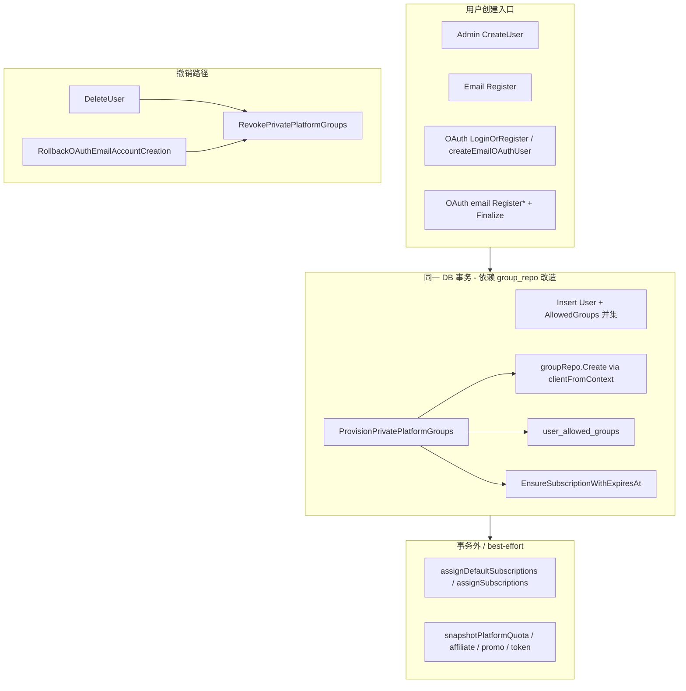

# 私有专属平台订阅分组自动供给

| 字段 | 值 |
|------|-----|
| **文档标题** | 用户创建时私有专属平台订阅分组自动供给（Private Platform Groups Provisioning） |
| **作者** | Sub2API Architecture / TBD |
| **日期** | 2026-07-29 |
| **状态** | Draft（已按 design review 修订） |
| **关联需求** | 新用户（`role=user`）按平台自动创建 `private-{userId}-{platform}` 专属订阅组，并绑定 allowed + 发放 UserSubscription；管理端可配置统一绝对到期日并对存量私有订阅批量同步 |

---

## Overview

Sub2API 当前在用户创建后仅通过 `assignDefaultSubscriptions` / `assignSubscriptions` 向**既有**订阅分组发放订阅（系统默认订阅列表）。运营希望：每个普通用户在创建成功后自动获得一套**按平台隔离的私有专属订阅分组**（约 5 个平台，排除 `composite`），组内初始无上游账号（空池），由运营后续灌号；用户侧可正常看到这些组并自助绑定 API Key。

本设计在**所有**会新建 `users` 行的路径上抽取共享 `ProvisionPrivatePlatformGroups(ctx, userID)`：与用户插入**同一事务**内创建 Group、`user_allowed_groups`、`UserSubscription`。该契约的**硬前置**是改造 `groupRepository.Create` / `DeleteCascade` 使其支持 `clientFromContext` / `TxFromContext`（现状不支持，见下文）。管理端「用户默认配置」新增绝对到期日（Asia/Shanghai 当日 23:59:59）；另提供「同步到全部私有订阅」批量按钮与幂等补建 API。不回填存量用户、不自动建 Key、不自动绑账号。

**发布硬约束**：后端「默认隐藏 private 组」必须与 provision **同一发布单元**上线，禁止仅放量建组而不隐藏列表。

---

## Background & Motivation

### 现状（带代码锚点）

| 能力 | 现状位置 | 行为 |
|------|----------|------|
| 管理端建用户 | `admin_user.go:120-157` `CreateUser` | `userRepo.Create` 后 `assignDefaultSubscriptions` fail-open（L148-156） |
| 邮箱注册 | `auth_service.go:141-277` `RegisterWithVerification` | `CreateWithEmailAliasGuard`（L227）后 `assignSubscriptions`（L236）；邀请码 `Use` 非同事务 fail-open（L252-256） |
| OAuth 自动注册 | `LoginOrRegisterOAuth` L481+、`loginOrRegisterOAuthWithTokenPair` L604+、`createEmailOAuthUser`（`auth_email_oauth_auto.go:157`） | post-create 分配默认订阅；邀请路径有 user+redeem 外层事务、默认订阅在 commit 后（`auth_service.go:681-715`） |
| OAuth 两阶段邮箱 | `auth_oauth_email_flow.go`：`RegisterOAuthEmailAccount` L102、`RegisterVerifiedOAuthEmailAccount` L181、`FinalizeOAuthEmailAccount` L263、`RollbackOAuthEmailAccountCreation` L296 | Create 后 token 失败仅 `userRepo.Delete`，**无**组级联；Finalize 才 `assignSubscriptions` |
| 分组创建 | `admin_group.go:298` `CreateGroup`；`group_repo.go:45-52` `Create` | 管理端建组；**repo Create 始终用 `r.client`，不走 `clientFromContext`** |
| 分组级联删 | `group_repo.go:756-859` `DeleteCascade` | `ErrTxStarted` 时注释称复用事务，但 **未**取 `TxFromContext`，继续用 `r.client` |
| 订阅发放 | `subscription_service.go:191-284` | 仅 `ValidityDays`；`<=0` 默认 30 天；已存在则累加/重开天数 |
| 用户可绑组 | `api_key_service.go:925-972` | `GetAvailableGroups` 调 `ListActive` **全表**活跃组；subscription 类型只看有效订阅 map |
| 用户删除 | `admin_user.go:338-426` `DeleteUser` | 事务内删 API Key + 软删 User（L353-366）；**不**软删私有组 |
| 部分唯一索引 | `migrations/016_soft_delete_partial_unique_indexes.sql:30-32,44-46` | `groups_name_unique_active`、`user_subscriptions_user_group_unique_active` |
| 平台列表 | `service.AllowedQuotaPlatforms`（`domain_constants.go:52-58`）；`model.AllPlatforms()`（`error_passthrough_rule.go:43-45`） | 五平台，均不含 composite |
| 设置部分更新 | `setting_update.go` `OmittedSettingKeys`；`setting_handler_update.go:422-443` `omittedSettingKeys` | 未发送的 value 字段进入 omitted，避免整表零值覆盖 |

痛点：

1. 无法为每用户提供独立平台通道（专属 `is_exclusive` + 订阅限额语义）。
2. 默认订阅只能挂到已有 group_id，无法「一人一组」。
3. 到期日只能按天数相对计算，无法运营侧统一绝对日历日。
4. 若直接暴露全部 `private-*` 组，管理端列表与用户侧 `GetAvailableGroups` 均会在 N×5 规模下崩溃式变慢。

### 产品结论（已锁定，不再重开）

见本文 **Key Decisions**；实现必须以这些决策为准。

---

## Goals & Non-Goals

### Goals（v1）

1. `role=user` 的新用户创建成功后，为 `service.AllowedQuotaPlatforms` 中每个平台创建一组私有专属订阅分组（权威源，已无 composite）。
2. 同时写入 `user_allowed_groups` 与 `UserSubscription`（立即发放）。
3. 与现有 `assignDefaultSubscriptions` **并存**；管理端 `AllowedGroups` 与私有组 **并集**；后续 `UpdateUser` 不得抹掉私有 allowed 行。
4. 用户创建与私有供给 **同事务**；任一步失败整单回滚（含 group_repo 事务改造硬依赖）。
5. 管理端用户默认配置：绝对到期日；未配置 → `expires_at = now` 且 `status=expired`；可清空（仅影响未来新用户；`OmittedSettingKeys` 语义完整）。
6. 独立按钮「同步到全部私有订阅」：S1——含 expired/**suspended**；`expires_at` 统一改写；target 未来 → `status=active`（含原 suspended 救活）；target 过去 → `status=expired`（含原 suspended，日历切割语义）。
7. 管理端分组列表默认隐藏私有组，可切换显示；**与 provision 同版本上线**。
8. 私有组保护：禁止改名 / platform / subscription_type / 降级 `is_exclusive`；允许倍率、限额、绑账号、启停。
9. 删用户 / OAuth Rollback 同事务（或同原子路径）软删 `private-{userId}-*` 组及相关 allowed + subscription + account_groups。
10. 管理端幂等补建 API（不部署时自动回填存量）。
11. 用户侧热路径（`GetAvailableGroups`、`ChannelService.ListAvailable`）与管理端 `GetAllGroups*` 三分支不因 N×5 private 组全表扫描而劣化。

### Non-Goals（v1）

- 自动创建每平台 API Key
- 自动从模板/全量账号灌号到私有组
- 部署时批量回填历史用户
- 用户侧友好显示名（phase 2）
- 角色变更时自动创建/删除私有组
- 改动 `composite` 平台逻辑
- 强制上线 Prometheus 指标（v1 以结构化日志为主）

---

## Proposed Design

### 高层架构



### 硬前置：Repository 事务改造（阻塞实现）

**现状核验**（不可按「外层 tx 包一层」直接开工）：

| 组件 | 事务支持 | 位置 |
|------|----------|------|
| `userRepo.create` | ✅ `ErrTxStarted` + `TxFromContext` | `user_repo.go:55-80` |
| `userSubRepo.Create` / `AddGroupToAllowedGroups` | ✅ `clientFromContext` | 既有模式 |
| `groupRepo.Create` | ❌ 始终 `r.client` | `group_repo.go:45-52` |
| `groupRepo.DeleteCascade` | ❌ `ErrTxStarted` 时仍用 `r.client`，未 `TxFromContext` | `group_repo.go:756-776` |
| `clientFromContext` helper | 已存在 | `error_translate.go:26-31` |

**必做改造（PR1 硬依赖，合并门禁）：**

1. **`groupRepository.Create`**  
   ```go
   func (r *groupRepository) Create(ctx context.Context, groupIn *service.Group) error {
       client := clientFromContext(ctx, r.client)
       if err := createGroupRecord(ctx, client, groupIn); err != nil {
           return err
       }
       // outbox：仅在「无外层 tx」时立即 enqueue；
       // 有外层 tx 时由调用方 commit 后调用 EnqueueGroupChanged(groupID)，
       // 或在 repo 内检测 TxFromContext!=nil 则跳过 enqueue 并返回 needOutbox=true。
       ...
   }
   ```

2. **`DeleteCascade`**  
   - `ErrTxStarted` 时：`existingTx := dbent.TxFromContext(ctx)`，`exec/txClient = existingTx.Client()`，**不**自行 Commit。  
   - 无外层 tx：保持现有 begin/commit。  
   - outbox `enqueueSchedulerOutbox` 仅在本方法真正 commit 成功后发送；外层 tx 场景延迟到外层 commit 后。

3. **集成测试**  
   - 外层 `tx` + Create user + Create group + Rollback → `groups` / `user_allowed_groups` / `user_subscriptions` 均为 0。  
   - 外层 `tx` + DeleteCascade + Rollback → 组仍存在。  
   - 无外层 tx 的 Create/DeleteCascade 行为回归不破坏。

4. **GetByName（硬依赖）**  
   ```go
   // GroupRepository / AdminGroupRepository
   GetByName(ctx context.Context, name string) (*Group, error) // 默认软删过滤
   ```  
   现状仅有 `ExistsByName`（`group_repo.go:679-681`），幂等 provision 需要整行。冲突时：catch unique → `GetByName` 重读。

若短期不改 group_repo：**禁止**上线本功能（不接受 best-effort provision 补偿方案，与产品 fail-closed 冲突）。

### 核心模块：`PrivateGroupProvisioner`

- 文件：`backend/internal/service/private_group_provision.go`

| 方法 | 说明 |
|------|------|
| `ProvisionPrivatePlatformGroups(ctx, userID)` | 幂等补齐；**错误向上返回** |
| `RevokePrivatePlatformGroups(ctx, userID)` | 软删私有组 + 关联（DeleteCascade 语义） |
| `SyncPrivateSubscriptionExpiresAt(ctx)` | 批量同步存量私有订阅到期日（读当前设置） |
| `PrivateGroupName` / `IsPrivateGroupName` / `ParsePrivateGroupName` | 命名与识别 |
| `ResolvePrivateExpiresAt(ctx)` | 设置 → `time.Time` + 建议 status |

#### 依赖注入 / Wire

```go
type PrivateGroupProvisioner interface {
    ProvisionPrivatePlatformGroups(ctx context.Context, userID int64) (*ProvisionResult, error)
    RevokePrivatePlatformGroups(ctx context.Context, userID int64) error
    SyncPrivateSubscriptionExpiresAt(ctx context.Context) (*SyncResult, error)
}

type privateGroupProvisioner struct {
    entClient      *dbent.Client
    groupRepo      GroupRepository // 或 AdminGroupRepository
    userRepo       UserRepository
    userSubRepo    UserSubscriptionRepository
    settingService *SettingService
    billingCache   *BillingCacheService // 可选，invalidate
    // 不依赖 AdminService / AuthService，避免循环
}
```

- Wire：`NewPrivateGroupProvisioner` 加入 `backend/cmd/server/wire.go`，`go generate` 更新 `wire_gen.go`。  
- **`AuthService`** 与 **`adminServiceImpl`** 均注入同一 `PrivateGroupProvisioner` 接口（与 `defaultSubAssigner` 类似）。  
- **禁止** Admin 调 Auth 或 Auth 调 Admin 拿 provisioner。  
- 测试 stub：为 `admin_service_*_test`、`auth_service_*_test`、`auth_email_oauth_*_test`、`auth_oauth_email_flow_test` 补 no-op / recording stub。

#### 平台枚举（单一权威源）

```go
// 实现锁定：service.AllowedQuotaPlatforms（domain_constants.go:52-58）
// 已含 anthropic/openai/gemini/antigravity/grok，不含 composite。
// 禁止再拷贝一份 model.AllPlatforms() 或手写五平台常量导致漂移。
// 单测：privateGroupPlatforms() == AllowedQuotaPlatforms
func privateGroupPlatforms() []string {
    return append([]string(nil), AllowedQuotaPlatforms...)
}
```

`IsPrivateGroupName` 的 platform 白名单 **必须**与该列表同步（或从该列表生成正则）。

### 组形状（固定）

| 字段 | 值 |
|------|-----|
| `name` | `private-{userId}-{platform}`，例 `private-42-anthropic` |
| `description` | 固定英文可检索：`private platform group for user_id={id} platform={platform}` |
| `subscription_type` | `subscription` |
| `is_exclusive` | `true` |
| `rate_multiplier` | `1.0` |
| `daily/weekly/monthly_limit_usd` | `null` |
| `default_validity_days` | `365`（占位；真实到期用设置绝对日） |
| `status` | `active` |
| `sort_order` | `0` |
| `require_oauth_only` / `require_privacy_set` / models 等 | bool/空 map 零值可接受（false / nil） |
| `allow_image_generation` | 与 `defaultAllowImageGenerationForPlatform` 一致（目前仅 Grok 默认 true，`admin_group.go:261-265`） |
| `mcp_xml_inject` | `true`（与 CreateGroup 默认一致，L395-399） |
| `image_rate_multiplier` | **显式 `1.0`**（与 CreateGroup 默认一致） |
| `video_rate_multiplier` | **显式 `1.0`** |
| `peak_rate_multiplier` | **显式 `1.0`**（`peak_rate_enabled=false`） |
| `batch_image_discount_multiplier` | **显式 `0.5`**（`defaultBatchImageDiscountMultiplier`，`batch_image_public.go:28`） |
| `batch_image_hold_multiplier` | **显式 `0.6`**（`defaultBatchImageHoldMultiplier`，`batch_image_public.go:29`；须 ≥ discount） |
| 账号 | 不绑定 |

**`createGroupRecord` 零值陷阱（必读）**：

- `group_repo.go:78-79` 对 `BatchImageDiscountMultiplier` / `BatchImageHoldMultiplier` **无条件** `Set*(groupIn....)`。
- Go 零值 `0` 会**显式写入 0**，**不会**回落到 schema Default（0.5 / 0.6，`ent/schema/group.go:124-130`）。
- `0` 在业务注释中表示「免费」，且可能破坏 hold≥discount 运营习惯。
- Provision 构造 `service.Group` 时 **必须**与 `AdminService.CreateGroup` 使用同一常量（`defaultBatchImageDiscountMultiplier=0.5`、`defaultBatchImageHoldMultiplier=0.6` 及 rate 1.0），**禁止**依赖「schema 默认会生效」的错误假设。
- 单测：创建后的 private 组读回 batch discount/hold 分别为 0.5/0.6，rate multipliers 为 1.0。

**禁止**调用 `AdminService.CreateGroup`（大量校验、复制账号、不适合事务内自动供给）。构造 `service.Group`（上述字段全部显式赋值）后直接 `groupRepo.Create(txCtx, group)`（改造后）。

**绑定**：

1. `userRepo.AddGroupToAllowedGroups`（OnConflict）  
2. `EnsureSubscriptionWithExpiresAt`（见下）

### 命名与唯一性

- 部分唯一索引：`016_soft_delete_partial_unique_indexes.sql`。  
- 软删后同名可重建。  
- 识别：严格 `^private-(\d+)-({platforms})$`，`platforms` 来自 `AllowedQuotaPlatforms` 拼接。  
- 同步 / 删用户 / 列表隐藏 **同一** `IsPrivateGroupName` helper（Go 与 SQL 白名单一致）。

### 事务边界与创建路径矩阵

#### 目标语义

```
BEGIN
  INSERT user (+ sync input AllowedGroups)
  IF role=user:
    FOR each platform in AllowedQuotaPlatforms:
      ensure private group (GetByName / Create)
      ensure user_allowed_groups
      EnsureSubscriptionWithExpiresAt
COMMIT  -- 之后才 enqueue group outbox
-- 事务外 best-effort：
assignDefaultSubscriptions / assignSubscriptions
snapshotPlatformQuota / affiliate / promo / bootstrap / JWT
```

#### 生产 Create 调用点覆盖 checklist（合并门禁）

| # | 路径 | 文件 | Provision 时机 | Rollback/Delete 是否 Revoke |
|---|------|------|----------------|------------------------------|
| 1 | Admin CreateUser | `admin_user.go:120` | 同事务 Create 后 | DeleteUser → Revoke |
| 2 | RegisterWithVerification | `auth_service.go:227` | 同事务 Create 后 | N/A（失败不 commit） |
| 3 | LoginOrRegisterOAuth 新建 | `auth_service.go:532` | 同事务 | N/A |
| 4 | loginOrRegisterOAuthWithTokenPair 新建（无邀请） | `auth_service.go:718` | 同事务 | N/A |
| 5 | loginOrRegisterOAuthWithTokenPair 新建（有邀请外层 tx） | `auth_service.go:681-715` | **纳入同一外层 tx**（Create+Use+Provision） | N/A |
| 6 | createEmailOAuthUser | `auth_email_oauth_auto.go:193` | 同事务 Create 后 | 邀请失败调 Rollback → **须 Revoke**（L210） |
| 7 | RegisterOAuthEmailAccount | `auth_oauth_email_flow.go:163` | Create 后同事务 provision | token 失败 Rollback L173 → **须 Revoke** |
| 8 | RegisterVerifiedOAuthEmailAccount | `auth_oauth_email_flow.go:246` | 同上 | Rollback L255 → **须 Revoke** |
| 9 | FinalizeOAuthEmailAccount | `auth_oauth_email_flow.go:263` | **不**再次 provision（Create 已完成）；仅 assignDefaultSubscriptions 等 | — |

**两阶段 OAuth 策略（钉死）**：

- Provision 挂在 **Create**（路径 7/8），保证「创建成功即有组」。  
- `RollbackOAuthEmailAccountCreation` **必须**在 `userRepo.Delete` 之前调用 `RevokePrivatePlatformGroups`（或统一走扩展后的 delete 级联）。  
- `Finalize` 只做邀请/默认订阅/affiliate，**不**重复 provision。  
- `ErrEmailExists` 返回已存在用户且 `created=false`：不补 provision；历史半失败用户靠管理端补建 API。

#### 管理端 CreateUser / Auth 统一 helper

```go
// createUserWithPrivateGroups：所有「新建 user 行」路径优先走此 helper
func (p *privateGroupProvisioner) CreateUserWithPrivateGroups(
    ctx context.Context,
    createFn func(txCtx context.Context) (*User, error), // 内部 userRepo.Create*
) (*User, error) {
    // begin tx if not already in one
    // createFn(txCtx)
    // if role==user: Provision...
    // commit + deferred outbox
}
```

角色：`role != user` → Provision no-op。

#### AllowedGroups 并集 + 防覆盖写（Issue 4）

**Create**：`userRepo.Create` sync 输入 AllowedGroups；Provision 再 `AddGroupToAllowedGroups` → 并集。

**UpdateUser 保护（硬要求）**：

`admin_user.go:265-270` 在 `AllowedGroups != nil` 时整表 `syncUserAllowedGroups`。`UserAllowedGroupsModal.vue:232` 只加载 `subscription_type === 'standard'`，保存时 exclusive 勾选列表 **不含** private 组 ID → 会抹掉 private allowed 行。

**后端修复（推荐，单一真相）**：

```go
// UpdateUser / syncUserAllowedGroups 前：
// 若 userID 对应仍存在 active private groups，将那些 group_id 强制 merge 进 AllowedGroups
// 即：final = union(requestAllowed, privateGroupIDsForUser)
// 管理员无法通过 Modal「取消勾选」删除私有 allowed（与产品「私有组由系统供给」一致）
```

可选前端兜底：save 时 merge `user.allowed_groups` 中 `IsPrivateGroupName` 的 ID——**不能替代**后端保护。

测试：建用户有 private allowed → 打开 Modal 保存 → private 行仍在。

### EnsureSubscriptionWithExpiresAt（关键风险 #2）

**不**扩展 `AssignOrExtendSubscription` 续期语义；独立 helper：

```go
func (s *SubscriptionService) EnsureSubscriptionWithExpiresAt(
    ctx context.Context,
    userID, groupID int64,
    expiresAt time.Time,
    notes string,
) (*UserSubscription, error) {
    // 1. group 必须存在且 IsSubscriptionType()，否则 ErrGroupNotSubscriptionType
    // 2. GetByUserIDAndGroupID：存在则 return 原记录（幂等，不改 expires_at / status）
    // 3. 不存在：创建
    //    status = active if expiresAt.After(now) else expired
    //    starts_at = now, expires_at = clamp(expiresAt, MaxExpiresAt) // MaxExpiresAt 为 UTC 2099-12-31
    // 4. maybeInvalidateAssignmentCaches(userID, groupID, false) — 与 AssignOrExtend 一致，同步失效
}
```

- 未配置日期：`expires_at = time.Now()`，**status = expired**（避免 active-but-expired 脏状态；与 `ListActiveByUserID` 的 `ExpiresAtGT(now)` 一致，立即不可用）。  
- 补建：已存在订阅 **不改期**。  
- 批量同步：独立 UPDATE 路径，可改期与 status。

单测表：subscription type 校验、unset→expired、Shanghai 日末、MaxExpiresAt clamp、幂等不改期、创建后 cache invalidate 被调用。

### 设置读写契约（Issue 7）

| 项 | 值 |
|----|-----|
| DB key | `private_group_expires_date`（`SettingKeyPrivateGroupExpiresDate`） |
| JSON 名 | `private_group_expires_date`（与 key 同名 → 自动进 `settingKeyByJSONName`） |
| Go 字段 | `SystemSettings.PrivateGroupExpiresDate string` |
| 空串 `""` | **清空**（未配置）；`buildSystemSettingsUpdates` **显式写入**空串 |
| 字段未出现在 JSON | 进入 `OmittedSettingKeys` → **保留**库中值（防部分 PATCH / 旧客户端误清空） |
| 非法格式 | 非空且非 `YYYY-MM-DD` → 400 |
| 合法日期 | 存 `YYYY-MM-DD`；运行时解析为 Asia/Shanghai 23:59:59 |

**须改文件清单**：

- `backend/internal/service/domain_constants.go`  
- `backend/internal/service/settings_view.go`（`SystemSettings`）  
- `backend/internal/service/setting_parse.go`  
- `backend/internal/service/setting_features.go`（getter）  
- `backend/internal/service/setting_update.go`（`buildSystemSettingsUpdates`）  
- `backend/internal/handler/dto/settings.go` / admin `UpdateSettingsRequest`  
- `backend/internal/handler/admin/setting_handler*.go`（反射自动覆盖 JSON 名；校验日期）  
- `frontend/src/api/admin/settings.ts`  
- `frontend/src/views/admin/SettingsView.vue` users tab defaults 卡片（约 L3380+）  
- i18n `zh/en admin/settings.ts`

与 `default_balance` 同卡片；清空用 clear 按钮或允许空日期；**同步按钮不在 save 内**。

### 管理端列表隐藏（与 provision 同发）

#### 后端（PR2 必含）

扩展 `ListWithFilters` / `ListGroups` / `GetAllGroups` / `GetAllGroupsIncludingInactive`：

```go
// 默认 excludePrivate=true：WHERE name 不匹配 private 模式
// show_private=true 时关闭
// GetAllGroups*（下拉）：永远 excludePrivate=true，永不加载 private
```

- Handler query：`show_private=true`。  
- 修正 `GetAllGroupsIncludingInactive` 等「PageSize 10000 / dozens 组」假设：过滤 private 后仍应用合理上限或分页，避免 account_count 全量排序路径在运营组增长后爆炸。

#### 前端

- `GroupsView.vue` 开关可后置（PR3）；**后端默认 hide 已足够防止污染**。

### ListActive / 用户侧与管理端列表可扩展性

**问题不只 `GetAvailableGroups`**：`groupRepo.ListActive` 会加载**全部** active groups 并 `loadAccountCounts`（`group_repo.go:576-603`）。N×5 private 空组会拖垮所有「全表 ListActive」调用方。

#### ListActive 调用方矩阵（v1 硬要求）

| 调用方 | 位置 | 路径/用途 | v1 策略 |
|--------|------|-----------|---------|
| `APIKeyService.GetAvailableGroups` | `api_key_service.go:937` | `GET /keys/groups/available` | **改造**：`ListActiveExcludingPrivate` + 用户 active sub 的 `ListByIDs` |
| `ChannelService.ListAvailable` | `channel_available.go:58` | 用户侧 `GET .../channels/available`（`routes/user.go`） | **v1 硬改**：优先 `ListByIDs(unique channel.GroupIDs)`（渠道通常不含 private，且避免任何全表）；若需 fallback 活跃映射则用 `ListActiveExcludingPrivate`。**禁止**继续 `ListActive` 全表 |
| `GetAllGroups` | `admin_group.go:33` | 管理端下拉 | **exclude private**（永不加载） |
| `GetAllGroupsByPlatform` | `admin_group.go:36-37` → `ListActiveByPlatform` | 管理端按平台下拉 | **exclude private**（`ListActiveByPlatform` 同步加 exclude，或 service 层过滤） |
| `GetAllGroupsIncludingInactive` | `admin_group.go:40-44` → `ListWithFilters` PageSize 10000 | API Key 组过滤等 | **exclude private**（与 ListGroups 默认 hide 同一谓词；修正「O(dozens)」假设） |
| `ListGroups` / `ListWithFilters` | `admin_group.go:23` / `group_repo.go:374` | 管理端分组列表 | 默认 exclude；`show_private=true` 可开 |
| Scheduler snapshot / group capacity | `scheduler_snapshot_service.go`、`group_capacity_service.go` 等 | 调度热路径；多用 `ListActiveIDs`（较轻） | **保留 private**（已灌号私有组须参与调度）。Risk：空池 private 使 ID 集合膨胀；v1 **不阻塞**，规模阈值后可选「仅有 account_groups 的组」优化（记入 Risks，非 v1 门禁） |
| `admin_account` 绑组列表 | `admin_account.go:531` 等 `ListActiveByPlatform` | 管理端账号绑组 | **exclude private** 或仅展示运营组（private 灌号应走「按用户/搜索 private 名」专用入口；v1 可用 `show_private` 搜索，避免下拉灌满） |

#### GetAvailableGroups（用户可选组）

```go
func (s *APIKeyService) GetAvailableGroups(ctx context.Context, userID int64) ([]Group, error) {
    // 1) 运营组：ListActiveExcludingPrivate
    // 2) 用户有效订阅：ListActiveByUserID → group IDs
    // 3) groupRepo.ListByIDs(subGroupIDs)  // 含 private 订阅组
    // 4) 合并去重后按 canUserBindGroupInternal 过滤
}
```

#### Channel ListAvailable（用户可用渠道）— v1 硬要求

```go
// channel_available.go ListAvailable — 推荐实现
// 收集所有 channel.GroupIDs 去重 → groupRepo.ListByIDs(ids)
// 再 map 到 AvailableGroupRef；停用/缺失组忽略（与现语义一致）
// 复杂度 O(渠道关联组数)，与 private 组总数无关
```

- 渠道 `GroupIDs` 在 v1 不会挂 private（运营不把 private 组绑进渠道）→ 正确性不变。  
- 即使误绑，`ListByIDs` 仍只加载这些 ID，不会扫 5 万 private。

#### 管理端 GetAllGroups 三分支（checklist 写全）

handler 三路（`group_handler.go` 约 L396-410：`/all`、按 platform、include_inactive）均须 exclude private：

1. `GetAllGroups`  
2. `GetAllGroupsByPlatform`  
3. `GetAllGroupsIncludingInactive`  

实现偏好：repo 层 `excludePrivate bool` 或统一 `notPrivateNamePredicate`，避免只改 service 漏 ByPlatform。

#### 测试

- 造 1000+ private 组后：`GetAvailableGroups`、`ChannelService.ListAvailable` 耗时/扫描行数不随 private 总数线性恶化（或断言未调用全量含 private 的 `ListActive`）。  
- `GetAllGroups` / `ByPlatform` / `IncludingInactive` 结果均无 `private-*`。

### 编辑保护

`UpdateGroup`（`admin_group.go:609+`）：

- `IsPrivateGroupName` 时禁止：改 `name`、`platform`、`subscription_type`、将 `is_exclusive` 设为 false。  
- 允许：rate、limits、status、绑账号、图片/高峰等。  
- 前端编辑表单禁用上述控件。

### 用户侧可见（U1）

- 有效私有订阅 → 出现在 `GetAvailableGroups`（经 ListByIDs 路径）。  
- 未配置到期日 → status=expired → 不可绑新 Key。  
- 已绑 Key 的请求路径沿用现有订阅校验。

### 删除用户与 Revoke 算法（Issue 6）

**顺序（钉死）**，均在 `DeleteUser` 已有外层 `tx` / `opCtx` 内：

1. 列出 `IsPrivateGroupName` 且 name 含 `userID` 的 active groups（`GetByName` 循环或 `name LIKE 'private-{id}-%'`）。  
2. 对每个 group 调用 **事务感知的** `DeleteCascade(opCtx, id)`：  
   - 软删 `user_subscriptions`  
   - 删 `user_allowed_groups`  
   - 删 `account_groups`（账号实体保留；运营绑到该私有组的关联解除——**可接受**，账号可再绑他组）  
   - 软删 composite routes（private 组通常无）  
   - 软删 group  
3. 现有：`deleteUserWithAPIKeys`（先删用户 API Key，再软删 user）。  
   - Key 的 `group_id` 可保留指向已软删组（与 `DeleteCascade_PreservesApiKeyGroupID` 一致）；因 Key 本身将被删除，无泄漏。  
4. Commit 后：billing cache invalidate（每组 affected users，此处即该 userID）+ auth cache（已有）。

**Revoke 实现**：优先复用 `groupRepo.DeleteCascade`（修 tx 后），而非手写半套 SQL；`DeleteGroup` 的异步 cache 逻辑可在 Revoke 结束统一调用 `billingCacheService.InvalidateSubscription(userID, groupID)`，5 组同步调用可接受（删用户低频）。

**OAuth Rollback**：

```go
func (s *AuthService) RollbackOAuthEmailAccountCreation(...) {
    _ = s.privateGroups.RevokePrivatePlatformGroups(ctx, userID) // 先撤销组
    restore invitation
    userRepo.Delete
}
```

Rollback 若无外层 tx，Revoke 自管事务；须保证 Revoke 失败时仍尽量删 user（记 error 日志），避免用户残留但无登录路径——**优先** Revoke 与 Delete 包同一事务。

### 批量同步到期日（S1 钉死）

#### API

`POST /api/v1/admin/settings/private-group-expires/sync`  
Body：`{ "confirm": true }`；无有效设置日期 → 400。

#### Status 语义（Key Decision）

| 条件 | expires_at | status |
|------|------------|--------|
| 全部匹配私有订阅（含 expired/**suspended**/active） | 设为 target（上海日末） | — |
| target > now | 同上 | **active**（含原 suspended → 救活） |
| target ≤ now | 同上 | **expired**（含原 suspended；日历切割，风控暂停也被日历覆盖——产品接受） |

确认弹窗文案必须写明：**会救活已过期与已暂停的私有订阅（若新到期日在未来）**。

#### SQL / 性能

- 使用与 Go 相同的 platform 白名单正则。  
- 辅助条件：`subscription_type='subscription' AND is_exclusive=true`。  
- v1：单条 UPDATE 可接受；大规模则 `id` 游标批 1000。  
- 缓存失效：分批 `InvalidateSubscription`，单批超时记日志不失败整个 HTTP（DB 已更新）；响应 `{ updated, expires_at }`。  
- **审计**：调用现有 admin audit 路径写入（`AuditLog` / `securityaudit` 体系，参考 `audit_log_handler.go`）；强制记录 actor_admin_id、updated count、target date。禁止「若有则写」的模糊表述。

### 幂等补建

`POST /api/v1/admin/users/:id/provision-private-groups`  
- role≠user → 400  
- 调用同一 `ProvisionPrivatePlatformGroups`（可单事务包 5 平台）  
- 返回 created/reused 计数  

---

## API / Interface Changes

| 方法 | 路径 | 变更 |
|------|------|------|
| GET/PUT | `/api/v1/admin/settings` | `private_group_expires_date` |
| POST | `/api/v1/admin/settings/private-group-expires/sync` | 新增 |
| POST | `/api/v1/admin/users` | role=user 同事务 provision |
| POST | `/api/v1/admin/users/:id/provision-private-groups` | 幂等补建 |
| DELETE | `/api/v1/admin/users/:id` | Revoke 私有组 |
| PUT | `/api/v1/admin/users/:id` | allowed 合并保留 private |
| GET | `/api/v1/admin/groups` | `show_private`；默认隐藏 |
| GET | `/api/v1/admin/groups/all` | **永不**返回 private |
| PUT | `/api/v1/admin/groups/:id` | 身份字段保护 |
| GET | `/api/v1/keys/groups/available` | 实现变更（规模安全），契约不变 |

内部：`GroupRepository.GetByName`、`ListActiveExcludingPrivate`、`ListByIDs`；`PrivateGroupProvisioner`。

---

## Data Model Changes

- **无新表**。Settings KV 新 key。  
- 可选索引（PR 可选）：`groups(name) WHERE deleted_at IS NULL AND name LIKE 'private-%'`。  
- 数据量：1 万用户 ≈ 5 万 groups；列表/可选组路径必须过滤。

---

## Alternatives Considered

### A1. 每用户一个 composite 组

否决：与按平台隔离不符；composite 已排除。

### A2. 仅 allowed、不建 UserSubscription

否决：产品锁定 allowed+subscription；可选组依赖有效订阅。

### A3. 相对天数

否决：产品改为绝对日历日。

### A4. 异步 provision

否决：违背同事务 fail-closed。

### A5. 用 is_exclusive 过滤列表

否决：误伤运营 exclusive 组；必须用 name 模式。

### A6. 不改 group_repo，Provision 用 tx.Client() 直写 ent

可选应急，但绕过 repo 导致 outbox/字段映射分叉；**不如正式修 Create/DeleteCascade**。不作为主方案。

---

## Security & Privacy Considerations

| 威胁 | 严重度 | 缓解 |
|------|--------|------|
| 绑他人 private 组 | 中 | exclusive + 订阅校验 |
| 误改 private 身份字段 | 中 | UpdateGroup 硬保护 |
| 批量同步误救活（含 suspended） | 高 | 独立按钮 + 二次确认明示 + **强制审计日志** |
| Modal 抹掉 private allowed | 中 | UpdateUser merge 保留 |
| 事务外 group 孤儿 | 高 | group_repo 事务改造 + Rollback Revoke |
| description 含 user_id | 低 | 管理端语境可接受 |

---

## Observability

**v1**：

- 结构化日志：`private_group_provision` / `revoke` / `sync` 事件，字段 `user_id`, `result`, `expires_at`, `updated`, `err`。  
- 注册失败率从现有错误日志观察。  

**非 v1 阻塞**：Prometheus counter/histogram（PR 可选）；无指标时 **不**配置「error rate > 1%」告警。

---

## Rollout Plan

1. **PR1 先合**：settings + EnsureSubscription + **group_repo 事务 + GetByName**（无用户可见行为变化）。  
2. **PR2 同版本**：Provision 全路径 + Delete/Rollback 级联 + **后端默认 hide private** + GetAvailableGroups 规模修复 + UpdateUser allowed merge。  
   - **禁止** PR2 在无 hide 的情况下单独放量到生产。  
3. PR3：UpdateGroup 保护 + 前端 Groups 开关。  
4. PR4：补建 + sync API + 审计。  
5. PR5：Settings 日期 UI（可部分依赖 PR1 先交付只读/配置）+ 同步确认 + Users 补建按钮。  

回滚：代码回滚后新用户不再建组；已建组保留。紧急：同步 target 到过去批量 expired。

---

## Risks & Mitigations

| # | 风险 | 严重度 | 缓解 |
|---|------|--------|------|
| 1 | group_repo 未改导致孤儿组 | 致命 | PR1 硬门禁 + rollback 集成测 |
| 2 | PR2 无 hide 单独上线 | 高 | 发布清单写死同版本 |
| 3 | OAuth Rollback 漏 Revoke | 高 | 路径矩阵 + 测试 |
| 4 | Modal 抹 allowed | 中 | UpdateUser merge |
| 5 | GetAvailableGroups / Channel ListAvailable 全表扫 | 高 | ListActive 调用方矩阵；Channel 用 ListByIDs；三路 GetAllGroups* exclude |
| 5b | 调度 ListActiveIDs 含空 private 膨胀 | 中（v1 接受） | Risks 记录；规模后再滤无 account 组 |
| 5c | createGroupRecord 写入 0 倍率 | 中 | 构造时显式 0.5/0.6/1.0，禁止依赖 schema default |
| 6 | AssignOrExtend 误续期 | 高 | 独立 Ensure helper |
| 7 | 设置 omit 漏映射误清空 | 中 | OmittedSettingKeys 契约 + 单测 |
| 8 | 空账号池选号失败 | 低 | 已接受；运营灌号 |
| 9 | suspended 被日历救活/切 expired | 中 | 产品 S1 已接受；确认文案明示 |
| 10 | Wire/stub 遗漏编译失败 | 中 | DI 节 + 全量 test stub |

---

## Open Questions

产品决策已锁定。实现期技术细节：

1. outbox 延迟发送的 API 形状（repo 返回 flag vs provisioner commit hook）——实现选一种并单测。  
2. `ListActive` 调度路径是否需要显式「含 private」命名以免误改——建议新增 `ListActiveExcludingPrivate`，保留 `ListActive` 行为给调度。  
3. 可选前缀索引是否 v1 做——默认否。

---

## Key Decisions

| 决策 | 选择 | 理由 |
|------|------|------|
| 触发范围 | 所有新建 User 路径 + 共享 Provision | 避免分叉遗漏 |
| 角色 | 仅 `role=user` | Admin 不需要个人通道 |
| 绑定 | Group + allowed + UserSubscription | 订阅组可用性依赖有效订阅 |
| 与默认订阅 | 并存；默认订阅事务外 fail-open | 与现网一致；私有 fail-closed |
| AllowedGroups | 并集；UpdateUser **强制保留** private IDs | 防 Modal 覆盖写 |
| 到期模型 | 绝对日期 Asia/Shanghai 23:59:59；unset→now+status expired | 逼配置；避免脏 active |
| 批量同步 S1 | 全量私有订阅改 expires_at；未来→**active**（含 suspended 救活）；过去→**expired**（含原 suspended） | 产品日历切割；确认框明示 |
| 事务 | 用户+provision 同事务；**group_repo 必须 Tx 感知** | 禁止孤儿组 |
| 列表 | 默认隐藏；与 provision 同发；GetAllGroups/ByPlatform/IncludingInactive 永不 private | 防污染 |
| 用户/管理 ListActive 热路径 | GetAvailableGroups（exclude+订阅 ListByIDs）；Channel ListAvailable（ListByIDs 优先）；GetAllGroups 三分支 exclude | N×5 规模 |
| 调度 ListActiveIDs | 保留 private；空组膨胀 v1 接受 | 已灌号须调度 |
| 编辑保护 | 禁 name/platform/subscription_type/降 exclusive | 供给契约 |
| 建组方式 | groupRepo.Create 直写，不调 Admin CreateGroup；倍率字段**显式** 0.5/0.6/1.0 | 事务 + 避免 createGroupRecord 把 Go 零值写成 0 |
| 平台列表 | `service.AllowedQuotaPlatforms` 唯一源 | 防漂移 |
| 存量 | 幂等 API，不自动回填 | 降风险 |
| OAuth 两阶段 | Provision@Create；Rollback 必 Revoke | 无孤儿、无长窗口 |
| 可观测性 v1 | 结构化日志 | 无现成 metrics 基建 |

---

## References

| 主题 | 锚点 |
|------|------|
| CreateUser / 默认订阅 | `backend/internal/service/admin_user.go:120-193` |
| DeleteUser 事务 | `admin_user.go:338-426` |
| UpdateUser AllowedGroups | `admin_user.go:265-270` |
| RegisterWithVerification | `auth_service.go:141-277` |
| LoginOrRegisterOAuth | `auth_service.go:481-573` |
| loginOrRegisterOAuthWithTokenPair 邀请事务 | `auth_service.go:681-715` |
| createEmailOAuthUser | `auth_email_oauth_auto.go:157-214` |
| OAuth email Create/Finalize/Rollback | `auth_oauth_email_flow.go:102-307` |
| CreateGroup / 默认图片 | `admin_group.go:261-265,298-521` |
| UpdateGroup | `admin_group.go:609+` |
| ListGroups / GetAllGroups | `admin_group.go:23-44` |
| DeleteGroup cache | `admin_group.go:904-938` |
| AssignOrExtend / createSubscription / MaxExpiresAt | `subscription_service.go:20-25,191-433` |
| GetAvailableGroups / canUserBind | `api_key_service.go:925-972` |
| Channel ListAvailable | `channel_available.go:52-61`（`ListActive` L58） |
| GetAllGroups / ByPlatform / IncludingInactive | `admin_group.go:32-44` |
| CanBindGroup | `user.go:75-91` |
| groupRepo Create / ExistsByName / ListActive / DeleteCascade | `group_repo.go:45-52,576-604,679-681,756-859` |
| createGroupRecord SetBatch* | `group_repo.go:78-79`（零值陷阱） |
| batch 默认常量 | `batch_image_public.go:28-29`（0.5 / 0.6） |
| schema batch defaults | `ent/schema/group.go:124-130` |
| clientFromContext | `error_translate.go:26-31` |
| userRepo create 外层 tx | `user_repo.go:45-145` |
| AddGroupToAllowedGroups | `user_repo.go:1071-1082` |
| 部分唯一索引 | `migrations/016_soft_delete_partial_unique_indexes.sql` |
| AllowedQuotaPlatforms | `domain_constants.go:49-58` |
| model.AllPlatforms | `error_passthrough_rule.go:43-45` |
| OmittedSettingKeys | `setting_update.go:19-51`；`setting_handler_update.go:380-443` |
| NewAdminService / NewAuthService | `admin_service.go:649+`；`auth_service.go:96-126` |
| Settings UI defaults | `frontend/.../SettingsView.vue` ~L3380 |
| UserAllowedGroupsModal | `UserAllowedGroupsModal.vue:232,283-304` |
| GroupsView | `frontend/.../GroupsView.vue` |
| AuditLog | `handler/admin/audit_log_handler.go` |

---

## PR Plan

### PR1 — Repo 事务基础 + 设置 + EnsureSubscription + GetByName

- **标题**：`feat(groups): tx-aware group create/delete and private expiry setting foundation`
- **影响**：  
  - `group_repo.go`：Create/`createGroupRecord` 用 `clientFromContext`；DeleteCascade 用 `TxFromContext`；outbox 延迟策略  
  - `GetByName`、（可选）`ListByIDs`、`ListActiveExcludingPrivate`  
  - `subscription_service.go`：`EnsureSubscriptionWithExpiresAt`  
  - settings key/parse/update/DTO/handler + OmittedSettingKeys 契约测试  
  - 集成测：外层 tx rollback 无残留 group  
- **依赖**：无  
- **说明**：无用户可见 provision 行为；可独立合并。

### PR2 — Provision 全路径 + 级联撤销 + 后端隐藏 + 规模修复 + allowed merge

- **标题**：`feat(user): provision private platform groups with list exclusion`
- **影响**：  
  - `private_group_provision.go` + Wire DI（组字段**显式** 0.5/0.6/1.0 倍率）  
  - Admin CreateUser / DeleteUser  
  - Auth：Register、LoginOrRegister*、createEmailOAuthUser、RegisterOAuth*、Rollback  
  - ListGroups + **GetAllGroups / GetAllGroupsByPlatform / GetAllGroupsIncludingInactive** 默认 exclude private  
  - GetAvailableGroups 规模安全  
  - **ChannelService.ListAvailable**：`ListByIDs(channel.GroupIDs)` 或 `ListActiveExcludingPrivate`（禁止全表 `ListActive`）  
  - UpdateUser allowed merge private IDs  
  - 路径覆盖 checklist 测试门禁  
- **依赖**：PR1  
- **硬约束**：**不可**在无后端 hide / 无 ListAvailable 规模修复的情况下单独放量；hide 与 provision 同 PR 或同版本发布。  

**PR2 合并门禁 checklist**：

- [ ] 上表 9 条 Create 路径均覆盖  
- [ ] Rollback 后 0 private groups  
- [ ] DeleteUser 后 0 private groups / subs / allowed  
- [ ] ListGroups 默认无 private-*  
- [ ] **GetAllGroups** 无 private-*  
- [ ] **GetAllGroupsByPlatform** 无 private-*  
- [ ] **GetAllGroupsIncludingInactive** 无 private-*  
- [ ] Modal 保存后 private allowed 仍在  
- [ ] GetAvailableGroups 不调用「含 private 的全表 ListActive」  
- [ ] **Channel ListAvailable** 不调用「含 private 的全表 ListActive」（优先 ListByIDs）  
- [ ] 新建 private 组 `batch_image_discount/hold` = 0.5/0.6，rate multipliers = 1.0

### PR3 — UpdateGroup 保护 + 前端 Groups 开关

- **标题**：`feat(admin): lock private group identity fields and show-private toggle`
- **影响**：`UpdateGroup`、`GroupsView.vue`、i18n  
- **依赖**：PR2（有数据可测）

### PR4 — 补建 API + 批量同步 + 审计

- **标题**：`feat(admin): provision-private-groups and sync private subscription expiry`
- **影响**：admin routes/handlers、Sync SQL、AuditLog 强制写入、缓存分批失效  
- **依赖**：PR1 + PR2

### PR5 — 前端用户默认配置日期 + 同步确认 + 用户补建按钮

- **标题**：`feat(frontend): private group expiry date picker and sync confirm`
- **影响**：`SettingsView.vue`、`settings.ts`、i18n、`UsersView` 补建  
- **依赖**：日期字段依赖 PR1；同步/补建按钮依赖 PR4  
- **说明**：可在 PR1 后先合「仅日期保存 UI」（PR5a），同步按钮等 PR4（PR5b）。

### PR6（可选）— 前缀索引 + metrics

- **依赖**：PR2  
- **说明**：规模与可观测增强，非阻塞。

---

## 测试计划（摘要）

| 用例 | 类型 |
|------|------|
| 外层 tx + group Create + rollback → 0 groups | integration（PR1） |
| CreateUser role=user → 5 groups + allowed + subs | integration |
| CreateUser role=admin → 0 private | unit |
| AllowedGroups 并集 + Modal 保存保留 private | integration |
| Register / OAuth create 同事务；Provision 失败无 user | integration |
| OAuth Create → Rollback → 0 private groups | integration |
| Finalize 不重复建组 | unit |
| unset 日期 → status expired, expires≈now | unit |
| 配置日期 → 上海 23:59:59 | unit |
| Ensure 幂等不改期 | unit |
| 同步 S1：suspended+future→active；past→expired | integration |
| 同步不碰非 private 订阅 | integration |
| ListGroups 默认无 private；show_private 可见 | unit |
| GetAllGroups 无 private | unit |
| UpdateGroup 改名/platform 失败 | unit |
| DeleteUser 级联 | integration |
| GetAvailableGroups 规模：大量 private 下仍正确 | integration |
| Channel ListAvailable 不随 private 总数恶化 / 未全表 ListActive | integration |
| GetAllGroups + ByPlatform + IncludingInactive 均无 private | unit |
| private 组 batch 0.5/0.6、rate 1.0（非 0） | unit |
| 设置 omit 未传字段不清空；显式 "" 清空 | unit |

---

*本文档状态：Draft（design review 修订版）。实现以 Locked product decisions 与本文 Key Decisions 为准。*
