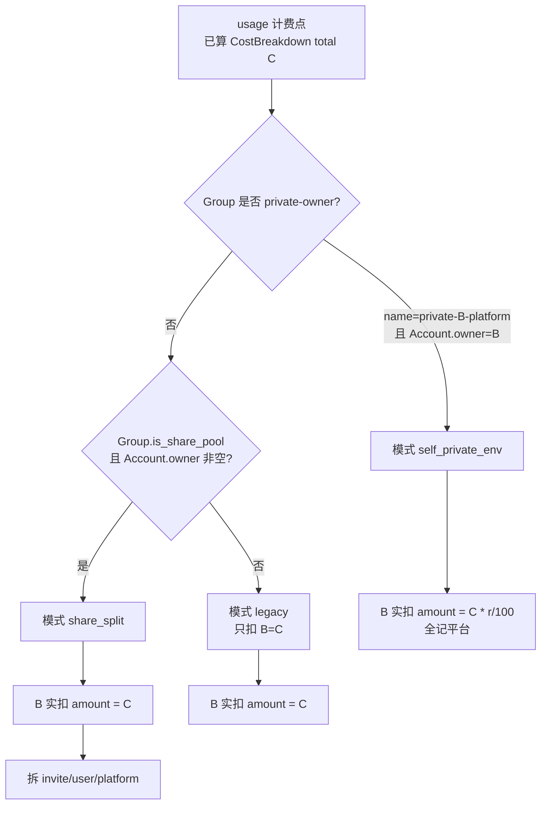

# 共享账号收益分配（Share Revenue Split）

| 字段 | 值 |
|------|-----|
| **文档标题** | 共享账号收益分配 |
| **作者** | Sub2API / grilling 共识归档 |
| **日期** | 2026-08-03 |
| **状态** | **已实现**（核心分账 + 管理端 Settings + 用户「贡献收益」页；flag 默认关） |
| **关联需求** | 用户贡献账号进共享池后，调用方付费可拆为邀请返利 / 贡献者收益 / 平台；自用 private 组仅收环境费率 |
| **相关设计** | [`user-owned-shared-accounts.md`](./user-owned-shared-accounts.md)、[`user-oauth-for-owned-accounts.md`](./user-oauth-for-owned-accounts.md) |
| **代码锚点** | `gateway_usage_billing.go`、`AffiliateService`、`BillingCacheService`、`accounts.owner_user_id`、`groups.is_share_pool` |

---

## Overview

用户自建账号与共享池（`is_share_pool`）已落地：调用方 B 的 API Key 经共享池组调度到贡献者 A 的账号时，**钱仍只从 B 扣**（caller-pays），A 只贡献上游资源（并发/调度占用）。

本设计补上 **收益分配最后一步**：

1. **共享池路径**：B 应付全额 `total`（含分组倍率）拆成三份——**邀请返利（B 的邀请人）**、**用户收益（账号 owner A）**、**平台**；比例全局可配且和为 100%。  
2. **自用 private 路径**：A 用 `private-{A}-{platform}` 打自己的号时，先算正常计费 C，实际只扣 **C × 环境费率 r%**，全部归平台（不走三方）。  
3. **系统号**（无 `owner_user_id`）或非共享池路径：保持现网只扣 B，不分账。

---

## Background & Motivation

### 现状

| 能力 | 位置 | 行为 |
|------|------|------|
| 网关扣费 | `service/gateway_usage_billing.go` `applyUsageBilling` / `postUsageBilling` | 扣 API Key 所属用户余额/订阅；写 `usage_logs` |
| 分组倍率 | `getUserGroupRateMultiplier` + `groups.rate_multiplier` | 乘入成本 |
| 邀请返利 | `AffiliateService`、settings `affiliate_rebate_*` | 充值等场景有返利；**未**与共享池 usage 挂钩 |
| 共享池 | `groups.is_share_pool`、`accounts.owner_user_id` / `visibility` | 调度可用；**无**收益划转 |
| 旧产品共识 | grilling user-owned | 「贡献者不因被调度而扣费」= 不另扣 A；**未**规定 A 如何从 B 的付款中分润 |

### 痛点

没有分润则用户缺乏持续贡献账号的动力，共享池难以形成良性循环。

---

## Goals & Non-Goals

### Goals（v1）

1. 识别两种计费模式并正确扣/入账。  
2. 全局可配：共享池三方比例；private 自用环境费率。  
3. 同事务：B 扣 total（或 C×r）→ A/邀请人入账 → 平台余量；误差归平台。  
4. 流水可审计：usage 侧可查 total 与拆分金额。  
5. 与现有 affiliate 邀请关系表兼容（查 B 的邀请人）。  
6. Feature flag 可关，关闭后行为与现网一致。

### Non-Goals（v1）

1. 按组覆盖分账比例（仅全局）。  
2. 贡献者收益冻结/提现专用钱包。  
3. 上游真实成本核算（「利润分账」）。  
4. 对 A 另扣「账号额度」余额。  
5. 税务发票、跨境结算。

---

## Key Decisions

| ID | 决策 | 理由 |
|----|------|------|
| K1 | 待分配基数 = B 应付 **total**（倍率后） | 与 caller-pays 一致，B 只扣一次 |
| K2 | 三方：邀请=B 的邀请人；用户收益=owner A；平台=系统 | 鼓励邀请消费 + 贡献账号 |
| K3 | 无邀请人 / 返利关 → invite 份额 **并入平台** | 不漏账 |
| K4 | 仅 `group.is_share_pool && account.owner_user_id != nil` 走三方 | 与「共享场景」对齐 |
| K5 | 系统号（owner 空）不分账 | 避免假贡献者 |
| K6 | Private 自用：扣 **C × r%** 全归平台 | 环境成本；不给自己转账 |
| K7 | A 收益 **即时入余额**，无冻结 | 产品要求；需监控刷量 |
| K8 | 分账与扣费 **同事务** | 对账简单 |
| K9 | 比例全局 settings，和=100% | v1 简单 |
| K10 | 「消耗 A 的额度」= 调度占用上游号，非扣 A 余额 | 与 K1 一致 |

---

## Proposed Design

### 模式判定



**判定细节：**

| 模式 | 条件（均需 usage 成功计费） |
|------|---------------------------|
| `self_private_env` | `IsPrivateGroupNameForUser(group.Name, callerUserID)` **且** `account.OwnerUserID != nil && *account.OwnerUserID == callerUserID` |
| `share_split` | `group.IsSharePool == true` **且** `account.OwnerUserID != nil` **且** 非 self_private（owner≠caller 或非 private 组） |
| `legacy` | 其余（含系统号、非共享池运营组、他人 private 等——后者本就不可被密钥选） |

> 若同一请求既满足 private 自用又误标 share_pool：以 **private 自用优先**（私有组名优先）。

### 金额计算

#### 共享池 `share_split`

```
C      = 现网算出的应付（含 group/user 倍率、模型价等），与今日 B 扣费公式一致
invite_pct, user_pct, platform_pct  // 全局，和=100
invite_amt = floor_money(C * invite_pct / 100)
user_amt   = floor_money(C * user_pct / 100)
// 无邀请人时 invite_amt 记 0，原 invite 份额并入平台
if inviter == nil || !affiliate_enabled:
  platform_amt = C - user_amt          // invite 并入平台
  invite_amt = 0
else:
  platform_amt = C - invite_amt - user_amt  // 余量归平台（含舍入误差）
```

**入账：**

1. `DeductBalance(B, C)`（或订阅扣减路径与现网一致）  
2. `AddBalance(A, user_amt)` 若 user_amt>0 且 A≠B（A==B 时见下）  
3. `AddBalance(inviter, invite_amt)` 若 invite_amt>0  
4. 平台份额 **不入用户余额**，仅 ledger 记账  

**边界 A==B 且仍走 share_split**（A 用共享池 Key 打到自己的 public 号）：  
- 仍扣 B(=A) 全额 C；  
- user_amt 加回 A = 净付 invite+platform；  
- 或产品上可简化为「owner==caller 时强制 legacy/self」——**v1 推荐：owner==caller 且非 private 组时仍 share_split，user_amt 加回自己**（与「即时余额」一致）。  

更清晰的 v1 规则（推荐写入实现）：

- `owner == caller` → **不走 share_split**，若 private 组则 `self_private_env`，否则 `legacy`（全额扣自己，无加回）。  
- 这样「自己赚自己」只可能在误用时出现，private 自用走环境费。

#### 自用 `self_private_env`

```
C = 正常计费全额
r = private_self_env_fee_pct  // 全局，如 1.0 表示 1%
amount = floor_money(C * r / 100)
if amount < min_charge && C > 0: amount = min_charge  // 可选，默认 0
DeductBalance(A, amount)  // 全记平台
```

`r=0` 表示完全免费（允许）。

### 设置项

| Key | 类型 | 默认建议 | 说明 |
|-----|------|----------|------|
| `share_revenue_split_enabled` | bool | false | 总开关；false=全 legacy |
| `share_split_invite_pct` | float | 10 | 邀请返利 % |
| `share_split_user_pct` | float | 40 | 贡献者 % |
| `share_split_platform_pct` | float | 50 | 平台 % |
| `private_self_env_fee_pct` | float | 1 | private 自用环境费率 % |

**校验：**  
- 三方 pct ≥0，和在容差内 =100（实现时自动把 platform 设为 `100-invite-user` 或拒绝保存）。  
- `private_self_env_fee_pct` ∈ [0, 100]。

管理端 Settings + `PublicSettings` 是否暴露给用户：  
- 用户侧可只读展示「贡献分成约 xx%」（可选 v1.1）；  
- v1 仅管理端可改。

### 数据模型

#### 方案推荐：`usage_logs` 扩展列 + 可选明细表

**A. usage_logs 增加列（热路径可读）**

| 列 | 类型 | 说明 |
|----|------|------|
| `revenue_mode` | varchar | `legacy` / `share_split` / `self_private_env` |
| `revenue_total` | decimal | 应付 C（或与 cost 字段复用则可不加） |
| `revenue_invite` | decimal | 邀请份额 |
| `revenue_user` | decimal | 贡献者份额 |
| `revenue_platform` | decimal | 平台份额 |
| `revenue_owner_user_id` | bigint null | A |
| `revenue_inviter_user_id` | bigint null | B 的邀请人 |

若现网已有 `total_cost`/`amount` 字段，则 `revenue_total` 与之对齐，避免重复。

**B. `share_revenue_ledgers`（审计/对账，可选 v1 同事务写）**

| 列 | 说明 |
|----|------|
| id, usage_log_id, request_id | 关联 |
| from_user_id | B |
| to_user_id | A 或 inviter；平台用 null |
| role | `invite` / `contributor` / `platform` |
| amount | >0 |
| created_at | |

v1 **最低要求**：usage_log 上可还原三方金额 + 余额变动与 `balance_transactions`（若已有）一致。

### 代码挂点

```text
applyUsageBilling / postUsageBilling 成功路径
  1. 计算 C（已有 CostBreakdown）
  2. resolveRevenueMode(group, account, callerUserID)
  3. switch mode:
       share_split → compute split; deduct C; credit A; credit inviter
       self_private_env → deduct C*r
       legacy → deduct C
  4. 写 usage_log 扩展字段
  5. invalidate billing cache (B, A, inviter)
```

**邀请人查询：** 复用 `AffiliateService` / `user_affiliates` 表（与注册 aff_code 同源）。  
**加余额：** 复用 user repo `AddBalance` + `BillingCacheService.InvalidateUserBalance`。

### 与 Affiliate 充值返利关系

| 场景 | 行为 |
|------|------|
| 充值返利 | 保持现网 `AffiliateService` 逻辑，**独立** |
| 共享池 usage 邀请份额 | **新路径**，比例用 `share_split_invite_pct`，**不**乘 `affiliate_rebate_rate` |
| 双开 | 允许同时存在；流水类型字段区分 `affiliate_recharge` vs `share_usage_invite` |

### 防刷与风控（v1 最低）

| 风险 | 缓解 |
|------|------|
| A 用小号 B 刷自己号套现 | owner==caller 不走 share_split；监控 A 收益异常增速 |
| 无冻结即时余额 | 管理端可禁用户；后续可加冻结 |
| 比例配错 | 保存校验和=100 |

---

## API / 配置界面

### Settings（管理端）

- 开关：共享收益分配  
- 三滑块/数字：invite / user / platform（联动和=100）  
- Private 自用环境费率  

### 用户侧（已实现）

- 侧栏「贡献收益」入口（feature flag：`share_revenue_split_enabled`）
- `GET /api/v1/user/share-revenue/summary`：累计收益 / 笔数 / 当前分成比例
- `GET /api/v1/user/share-revenue/ledgers`：贡献者流水（`user_amount`）

---

## Security & Privacy

- 分账仅服务端计算，客户端不可改比例。  
- 不可把平台份额写入任意用户。  
- owner 校验以 DB `accounts.owner_user_id` 为准，不信任请求体。  
- 管理端改比例需 admin 权限 + 审计日志。

---

## Observability

- 指标：`share_split_total_amount`、`share_split_count`、`self_env_fee_total`  
- 日志：request_id, mode, C, invite/user/platform, owner_id, inviter_id  
- 对账任务（可选）：日汇总 B 扣减 = A 入账 + 邀请入账 + 平台份额  

---

## Rollout

1. Migration + settings 默认 **关闭**  
2. 实现分账钩子 + 单测  
3. 预发打开小流量核对 usage_log  
4. 生产开 flag；异常关 flag 回 legacy  

**回滚：** `share_revenue_split_enabled=false` 立即停止分账（不回溯历史）。

---

## Testing

| 用例 | 期望 |
|------|------|
| 共享池 + owner=A + B 有邀请人 | B 扣 C；A+user；inviter+invite；平台余量 |
| 共享池 + B 无邀请人 | invite=0；平台=C-user |
| 系统号 + 共享池 | legacy，只扣 B=C |
| private 自用 | 扣 C×r，无 A/邀请入账 |
| private 自用 r=0 | 扣 0 |
| flag 关 | 全 legacy |
| 比例校验 | 和≠100 拒绝保存 |
| 并发同 request_id | 幂等不双分 |

---

## PR Plan

### PR1 — Schema + Settings

- migration：usage_logs 分账列（或 ledger 表）  
- settings keys + admin Settings UI  
- flag 默认 false  

### PR2 — 分账核心

- `resolveRevenueMode` + `applyShareRevenueSplit`  
- 挂 `applyUsageBilling`  
- 单测表驱动  

### PR3 — 邀请人解析与入账

- 对接 Affiliate 邀请关系  
- AddBalance + cache invalidate  
- 无邀请人并入平台  

### PR4 — 可观测与对账

- 日志/指标  
- 管理端简单汇总（可选）  

---

## Open Questions（实现默认可拍）

| # | 问题 | 推荐默认 |
|---|------|----------|
| Q1 | money 精度 | 与现网 balance 小数位一致；误差归平台 |
| Q2 | 订阅用户（非余额）是否也分账 | v1 **是**：以「等价 cost」记账；订阅扣减路径仍只减 B 订阅额度，A 入 **余额**（需产品确认是否接受「订阅换余额」） |
| Q3 | min_charge | v1 **0** |

**Q2 风险：** 若 B 走订阅不扣余额，A 仍加余额，平台可能亏。  

**更稳 v1 默认（建议实现采用）：**

- 仅当 B 的本笔扣费走 **余额 DeductBalance** 时执行 share_split / 给 A 加余额；  
- 纯订阅扣减路径 **legacy 或只记平台份额不给 A 现金**（实现时二选一，推荐 **legacy 仅记 usage 字段、不给 A 加余额**，直到订阅分账产品化）。

---

## References

- grilling 共识（本会话 2026-08-03）  
- `docs/design/user-owned-shared-accounts.md`  
- `backend/internal/service/gateway_usage_billing.go`  
- `backend/internal/service/affiliate_service.go`  

---

## 实现入口

> **按 `docs/design/share-revenue-split.md` 实现共享收益分配（PR1→PR4）**

**黄金验收：**

1. flag 开；B 用共享池 Key 打到 A 的号 → B 扣 C，A 余额 +user_pct，邀请人 +invite_pct  
2. A 用 private 组打自己的号 → 只扣 C×r  
3. flag 关 → 与现网一致  
