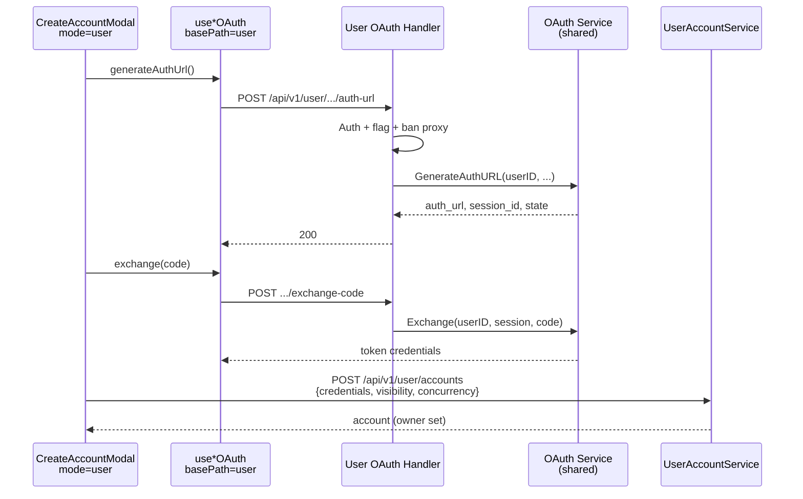

# 用户自建账号的 OAuth 授权链路

| 字段 | 值 |
|------|-----|
| **文档标题** | 用户自建账号 OAuth（User-owned Accounts OAuth） |
| **作者** | Sub2API / grilling 共识归档 |
| **日期** | 2026-07-31 |
| **状态** | **已实现**（main `cf231bf11`） |
| **关联需求** | 「我的账号」生成授权链接 403；普通用户无法走 OAuth 向导 |
| **相关设计** | [`user-owned-shared-accounts.md`](./user-owned-shared-accounts.md) |
| **关联现象** | `POST /api/v1/admin/antigravity/oauth/auth-url` → `403 Admin access required`（JWT `role=user`） |

---

## Overview

用户自建账号（`/my-accounts`）已复用管理端 `CreateAccountModal`（`mode=user`），创建落库走 `POST /api/v1/user/accounts`。但 OAuth「生成授权链接 / 换 code / 手动 RT」等请求仍打 **`/api/v1/admin/...`**，受 `AdminAuth` 保护，普通用户一律 **403**。

本设计规定：**用户专属 OAuth HTTP 入口 + 与管理端共用同一套 OAuth 业务逻辑**；前端在 `mode=user` 时切换 base path；换 token 后仍走用户建号 API（带 owner / 私有·公用）。

---

## Background & Motivation

### 现状（代码锚点）

| 能力 | 位置 | 行为 |
|------|------|------|
| 用户建号 API | `routes/user.go`、`handler/user_account_handler.go`、`service/user_account_service.go` | 已实现 CRUD + visibility |
| 我的账号页 | `frontend/src/views/user/MyAccountsView.vue` | `CreateAccountModal mode="user"` |
| OAuth 前端 | `useAccountOAuth` / `useOpenAIOAuth` / `useGeminiOAuth` / `useAntigravityOAuth` / `useGrokOAuth` | **硬编码 admin 路径** |
| OAuth 后端 | `routes/admin.go` 下 `accounts` / `openai` / `gemini` / `antigravity` / `grok` | **AdminAuth** |
| 服务端一键建号 | `POST .../create-from-oauth`（OpenAI / Grok） | 管理端 `CreateAccount`，无 owner |

### 复现（浏览器）

1. 普通用户登录 → `/my-accounts` → 添加账号 → Antigravity → 下一步 →「生成授权链接」  
2. 请求：`POST /api/v1/admin/antigravity/oauth/auth-url`  
3. 响应：`{"code":"FORBIDDEN","message":"Admin access required"}`  
4. UI：`生成 Antigravity 授权链接失败`

### 痛点

- UI 与管理端同源，能力预期对齐，但 OAuth 网关未对用户开放。  
- 若直接放宽 `/admin/...`，权限语义混乱，易误开放其它 admin 能力。

---

## Goals & Non-Goals

### Goals（v1）

1. 普通用户在「我的账号」可完成与管理端对齐的 OAuth 向导（生成链接、换 code、现网会点到的 RT/手动相关接口）。  
2. **全平台**：Anthropic / OpenAI / Gemini / Antigravity / Grok（及管理端已有的对等路径）。  
3. **API 边界清晰**：用户走 `/api/v1/user/...`；admin 路径不变。  
4. **逻辑单套**：OAuth service **不复制**；仅 HTTP 鉴权与入口不同。  
5. OAuth session **绑定 user_id**；用户路径 **禁止 proxy**。  
6. 功能开关 `user_owned_accounts_enabled=false` 时用户 OAuth **403**。  
7. 建号统一：`exchange`（等）拿 token → 前端 `POST /user/accounts`（owner + private/public）。  
8. 管理员使用「我的账号」时同样走 **user OAuth 路径**（保证号有 `owner_user_id`）。

### Non-Goals（v1）

1. 不放宽 `/api/v1/admin/...` 给普通用户。  
2. 用户侧 **不暴露** `create-from-oauth`（避免绕过 UserAccountService）。  
3. 不做 OAuth 专用 per-user 频控（依赖登录 + flag + 现有全局限流；后续可加）。  
4. 不改变管理端账号管理页（`/admin/accounts`）的 OAuth 行为。  
5. 不在本设计重开「用户可选 proxy」产品决议。

---

## Key Decisions

| ID | 决策 | 理由 |
|----|------|------|
| K1 | 用户专属路由 `/api/v1/user/...`，不放宽 admin | 权限与审计清晰 |
| K2 | OAuth **service 单套**；handler 薄包装 | 避免双份逻辑漂移 |
| K3 | v1 **全平台**对齐管理端 OAuth 能力 | 避免「只有某一平台能点」 |
| K4 | Session 绑定 `user_id`；Exchange 校验归属 | 防 session 串用 |
| K5 | 用户路径 **拒绝/忽略 proxy_id** | 与「用户不可选 proxy」一致 |
| K6 | 前端 composable 增 `mode` / `basePath` | 不复制 5 套 use*OAuth |
| K7 | v1 无专用 OAuth 频控 | 交付快；可观测后再加 |
| K8 | 用户侧不暴露 create-from-oauth；统一 exchange → `POST /user/accounts` | 强制 owner/visibility 路径 |

---

## Proposed Design

### 架构示意



### 后端

#### 鉴权与守卫

用户 OAuth 路由组（挂在已有 user JWT 中间件下）：

1. 必须已登录。  
2. `SettingService.IsUserOwnedAccountsEnabled(ctx) == true`，否则 **403** `USER_OWNED_ACCOUNTS_DISABLED`。  
3. 请求体若带 `proxy_id`：**忽略或 400**（推荐 **400** `PROXY_NOT_ALLOWED`，避免静默忽略难排查）。  
4. 生成 session 时写入 **owner_user_id = 当前用户**；exchange / 后续步骤校验 session 归属，不匹配 → **404/403**。

#### 路由映射（原则）

与管理端 **路径语义对齐**，前缀改为 user，例如（实现时以现网 `routes/admin.go` 清单为准做完整表）：

| 能力 | Admin（现有） | User（新增） |
|------|---------------|--------------|
| Anthropic auth-url | `/api/v1/admin/accounts/generate-auth-url` | `/api/v1/user/accounts/oauth/generate-auth-url`（或等价命名，实现时统一一张表） |
| OpenAI auth-url | `/api/v1/admin/openai/generate-auth-url` | `/api/v1/user/openai/oauth/...` |
| Gemini auth-url | `/api/v1/admin/gemini/oauth/auth-url` | `/api/v1/user/gemini/oauth/auth-url` |
| Antigravity auth-url | `/api/v1/admin/antigravity/oauth/auth-url` | `/api/v1/user/antigravity/oauth/auth-url` |
| Grok auth-url | `/api/v1/admin/grok/oauth/auth-url` | `/api/v1/user/grok/oauth/auth-url` |
| exchange / RT / cookie 等 | admin 对应路径 | user 对等路径 |
| create-from-oauth | admin 保留 | **用户侧不提供** |

> 实现 PR 中应附 **完整对照表**（从 `routes/admin.go` 逐条勾选），本表只定原则。

#### Handler / Service

```text
UserOAuthHandler.GenerateAntigravityAuthURL(c)
  userID := auth subject
  requireFeatureEnabled()
  rejectProxy(req)
  return sharedService.GenerateAuthURL(ctx, GenerateAuthURLInput{
    UserID: &userID,  // 绑定 session
    Platform: antigravity,
    // ProxyID: nil
  })
```

- **禁止**复制 service 实现；优先给现有 service 增加可选 `OwnerUserID` / `RequireOwner` 参数。  
- 若现有 session 存储结构无 owner 字段：扩展 session 元数据（Redis/DB，与现网 OAuth session 实现一致）。

#### 建号

- 用户侧 **不** 注册 `create-from-oauth`。  
- 前端换 token 成功后：`userAccountsAPI.create({ name, platform, type, credentials, visibility, concurrency })`。  
- 与现有 K17 一致：先 private 绑私有组 → 探测 plan → 可选升 public。

### 前端

#### Composable

```ts
// 示例
useAntigravityOAuth({ mode: 'user' })
// 或
useAntigravityOAuth({ basePath: '/user/antigravity' })
```

- `CreateAccountModal`：`isUserMode` 时所有平台 OAuth 注入 `mode: 'user'`。  
- **路径表集中维护**（常量对象），避免散落字符串。  
- Admin 默认 `mode: 'admin'`，行为零回归。

#### 涉及文件（预期）

| 文件 | 改动 |
|------|------|
| `composables/useAccountOAuth.ts` | mode/basePath |
| `composables/useOpenAIOAuth.ts` | 同上 |
| `composables/useGeminiOAuth.ts` | 同上 |
| `composables/useAntigravityOAuth.ts` | 同上 |
| `composables/useGrokOAuth.ts` | 同上 |
| `components/account/CreateAccountModal.vue` | isUserMode 注入 mode |
| 可选 `api/userOAuth.ts` | 集中 user OAuth client |

---

## Security & Privacy

| 风险 | 缓解 |
|------|------|
| 普通用户调 admin OAuth | 不放宽 admin；user 路由独立鉴权 |
| Session 串用 | session 绑 user_id；exchange 校验 |
| 借 proxy 滥用 | 用户路径禁 proxy |
| 功能关闭仍可灌号 | flag 关闭 403 |
| create-from-oauth 绕过 owner | 用户侧不暴露 |
| 刷 auth-url | v1 全局限流；后续可 per-user |

---

## Observability

- 日志字段：`user_id`、`platform`、`oauth_action`（auth_url / exchange / rt）、`request_id`。  
- 指标（可选）：user oauth 403（flag off）、exchange 失败率、auth-url 延迟。  
- 与现有 admin OAuth 日志区分 `surface=user|admin`。

---

## Rollout

1. 后端 user OAuth 路由 + session owner（flag 默认仍随 `user_owned_accounts_enabled`）。  
2. 前端 mode=user 切路径。  
3. 联调：普通用户 Antigravity / OpenAI 等生成链接 **200**，换 code，建号带 owner。  
4. 回归：管理端 `/admin/accounts` OAuth **不变**。  
5. 回滚：关 `user_owned_accounts_enabled` 或回退前端 path；admin 路径独立不受影响。

---

## Testing

| 用例 | 期望 |
|------|------|
| 普通用户 + flag on + auth-url | 200，返回 auth_url |
| 普通用户 + flag off | 403 USER_OWNED_ACCOUNTS_DISABLED |
| 普通用户调 admin auth-url | 仍 403 Admin access required |
| exchange 使用他人 session_id | 403/404 |
| user auth-url 带 proxy_id | 400 PROXY_NOT_ALLOWED |
| exchange → POST /user/accounts | 账号 `owner_user_id` 正确；visibility 规则不变 |
| 管理员在 /my-accounts 走 user OAuth | 200；号有 owner=管理员 |
| 管理员在 /admin/accounts | 仍走 admin OAuth，可建无 owner 系统号 |

---

## PR Plan

### PR-A：后端 User OAuth 路由 + session 绑 user

- **范围**：`routes/user.go`（或独立 `routes/user_oauth.go`）、薄 handler、service 扩展 owner、禁 proxy、flag。  
- **不含**：前端。  
- **验收**：curl 用户 token 调 user auth-url 200；admin 路径行为不变。

### PR-B：前端 composable mode + CreateAccountModal

- **范围**：五个 use*OAuth + CreateAccountModal 注入。  
- **依赖**：PR-A。  
- **验收**：浏览器普通用户 Antigravity「生成授权链接」成功。

### PR-C（可选）：对照表文档 + e2e/集成测

- 完整 admin↔user 路径对照表写入本文件附录；补关键路径集成测试。

---

## Open Questions（实现时可拍板，不阻塞开工）

| # | 问题 | 推荐默认 |
|---|------|----------|
| Q1 | user 路径命名是严格镜像 admin 还是统一 `/user/oauth/{platform}/...`？ | **镜像语义、前缀 `/user`**，实现时一张表定稿 |
| Q2 | proxy_id 是 400 还是静默忽略？ | **400** |
| Q3 | session 存 Redis 还是现有存储？ | **沿用现网 OAuth session 存储**，仅加 owner 字段 |

---

## References

- 主设计：`docs/design/user-owned-shared-accounts.md`  
- 路由：`backend/internal/server/routes/admin.go`、`routes/user.go`  
- 前端：`CreateAccountModal.vue`、`useAntigravityOAuth.ts` 等  
- 现象归档：2026-07-31 浏览器 MCP — `POST .../admin/antigravity/oauth/auth-url` 403 + JWT `role=user`

---

## 实现入口（给后续执行用）

开工口令建议：

> **按 `docs/design/user-oauth-for-owned-accounts.md` 实现用户 OAuth（PR-A → PR-B）**

验收黄金路径：

1. 普通用户 + flag 开 → 我的账号 → Antigravity → 生成授权链接 → **成功**  
2. 换 code → 创建成功 → 列表可见且 `owner` 为本人  
3. 管理端账号页 OAuth 无回归  
