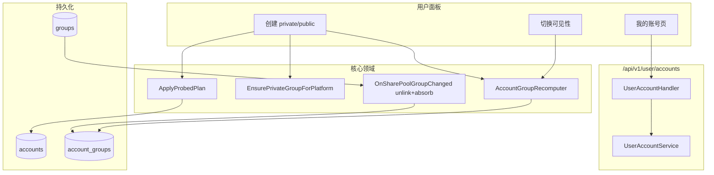
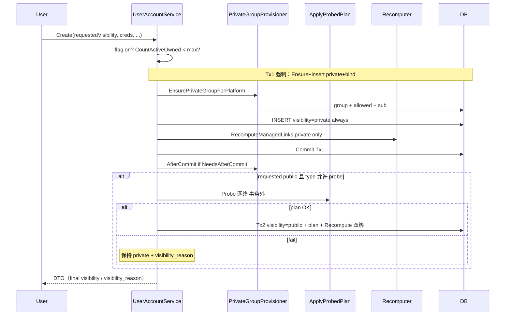

# 用户自建账号与私有/公用共享

| 字段 | 值 |
|------|-----|
| **文档标题** | 用户自建账号与私有/公用共享（User-owned Accounts + Private/Public Sharing） |
| **作者** | Sub2API Architecture / TBD |
| **日期** | 2026-07-30 |
| **状态** | Draft（已按 design review 修订 ×2） |
| **关联需求** | 普通用户可创建/管理自有上游账号；私有仅绑自有 `private-{userId}-{platform}`；公用（共享池）在私有绑基础上额外匹配 `is_share_pool` 公有组；管理端全权；计费仍为调用方（API Key 所有者）付费 |
| **相关设计** | [`private-platform-groups-provisioning.md`](./private-platform-groups-provisioning.md)、[`group-upstream-plan.md`](./group-upstream-plan.md) |

---

## Overview

Sub2API 当前上游账号（`accounts`）全部由管理端创建与绑定分组（`account_groups`），经网关「API Key → Group → Account 池」调度。用户虽已拥有按平台自动供给的私有专属订阅组 `private-{userId}-{platform}`（见私有组设计），但组内初始为空池，用户无法自行灌号；运营灌号成本高，且无法把用户贡献的账号按上游套餐档位汇入「共享池」公有组。

本设计引入 **用户自建账号（user-owned accounts）** 与 **私有/公用一维可见性**：

1. 用户在「我的账号」中创建账号（平台/鉴权最小集与管理端对齐），仅选择 **private / public**，不再多选分组。
2. 系统 **Ensure** 对应平台私有组，并 **自动探测** 上游套餐，经唯一入口 `ApplyProbedPlan` 写入 `accounts.upstream_plan`（与 `groups.upstream_plan` 同 code 体系）。
3. **private**：仅绑定 `private-{owner}-{platform}`。  
   **public**：双绑——私有组 + 所有匹配的共享池组；若选 public 但探测失败则 **强制降级 private**。
4. 创建后可双向切换 private ↔ public，触发 **managed 链接重算**；用户侧重算 **只维护** 私有组 + 共享池链接，**不碰** 管理员手工附加的非共享池组。
5. 组字段变更 **MUST Unlink+Absorb**：关池/失效卸链；**开池 / 改 plan 扫描吸入**已有匹配 public 用户号（运营先建号后勾池也能入池）。
6. 管理端列表可见全部账号（含归属用户、可见性）；用户列表严格 `owner_user_id = current user`。
7. **DeleteUser MUST** 同事务级联删除该用户全部自建账号；软删用户 **不** 触发 FK，不可依赖 `ON DELETE SET NULL`。

---

## Background & Motivation

### 现状（代码锚点）

| 能力 | 位置 | 行为 |
|------|------|------|
| 账号实体 | `backend/ent/schema/account.go` | SoftDeleteMixin；无 owner/visibility/upstream_plan 列；档位散落 credentials |
| 管理端建号 | `service/admin_account.go` `CreateAccount` / `buildAccountForCreate` | 可绑 `GroupIDs`；空则 `{platform}-default`；`SkipDefaultGroupBind` 可关；`BindGroups` 全量替换 |
| 删账号 | `account_repo.Delete` | **先硬删 `account_groups`** 再软删账号行 + scheduler outbox |
| 删用户 | `admin_user.go` `DeleteUser` | **软删** User + Revoke 私有组；**不**触发 PG `ON DELETE` |
| 分组 | `ent/schema/group.go` | 已有 `upstream_plan`、`is_exclusive`；**无** `is_share_pool` |
| 私有组守卫 | `validatePrivateGroupIdentityUpdate` | 锁 name/platform/subscription_type/is_exclusive；**未**含 is_share_pool |
| 私有组 | `service/private_group_provision.go` | `ensurePrivateGroup` unexported；`AfterCommit` 外层 tx 补 outbox |
| plan 写入 | `persistOpenAI429PlanType` 等 | **仅** credentials，无列、无 recompute |
| 凭证合并 | `MergePreservingSensitiveCreds` | Update 时敏感键保留 |
| 账号↔组 | `account_repo.BindGroups` | 全量替换 + priority=i+1 + outbox merge group IDs |
| 用户路由 | `routes/user.go` | **无** `/user/accounts` |
| Feature flag | `frontend/src/utils/featureFlags.ts` | 11 步 Adding a new flag；`PublicSettingsInjectionPayload` drift test |
| 计费 | Gateway | API Key 所有者扣费 |

### 痛点

1. 私有组空池：用户有订阅与 allowed，但选号失败直到运营绑号。
2. 用户无法安全自助贡献号源。
3. 账号 plan 与 `groups.upstream_plan` 未统一，无法按档位入池。
4. `BindGroups` 全量语义与「用户只维护 managed 子集」冲突。

### 产品结论（已锁定）

见 **Key Decisions**。

---

## Goals & Non-Goals

### Goals（v1）

1. 用户对 **自有** 账号 CRUD（字段 allowlist）、重鉴权、private/public 切换；列表仅 `owner_user_id = self`。
2. 用户创建 UI：无分组多选，仅 private/public；平台/type 白名单见下。
3. 创建前 **Ensure** 该平台私有组（单平台幂等：组 + allowed + subscription）。
4. 计划档位 **仅** `ApplyProbedPlan` 自动写入；用户不可手填；public 且探测失败 → 强制 private。
5. public **双绑**；多命中全绑。
6. 共享池候选规则（见匹配节）；`is_share_pool` 可配。
7. 事件驱动 recompute；组字段变更 **MUST** 同时覆盖 **卸链（unlink）** 与 **吸入（absorb）**（见 K13）。
8. 软上限 + feature flag（opt-in，全链路注入）。
9. 管理端：owner/visibility 过滤；用户号全权；改 visibility/plan/GroupIDs 后 **强制** recompute。
10. 计费：**caller pays**。
11. **MUST：DeleteUser 同事务级联删除全部 `owner_user_id=userID` 账号**（先账号卸链/删除 → 再 Revoke 私有组 → 再软删用户）。

### Non-Goals（v1）

- 好友/P2P 共享
- 用户手填 plan / 手选共享池目标组
- 用户列表出现 admin 账号（`owner_user_id` null）
- 用户 recompute 改动 admin 附加的 **非** share_pool 组
- 网关按 plan 再过滤调度
- 部署批量回填 owner
- 自动建 API Key
- composite / bedrock / vertex 用户自建（v1 仅 `AllowedQuotaPlatforms`）
- 用户创建 spark 影子账号
- 自动信誉/治理引擎（运营靠 admin disable / 强制 private）

---

## Key Decisions

| # | 决策 | 理由 |
|---|------|------|
| K1 | **Private/Public 为唯一共享轴** | 产品锁定；v1 不做 P2P |
| K2 | **Public = 双绑**（私有组 + 匹配共享池） | 所有者自用通道始终可用 |
| K3 | **探测失败且选 public → 强制 private** | 无 plan 无法安全匹配 |
| K4 | **权威 plan 列 `accounts.upstream_plan`** + credentials raw 审计 | 可索引、与 group 对称 |
| K5 | **`groups.is_share_pool`** admin 可配 | 显式运营意图 |
| K6 | **Plan 严格相等；任一侧空 = 不匹配** | 防 free 入 pro 池 |
| K7 | **用户 recompute 仅维护 managed 链接** | 保护 admin 非池手工绑定 |
| K8 | **用户 API 与 Admin API 分离** | AuthZ 与字段边界 |
| K9 | **用户路径禁用全量 `BindGroups`**；差分 Add/Remove | 避免抹掉 admin 绑定 |
| K10 | **Caller pays** | 与现网一致 |
| K11 | **Ensure 单平台** 复用 provisioner；角色集 = `CanProvisionPrivateGroups`（**含 admin**，与现码一致） | 避免第二套语义 |
| K12 | **`user_owned_accounts_enabled` opt-in** + 完整 11 步 flag 链路；`max_user_owned_accounts` 仅服务端 | 防菜单闪灭历史 bug |
| K13 | **组变更 Unlink+Absorb MUST**：破坏性变更对 `ListOwnerAccountsBoundToGroup` **显式** `RemoveGroups([groupID])`（**先于** recompute；不可仅靠 recompute 谓词）；建设性变更扫描匹配 public 号 `RecomputeManagedLinks` 吸入 | 关池不残号；开池不漏吸 |
| K14 | **DeleteUser 级联自建账号 = MUST**；FK `ON DELETE SET NULL` 仅硬删兜底，软删路径不依赖 FK | 安全阻断项 |
| K15 | **用户 Update 严格 allowlist**；visibility 仅专用 endpoint；禁止 group_ids/concurrency 等 | 防越权 |
| K16 | **唯一 plan 写入口 `ApplyProbedPlan`**；429/OAuth/reprobe/admin 改 creds 均委托 | 防列与 credentials 分叉 |
| K17 | **Create 强制单一 Tx1**：Ensure+insert（先 private）+首次 private 绑同事务；commit 后 `AfterCommit`；Probe 事务外；Tx2 升 public/双绑或维持 private | 无半成品、无漏 outbox |
| K18 | **Recompute 默认 GetByName only** 取私有组；禁止每次 recompute 隐式 Ensure；Ensure 仅 Create/SetVisibility 显式调用 | 避免非创建路径补 expired 订阅 |

---

## Proposed Design

### 高层架构



### 创建时序与事务边界（K17）

**Create 固定步骤（锁定，非可选）**：

1. 校验 flag + `CountActiveOwned`（事务外预检可，Tx1 内再检）。
2. **开启单一 DB Tx1**（Ensure 与 insert/bind 必须同事务；禁止「无事务 Ensure 再裸插账号」作为主路径）。
3. `EnsurePrivateGroupForPlatform`（同 Tx1）→ 得到 `group` + `ProvisionResult`。
4. **INSERT account：`visibility` 一律先写 `private`**（即使请求 public）；`upstream_plan=NULL`；apikey 请求 public 亦如此。请求的目标可见性记在内存 `requestedVisibility`。
5. `RecomputeManagedLinks`（同 Tx1）→ 至少落地 private 组绑定（GetByName，Ensure 已保证存在）。
6. **Commit Tx1**；若 `result.NeedsAfterCommit` → **必须** `AfterCommit(ctx, result)`（补 group outbox/cache）。
7. 若 `requestedVisibility==public` 且 type 允许 probe：
   - **事务外** `ProbeAndApply` 网络探测；
   - **Tx2**：成功则 `visibility=public` + `ApplyProbedPlan` + `RecomputeManagedLinks`（双绑）；失败则保持 `private` + `visibility_reason=plan_probe_failed`（已是 private，通常无需改行）。
8. Tx1 后 / Tx2 前进程崩溃：库中为 **private + 仅私有绑**（干净中间态，见下）；可重试 Create 旁路或用户再 `SetVisibility(public)` / `ReprobePlan`。
9. Tx1 内绑定失败 → **整事务回滚**（无私有组残留副作用可接受幂等；**无**账号行）。
10. Tx2 DB 硬失败 → 账号保持 private 单绑；返回明确错误；**禁止**返回假 public 双绑。



**失败语义（锁定）**：

| 阶段 | 失败 | 行为 |
|------|------|------|
| flag off / 超限 | — | 不写库；403/400 |
| Ensure 失败 | — | 不插账号；Tx1 回滚；错误向上 |
| insert 失败 | — | Tx1 回滚；私有组幂等残留可接受 |
| 绑定 private 失败 | — | **Tx1 回滚账号插入**；**不**留下无组账号 |
| Probe 网络/规范化失败 | public 请求 | 保持 `visibility=private`，`visibility_reason=plan_probe_failed`；**HTTP 201** |
| ApplyProbedPlan / recompute 硬错误（Tx2） | — | 保持 private 单绑；**5xx 或带 reason 的 201**（账号已存在）；**禁止** visibility=public 无池 |
| Tx1 已提交、Tx2 前崩溃 | — | **接受且干净**：行上为 private + 仅私有绑（K17 先插 private 策略）；无「public 无 plan」歧义 |
| 软上限竞态 | TOCTOU | Tx1 内 `CountActiveOwned` 再检；接受极低并发超 1；靠 panel 限流 |

**软上限计数**：`CountActiveOwned(ctx, userID)` = `owner_user_id=userID AND deleted_at IS NULL`（软删不计，Q4）。

**默认字段（创建）**：

- 复用 `buildAccountForCreate` 路径的 concurrency / priority / rate_multiplier / schedulable 默认（`normalizeAccountConcurrency` 等）。
- `SkipDefaultGroupBind=true`（禁止绑 `{platform}-default`）。
- `ProxyID=null`（用户不可设）。
- **混合渠道**：用户 managed 绑仅同 platform private + share pool → **跳过** `checkMixedChannelRisk`（`SkipMixedChannelCheck=true`）；admin 手工跨平台绑仍走 admin 检查。
- **禁止**用户创建 spark 影子（无 `CreateShadow` 用户入口）。

### 核心模块

#### 1. `UserAccountService`

路径：`backend/internal/service/user_account_service.go`

```go
type UserAccountService interface {
    List(ctx context.Context, userID int64, page, pageSize int, filters UserAccountListFilters) ([]Account, int64, error)
    Get(ctx context.Context, userID, accountID int64) (*Account, error)
    Create(ctx context.Context, userID int64, input *CreateUserAccountInput) (*Account, error)
    Update(ctx context.Context, userID, accountID int64, input *UpdateUserAccountInput) (*Account, error)
    Delete(ctx context.Context, userID, accountID int64) error
    SetVisibility(ctx context.Context, userID, accountID int64, visibility string) (*Account, error)
    RefreshCredentials(ctx context.Context, userID, accountID int64) (*Account, error)
    ReprobePlan(ctx context.Context, userID, accountID int64) (*Account, error)
}

type CreateUserAccountInput struct {
    Name        string
    Platform    string // AllowedQuotaPlatforms
    Type        string // 见 type 白名单
    Credentials map[string]any
    // Extra：v1 用户创建忽略或仅允许空 map（禁止运营向 extra 灌配额键）
    Visibility  string // private|public
    // 禁止：GroupIDs, ProxyID, Concurrency, Priority, RateMultiplier, UpstreamPlan, OwnerUserID
}

// Update 白名单（K15）——仅下列字段可被用户写入
type UpdateUserAccountInput struct {
    Name         *string           // 可选改名
    Credentials  map[string]any    // 合并：MergePreservingSensitiveCreds
    Status       *string           // 仅 "active" | "disabled"（禁止 error 等系统态）
    // 显式禁止（handler 丢弃/400）：group_ids, proxy_id, concurrency, priority,
    // rate_multiplier, load_factor, owner_user_id, upstream_plan, visibility,
    // schedulable, extra（v1 整包禁止用户改 extra；重鉴权走 Refresh/credentials）
}
```

**type / platform 白名单（创建）**：

| platform | 允许 type | public 探测 |
|----------|-----------|-------------|
| openai | `oauth`（含 PAT 模式 credentials） | 尝试 probe；见 ProbeOpenAI |
| openai | `apikey` | **禁止 public**（请求 public → 强制 private + reason `plan_probe_unsupported`） |
| grok | `oauth` | probe |
| antigravity | `oauth` | probe |
| anthropic | `oauth` / `setup-token` / `apikey`（与 admin 最小对齐） | v1 probe 失败 → public 降 private |
| gemini | `oauth` / `apikey` | 同上 |
| 其它 / composite / bedrock / vertex | **拒绝创建** | — |

**Delete**：`UserAccountService.Delete` **必须**调用与 `AdminService.DeleteAccount` **相同**仓库路径（`account_repo.Delete`：硬删 `account_groups` + 软删账号 + outbox）。用户号 v1 **不允许**存在 spark 影子；若误有 parent 关系，沿用 admin 删除级联策略或拒绝（实现选与 admin 一致）。

**AuthZ**：非 owner → **404**。

#### 2. `AccountGroupRecomputer` + 组变更 Unlink/Absorb（K13）

路径：`backend/internal/service/account_group_recompute.go`

**Desired managed**（K18：Get only，无副作用 Ensure）：

```text
desiredManaged(account):
  if owner_user_id == null: return ∅   // 系统号不跑用户 managed 算法
  private = groupRepo.GetByName(PrivateGroupName(owner, platform))  // 仅 Get
  if private == nil:
    // 不在此 Ensure。记录 observability: private_group_missing
    // 仍可 toRemove 全部 currentManaged share_pool 链接；toAdd 不含 private
    privateID = ∅
  else:
    privateID = {private.ID}
  if visibility != public OR upstream_plan == "":
    return privateID
  return privateID ∪ ListSharePoolMatches(platform, upstream_plan)
```

**谁负责 Ensure 私有组**（禁止 recompute 隐式 Ensure）：

| 路径 | Ensure？ |
|------|----------|
| `UserAccountService.Create` | **是**（Tx1 内显式 `EnsurePrivateGroupForPlatform`） |
| `UserAccountService.SetVisibility` → public | **是**（若 GetByName 缺失则 Ensure，再 recompute） |
| `ApplyProbedPlan` / 429 / OAuth refresh / admin BindGroups 后 recompute | **否**；Get 缺失则 log + 仅卸 share_pool managed 绑，**不**新建组/订阅 |
| `OnSharePoolGroupChange` absorb 扫描后的 recompute | **否**（同上） |

可选后续：运营 backfill API 补私有组；v1 不在 recompute 热路径 heal。

**常规差分**（用户 toggle / plan 变化 / absorb 扫描命中）：

```text
current = load account_groups for account
// currentManaged 谓词（仅用于「仍标记为系统托管」的链接）：
//   - 该 owner 的 private 组，或
//   - 当前 is_share_pool==true 且同 platform 的组
currentManaged = filter(current, isCurrentlyManagedPredicate)
desired = desiredManaged(account)
toAdd = desired - current
toRemove = currentManaged - desired
// 保留 current - currentManaged（admin 绑在非 share_pool 组上的链接）
AddGroups(toAdd); RemoveGroups(toRemove); outbox
```

**组字段变更统一入口 `OnSharePoolGroupChange`（MUST）**

`UpdateGroup` / `DeleteGroup` / `DeleteCascade` 在以下 **任一** 字段实际变化（或删除）时调用：

| 字段 / 事件 | 说明 |
|-------------|------|
| `is_share_pool` | false↔true 均触发 |
| `upstream_plan` | 空↔有、值变更均触发 |
| `platform` | 变更 |
| `status` | active↔非 active |
| 组删除 / DeleteCascade | 触发 |

**两步语义（锁定 MUST）**：

```text
OnSharePoolGroupChange(group, before, after):  // after=nil 表示删除
  groupID := group.ID  // 删除前仍用旧 ID；DeleteCascade 可能已清 account_groups

  // —— Step A: Unlink path（破坏性，MUST 显式 RemoveGroups）——
  // 不可仅靠后续 RecomputeManagedLinks：当 is_share_pool true→false 或
  // status 非 active 后，isCurrentlyManagedPredicate 不再命中该组，
  // currentManaged 不含 groupID → toRemove 为空 → 绑定残留。
  needsForcedUnlink := after == nil
    || !isSharePoolCandidate(after)   // 含 is_share_pool=false / 非 active / exclusive / private 名 / plan 空
    || (before != nil && after.Platform != before.Platform)

  boundOwnerAccounts := []
  if needsForcedUnlink || (before != nil && before.IsSharePool):
    // 凡仍绑定该 group 的用户自建号；删除场景若 account_groups 已空则列表为空，Remove 幂等
    boundOwnerAccounts = ListOwnerAccountsBoundToGroup(groupID)
    for each acc in boundOwnerAccounts:
      RemoveGroups(acc.ID, [groupID])   // MUST：不依赖 recompute 谓词；幂等

  // —— Step B: Absorb path（建设性，MUST）——
  absorbCandidates := ∅
  if after != nil && isSharePoolCandidate(after):
    absorbCandidates = ListAccounts(
      owner_user_id IS NOT NULL
      AND visibility = 'public'
      AND platform = after.Platform
      AND upstream_plan = after.UpstreamPlan   -- 严格相等
      AND deleted_at IS NULL
    )

  // —— Step C: 合并受影响集合并 recompute（补 private / 其它池；plan 变更时卸旧吸新）——
  affected := unique(boundOwnerAccounts ∪ absorbCandidates)
  if before != nil && after != nil && before.Platform != after.Platform && before.UpstreamPlan != "":
    affected ∪= ListAccounts(public, platform=before.Platform, plan=before.UpstreamPlan, owner not null)
  if before != nil && after != nil && before.UpstreamPlan != after.UpstreamPlan && before.IsSharePool:
    affected ∪= ListAccounts(public, platform=before.Platform, plan=before.UpstreamPlan, owner not null)

  for each acc in affected:
    RecomputeManagedLinks(acc)
    // GetByName only；desired 可 Add 其它仍匹配的池 / 补 private。
    // 注意：关池场景下该 groupID 的卸链已由 Step A 完成；recompute 不得假设
    // 「currentManaged 仍含已取消 share_pool 的组」。

  outbox for groupID ∪ all touched group IDs
```

**顺序硬约束**：Step A `RemoveGroups` **必须先于** Step C `RecomputeManagedLinks`。实现评审门禁：禁止「只收集 boundOwnerAccounts 再 recompute」而无 `RemoveGroups` 调用。

**`isSharePoolCandidate(g)`**：与共享池匹配节相同谓词（`is_share_pool && !is_exclusive && status=active && !IsPrivateGroupName && platform 匹配上下文 && upstream_plan 非空`）。

**为何 Unlink 必须显式 `RemoveGroups`（不可只 recompute）**：

| 场景 | 仅 recompute？ | 正确做法 |
|------|----------------|----------|
| `is_share_pool` true→false | **错误**：谓词不再认该组为 managed → toRemove 空 → **残留** | Step A `RemoveGroups([groupID])` |
| status active→disabled | 同上 | Step A |
| 组删除 | Cascade 可能已清行；`RemoveGroups` 幂等 | Step A + 幂等 |
| 仍 share_pool 仅 plan 变 | recompute 可 toRemove（谓词仍命中） | Step A 对已绑号仍可先卸再 recompute（统一实现）或仅 recompute；**推荐与关池同一强制卸链路径**以免分叉 |
| false→true 开池 | recompute 不负责吸入未绑号 | Step B Absorb 扫描 |

**为何 Absorb 必须扫描而非只靠「已绑定」集合**：

- 运营顺序常为：用户先建 public 号（当时无池）→ 后勾选 `is_share_pool` / 填写 `upstream_plan`。
- 仅 Unlink 或仅对已绑定账号 recompute **不会**把存量匹配号吸入新池。
- Absorb 扫描用索引 `idx_accounts_public_plan`（platform, upstream_plan）。

**单测 MUST**：

1. `is_share_pool true→false` → public 用户号 **account_groups 无该 groupID**；admin 绑在 **非** share_pool 组上的链接保留。  
   - 单元：mock/spy 断言 **`RemoveGroups` 被调用**（即使 `RecomputeManagedLinks` 被 stub 为空操作，绑定仍应通过 RemoveGroups 删除；或集成直接查表）。
2. **`is_share_pool false→true`** + 组 `upstream_plan=plus` + 已有 public/`plus` 用户号 → **出现**该组绑定（Absorb）。
3. 组 `upstream_plan` 设为 `plus` → 匹配 plus 的 public 号入池；`team` 号不入。
4. 组 plan `plus`→`team` → plus 号卸链、team 号吸入。
5. 用户 toggle private → 所有 share_pool 链接移除，private 保留。
6. Recompute 在私有组缺失时 **不** 调用 Ensure（spy/mock）。
7. 关池路径：**禁止**仅调用 recompute 而无 `RemoveGroups`（代码审查/单测门禁）。

#### 3. 仓库：`AddGroups` / `RemoveGroups` / List / Count

`AccountRepository` 增量：

```go
// 幂等：已存在则 no-op（ON CONFLICT DO NOTHING 或先查）
AddGroups(ctx context.Context, accountID int64, groupIDs []int64) error
// 幂等：不存在则 no-op
RemoveGroups(ctx context.Context, accountID int64, groupIDs []int64) error

CountActiveOwned(ctx context.Context, ownerUserID int64) (int64, error)

// 扩展过滤（替换或包装现 ListWithFilters）
ListWithFilters(ctx, params, AccountListFilters) ([]Account, *pagination.PaginationResult, error)

type AccountListFilters struct {
    Platform, Type, Status, Search string
    GroupID int64
    PrivacyMode string
    OwnerUserID *int64      // admin 过滤；user 列表强制 = me
    Visibility  string      // "", private, public
    UpstreamPlan string     // 可选
}
```

**priority**：`AddGroups` 对新建行使用 `COALESCE(MAX(priority),0)+1` 按 account 维度递增；若全空则从 1 开始。不重排已有行。

**outbox**：对齐 `BindGroups`——payload 含 **变更前+变更后** 相关 group IDs（`mergeGroupIDs(existing, added|removed)`），事件 `SchedulerOutboxEventAccountGroupsChanged`。

**admin list `owner_email`**：`ListWithFilters` 返回后按 `owner_user_id` **批量** `userRepo.GetByIDs`，禁止 N+1；或 SQL left join users（实现二选一，推荐批量）。

#### 4. 共享池匹配

```sql
WHERE is_share_pool = true
  AND is_exclusive = false
  AND status = 'active'
  AND deleted_at IS NULL
  AND platform = $1
  AND upstream_plan = $2          -- 严格；NULL/'' 不命中
  AND name NOT LIKE 'private-%'   -- 或应用层 IsPrivateGroupName 排除
```

索引：

```sql
CREATE INDEX CONCURRENTLY IF NOT EXISTS idx_groups_share_pool_match
  ON groups (platform, upstream_plan)
  WHERE deleted_at IS NULL AND is_share_pool = true AND status = 'active';
```

#### 5. `ApplyProbedPlan`（K16 唯一写入口）

路径：`backend/internal/service/upstream_plan_probe.go`

```go
// ApplyProbedPlan 是 accounts.upstream_plan 与 credentials 中 plan 类字段的唯一持久化入口。
// 1) Normalize(platform, raw) → code 或 fail
// 2) 原子更新 accounts.upstream_plan + credentials raw 键
// 3) 若 owner_user_id != nil 且 (plan 或需 recompute 的 visibility 上下文) 变化 → RecomputeManagedLinks
func ApplyProbedPlan(ctx context.Context, accountID int64, platform, raw string) (normalized string, err error)

// ProbeAndApply：按平台拉远程/解码 → ApplyProbedPlan
func ProbeAndApply(ctx context.Context, account *Account) (normalized string, err error)
```

**强制挂钩**（实现清单）：

| 现有路径 | 改造 |
|----------|------|
| `persistOpenAI429PlanType` | 改为调用 `ApplyProbedPlan`（禁止只 BulkUpdate credentials） |
| OpenAI/Grok/Antigravity OAuth refresh 持久化 | BuildCredentials 后 `ApplyProbedPlan` |
| User `ReprobePlan` / Create probe | 同上 |
| Admin `UpdateAccount` 若 credentials 含 plan 类键变化 | 检测后 `ApplyProbedPlan`；若手填 `upstream_plan` 字段则 **仅 admin** 允许并随后 recompute |

##### ProbeOpenAI 优先序（与 `openai_oauth_service` / enrichTokenInfo 对齐）

```text
ProbeOpenAI(account):
  if type == apikey: return fail(unsupported)  // 创建时已强制 private
  raw := firstNonEmpty(
    decodeIDToken(credentials.access_token|id_token).chatgpt_plan_type,  // 个人档权威
    credentials["plan_type"],
    credentials["chatgpt_plan_type"],
  )
  // 可选：whoami / accounts/check —— 仅当 raw 仍空时采用；
  // 且若 check 返回 workspace 类（如 self_serve_business_usage_based）且 ∉ group_upstream_plans[openai]
  // → 视为 fail（不写入未知 code），除非运营在设置中显式增加该 code
  if raw == "": return fail
  code := Normalize(raw)  // ToLower TrimSpace
  if code not in GetGroupUpstreamPlans("openai") codes:
    return fail  // 产品句：未配置的脏字符串不入池，public 降 private
  return ApplyProbedPlan(..., code as raw normalized)
```

429 路径：从 body 取 `plan_type` → **仅** `ApplyProbedPlan`（写列 + creds + recompute）。

##### 其它平台映射

| 平台 | 源 | code |
|------|----|------|
| grok | billing.plan / `subscription_tier` | free/basic/supergrok/supergrokheavy；∈ 设置则保留；否则 fail |
| antigravity | LoadCodeAssist PlanType | free→free-tier；pro→g1-pro-tier；ultra→g1-ultra-tier |
| anthropic / gemini | v1 无稳定 API | fail → public 降 private |

#### 6. Ensure 单平台（AfterCommit 契约）

```go
// 扩展 PrivateGroupProvisioner
EnsurePrivateGroupForPlatform(ctx context.Context, userID int64, platform string) (
    group *Group,
    result *ProvisionResult, // 可仅含本平台 Created/Ensured IDs + NeedsAfterCommit
    err error,
)
```

规则：

- 内部复用 `ensurePrivateGroup` + `AddGroupToAllowedGroups` + `EnsureSubscriptionWithExpiresAt`（与全量 provision 单次循环体一致）。
- 角色：`CanProvisionPrivateGroups`（**user 与 admin**，与现码一致）。
- **无外层 tx**：Create 后立即 enqueue outbox / cache（与现 `groupRepo.Create` 一致）。
- **有外层 tx**：`result.NeedsAfterCommit=true`，调用方 **必须** `AfterCommit(ctx, result)`（与 `ProvisionPrivatePlatformGroups` 相同）。
- `ResolvePrivateGroupExpiresAt` 未配置：现码 `expires_at=now` → 订阅可能 **expired**。  
  **Ensure 仍成功（不阻断建号）**；用户绑 Key 后若订阅鉴权失败，前端/API 错误沿用现订阅过期语义。创建账号响应可带 `private_subscription_status` hint（可选）。运营应配置 `private_group_expires_date`。

#### 7. 管理端 AuthZ 矩阵（K 补全）

| 操作 | Admin | 用户 |
|------|-------|------|
| 列表/过滤 owner、visibility | ✅ | 仅自己 |
| CRUD 用户号字段（含 concurrency 等） | ✅ 全权（现 UpdateAccount） | allowlist only |
| 改 `owner_user_id` / 转让 | **忽略/拒绝**（400 `OWNER_IMMUTABLE`）；v1 无 transfer | — |
| 改 `visibility` | ✅ 后 **强制** `RecomputeManagedLinks` | 仅 `PUT .../visibility` |
| 手填 `upstream_plan` | ✅ 后 **强制** recompute（仍建议走 ApplyProbedPlan 形态） | 禁止 |
| `BindGroups` 全量 | ✅ **之后强制** `RecomputeManagedLinks`：恢复 desired managed（至少私有组 + public 池），**不会**用 recompute 删掉 admin 放在非 share_pool 组上的绑定；但会补回被误删的 private 绑 | 禁止 group_ids |
| disable / 强制 private | ✅ 运营下架路径 | 仅 disabled 自己的号 |
| 勾选 is_share_pool | ✅；PR1 仅元数据直至 PR2a recompute 就绪 | — |

**Admin BindGroups 后 recompute 语义（锁定）**：以「desired managed ∪ (current − share_pool managed 谓词外的链接)」为最终态——即 recompute **补全** managed，**保留** admin 非池绑定；若 admin 故意从 private 组解绑，recompute **会补回** private 绑（产品：用户号私有通道不可被长期拆掉，除非删号）。若未来需要 admin「剥离私有通道」，另开决策。

#### 8. DeleteUser 级联（MUST / K14）

`DeleteUser` 事务顺序：

```text
1. List accounts WHERE owner_user_id=userID AND deleted_at IS NULL
2. For each: accountRepo.Delete (硬删 account_groups + 软删 account + outbox)
   // 共享池与私有组绑定一并消失
3. RevokePrivatePlatformGroups(userID)
4. Soft-delete user (+ 现有 API Key 等)
5. AfterRevokeCommit / account outbox 按现模式 post-commit
```

- **禁止**仅依赖 `ON DELETE SET NULL`（软删用户不触发）。
- FK 仍设 `ON DELETE SET NULL` 仅作 **硬删 users 行** 的兜底，文档与注释写明。
- 集成测：**删用户后** `ListSchedulableByGroupID(sharePoolGroup)` **不含**该用户号。

### 网关 / 计费

无选号算法变更。public 号入池后 caller pays。

**运营滥用**：admin 可 `status=disabled` 或强制 `visibility=private` + recompute；可调低 concurrency。v1 无自动信誉。

---

## API / Interface Changes

### 用户 API

`routes/user.go`，JWT + BackendModeUserGuard + panel rate limit + audit。

| Method | Path | 说明 |
|--------|------|------|
| GET | `/api/v1/user/accounts` | 仅 owner=me |
| GET | `/api/v1/user/accounts/:id` | 非 owner 404 |
| POST | `/api/v1/user/accounts` | 无 group_ids；见 Create 白名单 |
| PUT | `/api/v1/user/accounts/:id` | Update allowlist |
| DELETE | `/api/v1/user/accounts/:id` | 同 Admin DeleteAccount 路径 |
| PUT | `/api/v1/user/accounts/:id/visibility` | `{visibility}`；public 时若 plan 空则 Probe |
| POST | `/api/v1/user/accounts/:id/refresh` | 重鉴权 |
| POST | `/api/v1/user/accounts/:id/reprobe-plan` | 手动探测 |

flag off → `USER_OWNED_ACCOUNTS_DISABLED` 403。  
超限 → `USER_ACCOUNT_LIMIT_EXCEEDED` 400。

响应含：`visibility`、`visibility_reason?`、`upstream_plan`、`owner_user_id`、`group_ids`（仅自己的）、redacted credentials。

### 管理端增量

- ListAccounts：`owner_user_id`、`visibility` query；DTO + owner_email 批量填充。
- Groups：`is_share_pool`；Update/Delete 触发 `OnSharePoolGroupChange`（Unlink+Absorb MUST）。
- Settings：见下。

---

## Data Model Changes

### accounts

```sql
ALTER TABLE accounts
  ADD COLUMN IF NOT EXISTS owner_user_id BIGINT NULL REFERENCES users(id) ON DELETE SET NULL,
  ADD COLUMN IF NOT EXISTS visibility VARCHAR(16) NULL,
  ADD COLUMN IF NOT EXISTS upstream_plan VARCHAR(64) NULL;

-- 软删用户不触发 FK；级联靠 DeleteUser 应用逻辑（K14）

CREATE INDEX IF NOT EXISTS idx_accounts_owner_user_id
  ON accounts (owner_user_id)
  WHERE deleted_at IS NULL AND owner_user_id IS NOT NULL;

CREATE INDEX IF NOT EXISTS idx_accounts_owner_visibility
  ON accounts (owner_user_id, visibility)
  WHERE deleted_at IS NULL AND owner_user_id IS NOT NULL;

CREATE INDEX IF NOT EXISTS idx_accounts_public_plan
  ON accounts (platform, upstream_plan)
  WHERE deleted_at IS NULL AND visibility = 'public' AND owner_user_id IS NOT NULL;
```

不变量：`owner IS NULL ⇔ visibility IS NULL`；owner 非空 ⇒ visibility ∈ {private,public}。

### groups

```sql
ALTER TABLE groups
  ADD COLUMN IF NOT EXISTS is_share_pool BOOLEAN NOT NULL DEFAULT FALSE;
```

**守卫**：

- 扩展 `validatePrivateGroupIdentityUpdate`：`IsSharePool==true` → 400。
- `CreateGroup`：若 `IsPrivateGroupName(name)` → 拒绝或强制 `is_share_pool=false` 且建议直接 400 禁止手建 private 名（与现网私有组保护一致，优先 **400**）。
- `buildPrivateGroup` 显式 `IsSharePool=false`。

### Settings + Feature flag 全链路（K12）

| Key | 公开? | 默认 | 说明 |
|-----|-------|------|------|
| `user_owned_accounts_enabled` | **是** PublicSettings | **false** opt-in | 用户菜单/路由/API |
| `max_user_owned_accounts` | **否** 仅 SystemSettings | `10` | 服务端 Create 校验；`<=0` 禁止用户创建 |

**`user_owned_accounts_enabled` 必须走 `featureFlags.ts` 11 步清单**（实现检查清单逐条打勾）：

1. `domain_constants.go` → `SettingKeyUserOwnedAccountsEnabled`
2. `settings_view.go` → `PublicSettings` + `SystemSettings`
3. `setting_service.go` → Get/Update/GetAll/InitDefault/**`PublicSettingsInjectionPayload`**
4. `handler/dto/settings.go` → Public + System
5. `handler/setting_handler.go` 响应
6. `handler/admin/setting_handler.go` update + audit + **`OmittedSettingKeys`**
7. `frontend/types` PublicSettings
8. `frontend/api/admin/settings.ts`
9. `featureFlags.ts` → `defineFlag({ mode: 'opt-in' })`
10. `SettingsView.vue` Toggle
11. `AppSidebar.vue` → `makeSidebarFlag`

Drift test：`public_settings_injection_schema_test.go` 必须覆盖新字段。

**PR 约束**：enabled 的 **public 注入不晚于** 任一用户入口（PR3 API 或 PR5 菜单）合并。

### 服务模型

```go
// Account
OwnerUserID *int64
Visibility  string
UpstreamPlan string

// Group
IsSharePool bool
```

---

## 前端设计

### 用户「我的账号」

- 页：`views/user/MyAccountsView.vue`；路由 `/my-accounts`
- 侧栏 + `makeSidebarFlag(FeatureFlags.userOwnedAccounts)`
- API：`api/userAccounts.ts`

**PR5 范围（收窄，防 Modal 抽取拖垮）**：

- 列表 + 删除 + visibility 切换 + 状态
- 创建 **最小路径**：平台白名单 + **粘贴 token / apikey** 表单 + private/public；**不**阻塞于完整 OAuth 向导
- OAuth 向导：**PR5b / PR6**（blocked）；PR5 验收标准写明「无 OAuth 回调仍可用 apikey/粘贴 oauth token 创建」

### 管理端

- Accounts 过滤 owner/visibility；列 owner_email、visibility、upstream_plan
- Groups：`is_share_pool` checkbox + 徽章；hint：共享池应填 upstream_plan
- Settings：enabled + max

---

## Alternatives Considered

| 方案 | 结论 |
|------|------|
| A1 用户多选分组 | 拒绝：越权面 |
| A2 public 不绑私有 | 拒绝：自用通道不稳 |
| A3 命名约定当共享池 | 拒绝：脆弱 |
| A4 模糊 plan 匹配 | 拒绝：误入池 |
| A5 用户全量 BindGroups | 拒绝：抹 admin 绑 |
| A6 独立共享关系表 | v1 拒绝：调度大改；关池用 forcedRemove 即可 |
| **A7 异步周期 probe vs 创建时同步** | **v1 选同步 probe**：public 决策即时降级；异步仅作后续补探测增强 |
| A8 仅读 credentials 不落列 | 拒绝：见 K4 |

---

## Security & Privacy

| 威胁 | 严重度 | 缓解 |
|------|--------|------|
| 枚举他人账号 | 高 | 用户 API owner 过滤；404 |
| 绑到任意组 | 高 | 禁止 group_ids；仅 managed 规则 |
| 凭据泄露 | 高 | RedactCredentials；audit omit body |
| 刷号占上限 | 中 | 软上限 + panel 限流 |
| **删用户后共享池残留号** | **高** | **DeleteUser MUST 级联删自建账号**（K14）；集成测 |
| 关池后仍调度 | 高 | K13 Unlink path |
| 开池后存量 public 号不入池 | 高 | K13 Absorb path MUST + 索引扫描 |
| 恶意 public 污染池 | 中 | admin disable / 强制 private + recompute；调 concurrency |
| 软删 FK 误判 | 中 | 文档明确软删不走 FK |
| 改 concurrency/rate 套利 | 中 | 用户 Update allowlist 禁止 |

---

## Observability

事件：`user_account_create`、`user_account_visibility`、`account_group_recompute`、`share_pool_group_force_unlink`、`upstream_plan_probe`、`user_account_delete_cascade_on_user_delete`。

---

## Rollout Plan

1. 迁移 + flag 默认 false（PR1）。
2. PR2a recompute/卸链；PR2b probe 挂钩。
3. PR3 用户 API + **DeleteUser 级联 MUST** + flag injection。
4. PR4 admin UI。
5. PR5 最小用户 UI；开 flag 灰度。
6. 回滚：关 flag；已有绑定保留；可选脚本 public→private recompute。

---

## Risks

| 风险 | 严重度 | 缓解 |
|------|--------|------|
| 用户路径误用 BindGroups | 高 | 单测门禁 + code review |
| 关池卸链 / 开池吸入遗漏 | 高 | K13 Unlink+Absorb + 单测 |
| 软删用户漏级联 | 高 | K14 MUST + 集成测 |
| plan 双写分叉 | 中 | 唯一 ApplyProbedPlan |
| PR2/PR5 过大 | 中 | 已拆 PR2a/2b、PR5 最小创建 |
| anthropic/gemini public 名存实亡 | 低 | 接受；UI 提示易降级 |

---

## Open Questions（已决议）

| # | 问题 | 决议 |
|---|------|------|
| Q1 | 用户可选 proxy？ | **否**（v1 不暴露 proxy 选择） |
| Q2 | 用户平台范围 | **AllowedQuotaPlatforms only** |
| Q3 | 组变更 recompute 同步 vs outbox | **v1 同步**；超时再 outbox |
| Q4 | 软删计上限？ | **不计**（仅 active 未软删账号计 `max_user_owned_accounts`） |
| Q5 | 转让 owner？ | **v1 API 拒绝** |

---

## 测试计划

1. Create private → 仅 private 组；行上 visibility 始终先 private 再视 Tx2 升级。
2. Create public + plan + 2 池 → Tx2 后双绑。
3. Create public + probe fail → 保持 private。
4. Toggle / plan 变化差分。
5. **`is_share_pool true→false` 卸链**；admin 非池绑定保留。
6. **`is_share_pool false→true` Absorb**：存量匹配 public 号入池。
7. **组 `upstream_plan` 变更**：匹配号吸入、不匹配不入、旧 plan 号卸链。
8. **DeleteUser 后共享池无该用户号**。
9. 非 owner 404；超限 400；flag off 403。
10. Normalize 表；429 → 列更新 → recompute。
11. Update allowlist 拒绝 group_ids/concurrency。
12. Recompute 失败不返回假 public；recompute **不**隐式 Ensure。
13. AddGroups 幂等；outbox merge IDs。
14. Create Tx1 后 **AfterCommit**；Ensure 外层 tx 契约。
15. Private 组 is_share_pool=true → 400。

---

## References

- `docs/design/private-platform-groups-provisioning.md`
- `docs/design/group-upstream-plan.md`
- `backend/internal/service/private_group_provision.go`
- `backend/internal/service/admin_account.go`（Create/Delete/BindGroups）
- `backend/internal/repository/account_repo.go`（BindGroups / Delete）
- `backend/ent/schema/mixins` SoftDeleteMixin
- `frontend/src/utils/featureFlags.ts`（Adding a new flag 11 步）
- `backend/internal/handler/dto/public_settings_injection_schema_test.go`
- `MergePreservingSensitiveCreds`、`validatePrivateGroupIdentityUpdate`

---

## PR Plan

### PR1 — Schema & 模型 & flag 骨架

- **标题**：`feat(accounts): owner/visibility/upstream_plan + groups.is_share_pool + settings keys`
- **影响**：migration 193+；Ent；service/DTO 字段；Group Create/Update 读写 `is_share_pool` + private 守卫扩展；Settings keys + Omitted + **PublicSettingsInjectionPayload 字段**（enabled）；InitDefault false；repo `AccountListFilters`/`CountActiveOwned` 骨架可同 PR 或 PR2a。
- **依赖**：无（接 192）
- **Release note**：**`is_share_pool` 在 PR2a 前仅为元数据，勾选不会吸号/卸链**。

### PR2a — 差分绑定 + Recomputer + Ensure + Unlink/Absorb

- **标题**：`feat(accounts): managed group recompute with share-pool unlink and absorb`
- **影响**：Add/RemoveGroups + priority/outbox；Recomputer（GetByName only）；`OnSharePoolGroupChange` **Unlink+Absorb MUST**；`EnsurePrivateGroupForPlatform` + AfterCommit；Group Update/Delete 触发；单测关池卸链 + 开池/改 plan 吸入。
- **依赖**：PR1

### PR2b — ApplyProbedPlan + 平台 probe + 现网挂钩

- **标题**：`feat(accounts): ApplyProbedPlan and probe hooks`
- **影响**：upstream_plan_probe；映射表；`persistOpenAI429PlanType`/OAuth refresh 委托；单测 429→列→差分。
- **依赖**：PR2a

### PR3 — 用户 API + DeleteUser 级联 MUST

- **标题**：`feat(user): user-owned accounts API and delete-user cascade`
- **影响**：UserAccountService/Handler/routes/Wire；allowlist；flag 服务端校验；**DeleteUser 级联自建账号 MUST**；集成测共享池清空；OAuth 可先 credentials 提交。
- **依赖**：PR2a+PR2b；**injection 已在 PR1 具备**
- **说明**：用户 OAuth 回调非本 PR 阻塞。

### PR4 — 管理端 UI

- **标题**：`feat(admin): share-pool UI and account owner filters`
- **影响**：Accounts/Groups/Settings UI；i18n；admin BindGroups 后 recompute 已在 PR2a 服务层。
- **依赖**：PR1+PR2a

### PR5 — 用户最小 UI

- **标题**：`feat(user): My Accounts page (minimal create)`
- **影响**：列表/visibility/apikey·粘贴 token 创建；sidebar flag；**无**完整 OAuth 向导。
- **依赖**：PR3
- **验收**：无 OAuth 回调可完成 apikey/token 创建与 private/public。

### PR5b/PR6 — 用户 OAuth 向导 + 可选异步 recompute

- **依赖**：PR5
- **说明**：CreateAccountModal 抽取放此，避免拖垮 PR5。

---

## 实现检查清单

- [ ] Migration accounts 三列 + groups.is_share_pool + 索引
- [ ] Ent + service/DTO
- [ ] Feature flag **11 步** + drift test + OmittedSettingKeys
- [ ] max_user_owned_accounts 仅 SystemSettings
- [ ] Add/RemoveGroups priority/幂等/outbox
- [ ] Recomputer（**GetByName only**，无隐式 Ensure）
- [ ] **OnSharePoolGroupChange**：破坏性变更 **先** `RemoveGroups([groupID])` **再** recompute；Absorb 扫描吸入
- [ ] ApplyProbedPlan + 全部挂钩
- [ ] EnsurePrivateGroupForPlatform + AfterCommit；Create **强制 Tx1** 后 AfterCommit
- [ ] Create 先 insert private，Tx2 再升 public（K17）
- [ ] validatePrivateGroupIdentityUpdate 含 is_share_pool
- [ ] UserAccountService allowlist + routes
- [ ] **DeleteUser 级联 MUST** + 集成测
- [ ] Admin list filters + owner_email 批量
- [ ] Admin BindGroups/visibility/plan 后 recompute
- [ ] 用户 MyAccounts 最小创建 + sidebar
- [ ] 测试计划 1–15
- [ ] PR1 release note：share_pool 元数据直至 PR2a

---

**文档路径**：`docs/design/user-owned-shared-accounts.md`
