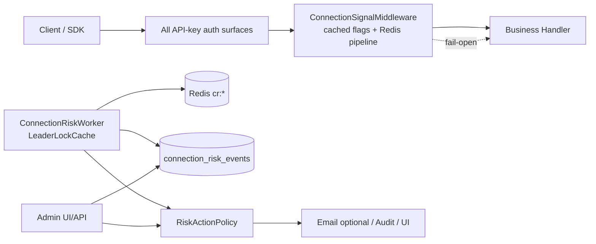
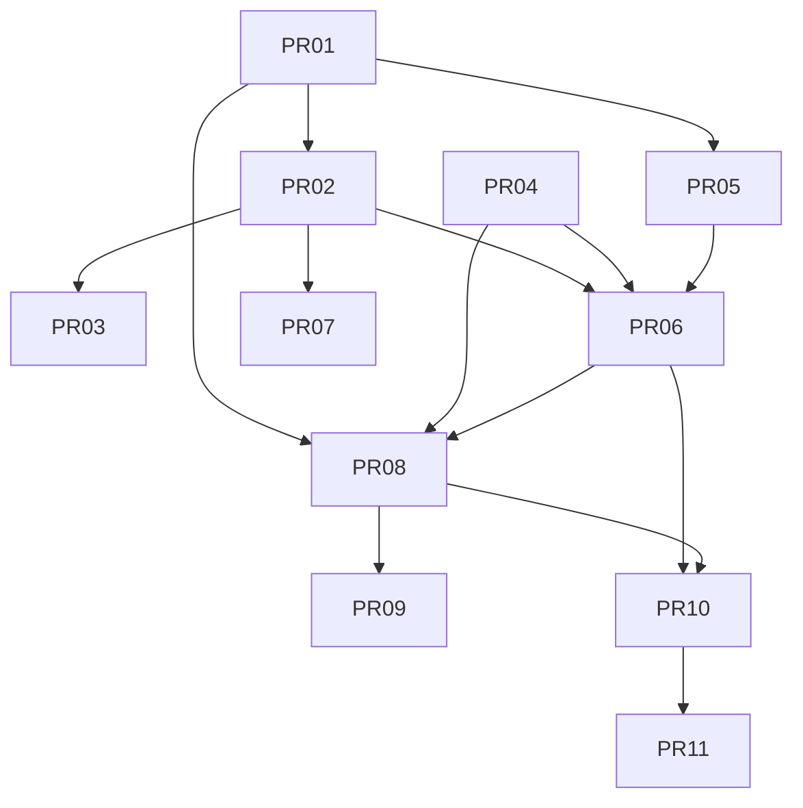

# 异常用户连接检测（方案 B）— 设计文档

| 字段 | 内容 |
|------|------|
| **Title** | Abnormal User Connection Detection (方案 B: Redis real-time signals + async scoring) |
| **Author** | TBD |
| **Date** | 2026-07-28 |
| **Status** | Draft |
| **Version** | **0.2.3**（R2 `uas:1h` 改为时间戳 ZSET 滑动 1h 窗；禁止累积 SET / 随机裁剪权威集） |
| **Audience** | 高级工程师 / 技术负责人 / 运维负责人 |
| **Product choice** | **B 锁定**：热路径仅写 Redis 信号；异步 Worker 聚合评分；MVP 默认只通知不自动封禁 |
| **Workspace** | `/home/wusixian/Downloads/sub2api修bug` |

---

## Overview

Sub2API 是 AI API 网关与订阅配额分发平台（Go + Vue + PostgreSQL + Redis）。运营方需要识别：

- **API Key 共享/倒卖**：单 Key 短时间出现大量 IP / UA
- **凭据泄露**：稳定使用突然多源并发（Phase B 基线；MVP 用绝对阈值近似）
- **Bot 群 / 多源并发滥用**：IP 爆炸 + 用户并发饱和（含 live 槽位）
- **面板会话劫持信号**：`session_binding` 指纹不匹配 + API 侧多 IP

**方案 B**：鉴权成功后同步写 Redis 连接信号（fail-open）→ `ConnectionRiskWorker`（默认 120s，leader 选举）聚合评分 → `connection_risk_events` → `RiskActionPolicy`（MVP **notify-only**）→ Admin API/UI。

热路径 **禁止** 写 PostgreSQL、**禁止** 直读 settings 仓储；Redis/设置读取失败 **fail-open**（不阻断 API）。



---

## Background & Motivation

### 当前能力（可复用，已核对代码）

| 能力 | 路径 / 标识 | 与本方案关系 |
|------|-------------|--------------|
| usage 日志 IP/UA | `backend/ent/schema/usage_log.go` | 离线回放；**非**实时评分源 |
| Key 最近 IP 索引 | migration `174_…`：`idx_usage_logs_api_key_latest_ip` | 历史排查；Worker 不扫 partition |
| API Key IP 白/黑名单 | `APIKeyService.compileAPIKeyIPRules`，`pkg/ip` | 硬 ACL；本方案做行为异常 |
| 会话绑定 | `middleware/session_binding.go`，`AuditActionSessionBindingMismatch` | R7 钩子点 |
| 用户并发 | `ConcurrencyCache.GetUserConcurrency` = regular **+ live** Lua | R5 **必须**走此 API，禁止裸 ZCARD |
| 用户/分组 RPM | `BillingCacheService.checkRPM`，`rpm:u:` / `rpm:ug:` | R6 辅助；Phase B throttle 不能假设 key 级 RPM |
| IPv6 /64 归一化 | `normalizeIngressRejectIP`（`ingress_reject.go`） | **唯一**信号 IP 格式（无 `/64` 后缀） |
| 无效鉴权滥用 | `invalid_abuse` + `invalidAuthClientKey` | 未鉴权侧；本方案只看鉴权成功 |
| 热路径 settings 缓存 | `GetPanelRateLimitSettingsCached` | 本方案必须同构 `GetConnectionRiskSettingsCached` |
| 分布式锁（推荐） | `LeaderLockCache` → Redis `leader:lock:{key}` | Worker **冻结**使用此接口 |
| Ops bare-key 锁 | `OpsAlertEvaluator` raw SetNX `ops:alert:evaluator:leader` | **不**混用；见 K7 |
| 审计 / wire Start-Stop | `AuditLogService`，`Provide*+Start`，`provideCleanup` | 对齐 |
| 可信客户端 IP | `EDGE_SECURITY.md`，`SessionBindingContext` | SecurityClientIP |

### 痛点

1. usage_logs 分区不可实时扫。
2. IP 白名单是静态硬拦，无法表达突发多 IP。
3. session binding mismatch 无统一风险工作台。
4. 网关有多套独立 auth 挂载面，漏挂 = 系统性漏检。

---

## Goals & Non-Goals

### Goals

1. 所有 **API Key 鉴权成功** 的网关流量都能 emit（见 §2.1 挂载清单）。
2. 热路径：仅缓存 flags + 精简 Redis pipeline；超时 fail-open；p99 附加目标在健康本机 Redis 下 < 2ms（共享/跨 AZ Redis 见 § 资源预算 caveat）。
3. 异步评分产生可去重、可 ack/resolve 的事件；MVP notify-only。
4. 与 wire DI、ent migration、Ops/LeaderLock 模式、Vue admin 一致。

### Non-Goals（MVP / Phase A）

| 非目标 | 说明 |
|--------|------|
| ML | — |
| 全表扫 usage_logs 实时评分 | — |
| 默认自动封禁 | Phase C，双开关默认 off |
| 与 prompt/content moderation 合表 | — |
| **R3 基线 p95** | **降级到 Phase B**；Phase A 仅绝对阈值 |
| **Phase B soft throttle 上线** | 设计在本文冻结，**实现不在 Phase A** |
| Geo/MaxMind | Phase B+ 可选；默认不做 |
| 分组/多租户差异化策略 | MVP 全局 + exempt 列表 |

---

## Proposed Design

### 1. 组件划分与包布局（冻结）

**MVP 使用 flat `package service` 文件**（对齐 `OpsAlertEvaluatorService` 等多数后台任务；**不**新建 `securityaudit` 式独立包，除非后续体量爆炸）。

| 组件 | 路径（冻结） | 职责 |
|------|--------------|------|
| Emitter | `backend/internal/service/connection_signal_emitter.go` | 热路径 Redis 写 |
| Signal cache | `backend/internal/repository/connection_signal_cache.go` | 键名/pipeline 封装 |
| Rules/Scorer | `backend/internal/service/connection_risk_rules.go` | 纯函数 R1–R7（R3 Phase B） |
| Worker | `backend/internal/service/connection_risk_worker.go` | 周期评估 |
| Policy | `backend/internal/service/risk_action_policy.go` | notify / throttle / disable |
| Service (admin) | `backend/internal/service/connection_risk_service.go` | list/ack/exempt |
| Settings | `backend/internal/service/setting_connection_risk.go` | JSON + **Cached** |
| Metrics | `backend/internal/service/connection_risk_metrics.go` | `sync/atomic` 快照 |
| Repo (PG) | `backend/internal/repository/connection_risk_repo.go` | ent |
| Middleware | `backend/internal/server/middleware/connection_signal.go` | emit |
| Admin handler | `backend/internal/handler/admin/connection_risk_handler.go` | REST |
| Frontend | `frontend/src/features/connection-risk/` | UI |

#### DI checklist（实现必须按序接线）

```text
1. config.ConnectionRiskConfig (YAML master kill)
2. SettingKeyConnectionRiskSettings + Get/Set + GetConnectionRiskSettingsCached
3. ConnectionSignalCache (repo) + ConnectionSignalEmitter (service)
4. ent ConnectionRiskEvent + migration + ConnectionRiskRepository
5. ConnectionRiskRules (pure) + ConnectionRiskWorker Provide+Start
6. provideCleanup Stop(ConnectionRiskWorker)
7. ConnectionRiskService + Admin handler field on AdminHandlers
8. registerConnectionRiskRoutes
9. RegisterGatewayRoutes 增加 connectionSignal middleware 参数
   SetupRouter / ProvideRouter / wire.go + go generate wire
10. Frontend feature + router + AppSidebar + i18n
```

`//go:generate`：`backend/cmd/server` 现有 wire 生成流程；PR-06/08 必须跑 `go generate` / 项目 Makefile wire 目标，提交 `wire_gen.go`。

---

### 2. 热路径：ConnectionSignalEmitter

#### 2.1 挂载清单（冻结，覆盖真实 `gateway.go`）

源文件：`backend/internal/server/routes/gateway.go` 的 `RegisterGatewayRoutes`。

**策略（强制）**：提取共享 helper，避免只改 `/v1` Group：

```go
// 概念 API（实现名可微调，语义冻结）
func withAPIKeyAuth(apiKeyAuth gin.HandlerFunc, signal gin.HandlerFunc, extra ...gin.HandlerFunc) []gin.HandlerFunc {
    // order: …pre…, apiKeyAuth, signal, …extra…
    chain := append([]gin.HandlerFunc{}, /* callers supply pre */...)
    // 实际由各调用点组合：pre + auth + signal + post
}
```

更可操作的落地方式（二选一，PR-03 选 **A** 为推荐）：

| 方案 | 做法 |
|------|------|
| **A（推荐）** | 定义 `postAuthSignal = ConnectionSignalMiddleware(...)`，在 **每一个** `Use(apiKeyAuth*)` 之后 `Use(postAuthSignal)`；对 **inline** 路由把 `postAuthSignal` 插在 `gin.HandlerFunc(apiKeyAuth)` **之后**、业务 handler **之前** |
| B | 大重构 `authenticatedGatewayChain(pre, auth, post…)` 统一所有表面（更大 diff，可跟 PR-03 或 follow-up） |

**完整挂载 inventory（PR-03 acceptance 矩阵）**：

| # | 表面 | Auth 中间件 | Emit 插入点 |
|---|------|-------------|-------------|
| 1 | `r.Group("/v1")` | `gin.HandlerFunc(apiKeyAuth)` via `Use` | **紧接**该 `Use` 之后（在 `compositeTarget` 前，使 `/v1/sub2api/billing` 等 auth-only 路由也 emit；可用 `include_read_only_endpoints` 过滤） |
| 2 | `r.Group("/v1beta")` Gemini | `APIKeyAuthWithSubscriptionGoogle(...)` | 紧接 Google auth `Use` 之后 |
| 3 | Root inline `POST/GET /responses*` | inline `apiKeyAuth` | auth 后、`compositeTarget` 前 |
| 4 | Root `POST /alpha/search` | inline | 同上 |
| 5 | Root `GET /models` | inline | 同上 |
| 6 | Root `POST /messages/count_tokens` | inline | 同上 |
| 7 | `r.Group("/backend-api/codex")` | `Use(..., apiKeyAuth, ...)` | auth 后 |
| 8 | Root `POST /chat/completions` | inline | auth 后 |
| 9 | Root `POST /embeddings` | inline | auth 后 |
| 10 | Root `/images/*`、`/videos/*` | inline | auth 后 |
| 11 | `GET /antigravity/models` | inline `apiKeyAuth` | auth 后 |
| 12 | `r.Group("/antigravity/v1")` | `Use(apiKeyAuth)` | 紧接之后 |
| 13 | `r.Group("/antigravity/v1beta")` | Google auth | 紧接之后 |

**DI 签名变化**：

- 今日：`RegisterGatewayRoutes(r, h, apiKeyAuth, apiKeyService, subscriptionService, opsService, settingService, compositeResolver, cfg)`
- 修订：增加 `connectionSignal gin.HandlerFunc`（或 `emitter` + 内部构造）。  
- 调用链：`ProvideRouter`（`http.go`）→ `SetupRouter`（`router.go`）→ `registerRoutes` → `RegisterGatewayRoutes`；wire 注入 emitter/middleware。

**不挂载**：panel JWT、admin、未鉴权公开路由。

#### 2.2 IP / UA 来源（冻结）

| 字段 | **唯一**取值 | 理由 |
|------|--------------|------|
| IP | **`middleware.SecurityClientIP(c)` only** | 全局已挂 `SessionBindingContext`；与 `invalidAuthClientKey` 同源意图；禁止在 emit 中再写 `GetSecurityClientIP(c, cfg.…)` 以免绕过 request-scoped snapshot |
| 归一化 | **`normalizeConnectionSignalIP` = 导出/上移的 `normalizeIngressRejectIP` 语义** | 见 §2.3 |
| UA | `c.Request.UserAgent()` + 与 session_binding 相同截断 | |
| IDs | `GetAPIKeyFromContext` / `GetAuthSubjectFromContext` | auth 后必有；缺失则 no-op |

单测：同一请求在 binding context 下，emit 使用的 raw IP 与 ACL 路径一致（ACL 在 auth 内用 `GetSecurityClientIP`；emit 用 `SecurityClientIP`——在 `SessionBindingContext` 已注入时二者等价）。

#### 2.3 规范化规则（冻结，对齐生产）

```text
normalizeConnectionSignalIP(raw):
  // 与 middleware.normalizeIngressRejectIP 完全一致：
  parse netip.Addr → Unmap
  if IPv6: return netip.PrefixFrom(addr, 64).Masked().Addr().String()
       // 例: 2001:db8:1:2:abcd::1 → "2001:db8:1:2::"   ← 无 "/64" 后缀
  if IPv4: return addr.String()
  invalid → skip emit member (or "0.0.0.0" 不入 set；推荐 skip)

hashUA(ua):
  lower(trim) → sha256 hex[:16]
  empty → "empty"
```

**实现**：将 `normalizeIngressRejectIP` **导出**为 `NormalizeClientIPForSecurity`（或移到 `pkg/ip`），invalid-abuse 与 connection-risk **共用**。单测断言：同一 raw IPv6，abuse key 与 signal member 字符串相等。

#### 2.4 Feature flag 与热路径 settings（冻结）

**禁止** middleware/emitter 调用 `settingRepo.GetValue`。

必选 API（PR-01）：

```go
// 对齐 GetPanelRateLimitSettingsCached：
// atomic.Value + singleflight + 60s TTL；DB 错误 → last-known / default；短 error TTL
func (s *SettingService) GetConnectionRiskSettingsCached(ctx context.Context) ConnectionRiskSettings
```

**优先级（高 → 低）**：

| 层级 | 键 | 语义 |
|------|-----|------|
| 1 | YAML/process `connection_risk.enabled == false` | **总杀**：emit 与 worker 均 no-op（紧急回滚） |
| 2 | settings.`enabled == false` | 功能关闭（admin 可开）；worker 不评估、不写事件 |
| 3 | settings.`emit_enabled` | 仅控制热路径写 Redis |
| 4 | settings.`worker_enabled`（默认 true when enabled） | 仅控制 worker；可 shadow：只 emit 不评分 **仅当** prune 仍运行（见 §3 active 有界） |

灰度推荐顺序：

1. `enabled=true`, `emit_enabled=false`, worker on（空转/heartbeat）  
2. `emit_enabled=true`（worker 必须已部署且 prune 生效）  
3. `notify_email=true`  
4. Phase B/C flags  

Middleware 伪代码：

```go
func ConnectionSignalMiddleware(...) gin.HandlerFunc {
  return func(c *gin.Context) {
    if cfg != nil && !cfg.ConnectionRisk.Enabled { c.Next(); return }
    s := settingService.GetConnectionRiskSettingsCached(c.Request.Context())
    if !s.Enabled || !s.EmitEnabled { c.Next(); return }
    apiKey, ok := GetAPIKeyFromContext(c)
    if !ok { c.Next(); return }
    if !s.IncludeReadOnlyEndpoints && isReadOnlySignalPath(c) { c.Next(); return }
    // emit best-effort then Next — 或 Next 前 emit（推荐 auth 后立即，不依赖 handler 成功）
    emitter.Emit(...)
    c.Next()
  }
}
```

`include_read_only_endpoints`：**默认 true**（K15）。`/v1/usage`、`/v1/models`、billing 自省计入连接多样性；若 NAT 噪声大，运营可关。

#### 2.5 Redis 写入：分层 pipeline + fail-open

信号键分两层（**冻结**）。规则权威输入 **必须** 落在 Always-on；Sampled 仅服务 evidence UI，**不得**作为 R1–R7 判定依据。

##### Tier A — Always-on（规则关键，每鉴权成功请求）

```text
ZADD  cr:active:keys     now keyID
ZADD  cr:active:users    now userID
SADD  cr:k:{id}:ips:{win} ipN ; EXPIRE 900          # 15m：服务 R1（≤5 win）足够
SADD  cr:k:{id}:uas:{win} uaH ; EXPIRE 900          # 15m：短窗调试/证据；**不是** R2 1h 权威
INCR  cr:k:{id}:cnt:{win}     ; EXPIRE 900
PFADD cr:k:{id}:ips:1h ipN    ; EXPIRE 7200
PFADD cr:k:{id}:ips:24h ipN   ; EXPIRE 93600        # R3-abs / Phase B 基线
ZADD  cr:k:{id}:uas:1h now uaH                      # R2 权威：ZSET score=unix，member=uaHash
ZREMRANGEBYSCORE cr:k:{id}:uas:1h -inf (now-3600)   # 滑窗：丢掉 >1h 未见的 UA（可每请求或每 N 次）
EXPIRE cr:k:{id}:uas:1h 7200                        # 键空闲 TTL；窗口语义由 score 决定，非 EXPIRE
SADD  cr:u:{uid}:keys:1h keyID ; EXPIRE 7200        # R4
PFADD cr:u:{uid}:ips:1h ipN    ; EXPIRE 7200        # R4
```

**R2 窗口 ↔ 存储（冻结，v0.2.3 — 真滑动 1h）**：

| 结构 | 类型 / TTL | 用途 |
|------|------------|------|
| `cr:k:{id}:uas:{win}` | SET / **15m** | 分钟短窗调试；**非** R2 权威 |
| **`cr:k:{id}:uas:1h`** | **ZSET** member=`uaHash`, score=`unix_ts`；键 **EXPIRE 7200**（空闲回收） | **R2 唯一权威**：真 **滑动 1h** |
| sampled `uaset` | ZSET 48h | evidence only（可与权威 ZSET 同源逻辑，但 sampled） |

**Emit 语义（权威 ZSET）**：

```text
now = unix seconds（优先 Redis TIME，与 win 桶一致）
ZADD cr:k:{id}:uas:1h now uaHash          # 同一 uaHash 刷新 score=lastSeen
ZREMRANGEBYSCORE cr:k:{id}:uas:1h -inf (now-3600)   # 移除 lastSeen>1h 的成员
EXPIRE cr:k:{id}:uas:1h 7200
```

- **ZREMRANGEBYSCORE**：默认 **每请求**执行（保证窗准确）；若压测证明过重，可改为每 N=8 次 emit 一次，但 **Worker 评分前必须再 trim 一次**，且单测覆盖「>1h 未见 UA 不得计入」。
- **R2 读法**：`ZCOUNT cr:k:{id}:uas:1h (now-3600) +inf` ≥ 6（或 trim 后 `ZCARD`，等价于窗内成员数）。
- **禁止**：
  - 把 `uas:1h` 当普通 **SET+EXPIRE**（那是**活跃期累积** distinct，不是 1h 窗）
  - 对权威集做 **随机删除** / 无序 trim「保 cap」（会破坏 lastSeen 语义与召回）；若需内存上限：仅 `ZREMRANGEBYSCORE` 按时间裁，或 `ZREMRANGEBYRANK` **只删最旧 score**（仍是时间序，不是 random）
  - Σ `SCARD(uas:{win})`、sampled `uaset` 作为 R2 判定

**go-redis Pipeline 命令计数（冻结预算，v0.2.3）**：

| 步骤 | 命令数 |
|------|--------|
| ZADD active ×2 | 2 |
| 分钟 ips/uas：SADD+EXPIRE ×2 | 4 |
| cnt：INCR+EXPIRE | 2 |
| key HLL 1h+24h：PFADD+EXPIRE ×2 | 4 |
| **key UA 1h ZSET：ZADD + ZREMRANGEBYSCORE + EXPIRE** | **3** |
| user keys SET：SADD+EXPIRE | 2 |
| user HLL 1h：PFADD+EXPIRE | 2 |
| **Always-on 合计（每请求 trim）** | **19** |
| 若 UA trim 每 N=8 次 | 均摊 ~**17**；Worker 评分前强制 trim |
| 偶发 active prune（每 N=32） | +2–4 摊销 ~0.1/请求 |

**对外陈述**：always-on **最坏 ≤19 pipeline cmds/请求**（含每请求 `uas:1h` 滑窗 trim）；Lua 合并 ZADD+ZREMRANGEBYSCORE+EXPIRE 可降至 **单脚本 + 其余 ~16**。**废除**「≤8 / SET+SCARD uas:1h」表述。

##### Tier B — Sampled / evidence-only（默认 `emit_sample_rate_evidence=0.1`）

```text
# 仅证据展示；R2 等规则不得依赖
ZADD cr:k:{id}:ipset now ipN
ZADD cr:k:{id}:uaset now uaH
```

- `sample_rate=0`：evidence 与 always-on 同基数（测试用）。
- `sample_rate=1`：全量证据（高内存）。
- Worker 仍对 ipset/uaset 做 ZREMRANGEBYRANK cap（200/50）。

**不在热路径**：

- `ZREMRANGEBYRANK` cap（Worker 裁剪）
- 可选：EXPIRE 合并进自定义 Lua 以降命令数（实现优化，不改语义）

**Active ZSET 有界（Issue 9，冻结）**：

| 机制 | 细节 |
|------|------|
| Emit 侧 | 每 N 次 emit（默认 N=32，进程计数或 `rand`）附加 `ZREMRANGEBYSCORE cr:active:keys -inf now-24h`（users 同理） |
| 硬顶 | 若 `ZCARD > max_active_members`（默认 **50000**），emit 再执行一次 `ZREMRANGEBYRANK 0 -(max+1)` 保最新 |
| Worker | 每 tick 开头 prune score < now-24h |
| 运维 | runtime 暴露 `active_keys_card`；告警 > 80% cap |
| 发布门禁 | **禁止** 在无 Worker 的环境打开 `emit_enabled`（PR-03 默认 emit off；验收见 PR Plan） |

Timeout：默认 **8ms**；超时/错误 → atomic `emit_error++`，**不**返回错误。  
Degraded mode：若 1 分钟滑动 `emit_error_rate > 5%`，runtime 标记 `degraded=true`（仍 fail-open；可后续自动降 `emit_sample_rate_evidence`（**不得**关闭 Tier A always-on），Phase A 仅暴露指标）。

---

### 3. Redis Key Schema（冻结 v0.2.3）

前缀：`cr:`。时间桶 `win = redisTIME.Unix()/60`（**Worker 与 Emit 均优先 Redis TIME**；Emit 若为降延迟可用本地钟，但 win 与 RPM 可能差 1 分钟——可接受；Worker 评分用 Redis TIME）。

| Key | 类型 | 成员/值 | TTL / 有界 | 说明 |
|-----|------|---------|------------|------|
| `cr:active:keys` | ZSET | keyID → lastSeen | **无键 TTL**；member 由 score 裁剪 + **ZCARD cap 50k** | 活跃 Key |
| `cr:active:users` | ZSET | userID → lastSeen | 同上 | 活跃 User |
| `cr:k:{keyID}:ips:{win}` | SET | normalized IP | 15m | 分钟 IP |
| `cr:k:{keyID}:uas:{win}` | SET | uaHash | **15m** | 分钟 UA（短窗调试；**非** R2 1h 权威） |
| **`cr:k:{keyID}:uas:1h`** | **ZSET** | **member=uaHash, score=unix lastSeen** | 键 TTL **2h**（空闲）；**成员由 score 滑窗 1h** | **Always-on；R2 权威**（`ZCOUNT` last 1h ≥ 阈值） |
| `cr:k:{keyID}:cnt:{win}` | STRING | count | 15m | 分钟请求数 |
| `cr:k:{keyID}:ips:1h` | HLL | IP | 2h | 1h 近似 |
| `cr:k:{keyID}:ips:24h` | HLL | IP | 26h | **Always-on**；R3-abs / Phase B 基线 |
| `cr:k:{keyID}:ipset` | ZSET | IP → lastSeen | 48h；**cap 200 worker 裁** | **Evidence-only（sampled）**；非规则权威 |
| `cr:k:{keyID}:uaset` | ZSET | uaHash → lastSeen | 48h；**cap 50 worker 裁** | **Evidence-only（sampled）**；非 R2 权威 |
| `cr:u:{userID}:ips:1h` | HLL | IP | 2h | **Always-on**；R4 |
| `cr:u:{userID}:keys:1h` | SET | keyID | 2h | **Always-on**；R4 |
| **`cr:u:{userID}:sb_mismatch:{win}`** | **STRING** | **INCR** | **30m** | **R7**：session binding 失败时写入 |
| `cr:baseline:k:{keyID}` | HASH | Phase B | 30d | **Phase A 不写** |
| `cr:baseline:k:{keyID}:day:{YYYYMMDD}` | STRING | Phase B daily PFCOUNT 快照 | 14d | **Phase B R3** |
| `cr:dedupe:{scope}:{id}:{rule}:{bucket}` | STRING | 1 | = rule cooldown | 去重 |
| `cr:exempt:k:{keyID}` / `cr:exempt:u:{userID}` | STRING | reason | TTL 或持久 | 豁免 |
| `cr:throttle:k:{keyID}` | HASH/STRING | 见 Phase B | TTL | Phase B |
| **Leader lock** | via `LeaderLockCache` | short key **`connection_risk_worker`** | TTL `max(90s, 2*interval)` | **实际 Redis key = `leader:lock:connection_risk_worker`** |

**禁止**再使用 bare key `connection_risk:worker:leader` 或与 OpsAlert 混用 raw SetNX，除非文档与代码同时迁移（本设计不迁移）。

---

### 4. Worker：ConnectionRiskWorker

#### 4.1 生命周期

```go
func ProvideConnectionRiskWorker(..., lock LeaderLockCache, ...) *ConnectionRiskWorker {
    w := New(...)
    w.Start()
    return w
}
// provideCleanup: ConnectionRiskWorker.Stop()
```

#### 4.2 调度与锁（冻结）

| 参数 | 默认 |
|------|------|
| interval | 120s（60–300 可配） |
| evaluate timeout | 45s |
| **lock API** | `LeaderLockCache.TryAcquireLeaderLock(ctx, "connection_risk_worker", instanceID, ttl)` |
| **Redis key** | `leader:lock:connection_risk_worker` |
| TTL | `max(90*time.Second, 2*interval)`且 **> evaluate timeout** |
| SetNX/cache **error** | **skip tick**（fail-closed，防双写）；与 Ops 在 Redis 出错时 skip 同向；`tryAcquireSingletonLeaderLock` 若注入则可 DB advisory 回退——**本 Worker 推荐只依赖 LeaderLockCache**，无 cache 时单实例直接跑（与 `tryAcquireSingletonLeaderLock` 无 backend 语义一致） |
| held by peer | skip |

#### 4.3 一轮流程

1. 抢锁  
2. `ZREMRANGEBYSCORE` prune active  
3. `ZREVRANGEBYSCORE` 取最近活跃 subject（上限 `max_subjects_per_tick=2000`）  
4. 每 subject：exempt 检查 → pipeline 读规则输入 → score → dedupe SETNX → upsert 事件 → policy  
5. 裁剪 **evidence** ipset/uaset cap；对权威 `uas:1h` **仅** `ZREMRANGEBYSCORE` 时间裁（禁止随机）  
6. atomic metrics + 可选 `ops_job_heartbeats`（`job_name=connection_risk_worker`）  
7. 释放锁  

**并发读（R5，冻结）**：

```go
n, err := concurrencyCache.GetUserConcurrency(ctx, userID)
// 内部 getCountScript: ZCARD regular + ZCARD live
```

**不要** `ZCARD concurrency:user:{id}` 单键。  
**不要**用 `concurrency:api_key:{id}` 做 R5 饱和判断：`TrackAPIKeySlot` 为 stats-oriented（`trackSlotScript` 无 max 上限），与 user/account 强制槽位不同；R5 **仅 user 维度** `GetUserConcurrency` vs `User.Concurrency`。

#### 4.4 事件去重

- Redis `SETNX cr:dedupe:...` + PG partial unique on open `dedupe_key`  
- 状态：`open → acknowledged → resolved | suppressed`；可选 `auto_resolved`

---

### 5. 规则 R1–R7

#### 5.0 综合分

\[
score = \min(100, \sum_i w_i \cdot c_i \cdot 1_{fired_i})
\]

| score | severity |
|-------|----------|
| ≥ 80 或 R7 | critical |
| ≥ 50 | high |
| ≥ 30 | medium |
| ≥ 15 | low |
| else | 不建事件 |

#### 5.1 规则表 + **权威输入（冻结）**

| Rule | Phase | 条件（默认） | Sev | c | w | **权威 Redis/API 输入** |
|------|-------|--------------|-----|---|---|-------------------------|
| **R1** | **A** | 近 5 个 `win` 的 `SADD` 并集 distinct IP ≥ **8** 且 5 分钟 `cnt` 之和 ≥ **20** | high | 0.85 | 30 | `SUNION` 5 keys `cr:k:{id}:ips:{w}` **或** 5×`SMEMBERS` 本地并集；`cnt` 5×`GET`。**权威=分钟 SET 并集**（非 HLL）。预算：每 key ≤ 10 命令，可 pipeline |
| **R2** | **A** | `ZCOUNT cr:k:{id}:uas:1h (now-3600) +inf` ≥ **6**（可配；评分前可先 `ZREMRANGEBYSCORE`） | medium | 0.7 | 15 | **权威=`uas:1h` ZSET 滑动 1h**（score=lastSeen）；**非**累积 SET；禁止分钟并集 / sampled uaset / 随机删权威成员 |
| **R3** | **B** | daily 快照 p95 偏离 | high | 0.8 | 25 | 见 §5.2；**Phase A 禁用** |
| **R3-abs**（A 替代） | **A** | `PFCOUNT ips:24h` ≥ **40**（可配）且 `PFCOUNT ips:1h` ≥ **15** | medium | 0.6 | 15 | **权威=always-on HLL**（1h+24h）；非 p95 |
| **R4** | **A** | `SCARD cr:u:{uid}:keys:1h` ≥ 3 且 `PFCOUNT cr:u:{uid}:ips:1h` ≥ 15 | medium | 0.75 | 20 | **权威=always-on** user keys/HLL |
| **R5** | **A** | `GetUserConcurrency/user.Concurrency ≥ 0.9` 且 5min IP 并集 ≥ 5 | high | 0.8 | 20 | 并发 **API** + R1 同 IP 输入 |
| **R6** | **A** | 当前 `win` 的 `cnt` ≥ `max(effectiveRPM, rpm_abs=120)` 且 当前分钟 IP ≥ 3 | medium | 0.65 | 10 | `cnt:{win}` + `ips:{win}`；`effectiveRPM` = user/group 配置（0 则只用 rpm_abs） |
| **R7** | **A** | 近 15min `Σ GET sb_mismatch:{win}` ≥ 1 **且** 同 user 下任 key 5min IP ≥ 3 | critical | 0.9 | 35 | **权威=`cr:u:{id}:sb_mismatch:*`** |

**每 subject Redis 往返**：目标 pipeline **1 次读**（MGET/SUNION 打包）+ 可选 concurrency 1 次；最坏 < 15 命令。`max_subjects_per_tick=2000` 时控制 tick < 45s。

#### 5.2 R3 基线（Phase B only — 可实现规格）

Phase A **不实现** `baseline.ip_p95`。

Phase B writer（每日 00:05 UTC，同 worker 或挂 OpsCleanup cron）：

```text
for key in active(last 7d):
  n = PFCOUNT cr:k:{id}:ips:24h
  SET cr:baseline:k:{id}:day:{YYYYMMDD} n EX 14d
  samples = GET last 7 day keys (skip missing)
  if len(samples) >= 3:
    ip_p95 = percentile(samples, 95)  # 7 点用 max 或线性插值 p95
    HSET cr:baseline:k:{id} ip_p95 ip_p95 sample_days len updated_at now
R3 fire: PFCOUNT 24h > ip_p95 * baseline_factor(3) AND sample_days >= 3
```

可选 usage_logs 校准：**不**作为实时路径；Phase B runbook 一次性 SQL 限流抽样，写入 day 快照——非 MVP。

#### 5.3 R7 写入点（双 auth 路径）

`enforceSessionBinding` 今日调用点（必须全部覆盖）：

| 调用方 | 文件 | 场景 |
|--------|------|------|
| 用户面板 JWT | `backend/internal/server/middleware/jwt_auth.go`（`jwtAuth`） | 普通用户 session |
| 管理面板 JWT | `backend/internal/server/middleware/admin_auth.go`（`validateJWTForAdmin`） | 管理员 session 劫持同样是信号 |

失败分支（已有 AuditLog + `RevokeSessionFamily`）增加：

```go
// nil-safe：
type SessionMismatchSignal interface {
    Incr(ctx context.Context, userID int64)
}
// 改 enforceSessionBinding(..., signal SessionMismatchSignal) 一处签名；
// jwt_auth 与 admin_auth 均传入同一实现（可为 nil → no-op）。
// redis 失败忽略（fail-open）。
Incr: INCR cr:u:{userID}:sb_mismatch:{win}; EXPIRE 30m
```

**产品默认**：user **与** admin mismatch **均计数**（admin 劫持同样危险）。若部署方只要 user，settings `r7_include_admin_actors=false`（默认 **true**）。

**Wire**：
- `NewJWTAuthMiddleware(auth, user, setting, audit, **signal**)`
- `NewAdminAuthMiddleware` / `validateJWTForAdmin` 同等注入
- 单测：`jwt_auth_test.go` + `admin_auth` 相关测试均覆盖 signal 调用
- **不要**注入完整 Emitter

PR-07 依赖 PR-02 R7 键 + 上述双路径。

---

### 6. RiskActionPolicy

| Phase | 动作 | 状态 |
|-------|------|------|
| **A** | `none` / `notified`（事件 + 可选 email + 人工 audit） | **MVP** |
| **B** | soft throttle + whitelist/exempt | 设计冻结，实现 PR-10 |
| **C** | auto-disable | 默认 off |

#### 6.1 Phase B soft-throttle（设计补全，非 Phase A 实现）

**问题**：`checkRPM` 是 **user/group** 维度；`user.RPMLimit==0` 且 group 无限时 **完全不计数**；throttle key 却是 **per api_key**。

**冻结语义**：

| 项 | 决定 |
|----|------|
| 标记 | `cr:throttle:k:{apiKeyID}` STRING/HASH：`{"mode":"rpm_cap","cap":30,"until":unix}` 或 `mode=concurrency_factor` |
| **主执行点** | 网关 **用户并发获取之前** 的轻量中间件/helper（与 emit 同 post-auth 链）：读 throttle 标记（缓存 1s 本地 optional） |
| **RPM=0 语义** | **不**依赖「×0.5 现有 RPM」。改为：`mode=rpm_cap` 使用 **绝对 cap**（默认 `max(10, settings.actions.throttle_abs_rpm)`，默认 30）；在 **API key 维度** 使用独立计数器 `cr:throttle:cnt:{keyID}:{win}` INCR，超过 cap → 429 `CONNECTION_RISK_THROTTLED` |
| 与 checkRPM 关系 | **并行**：既有 user/group RPM 仍生效；throttle 是 **额外** key 级 cap，不修改 `checkRPM` 公式 |
| 可选并发收紧 | `mode=concurrency_factor`：AcquireUserSlot 时 maxConcurrency 变为 `ceil(user.Concurrency * factor)`（factor 默认 0.5）；**仅当** Concurrency>0 |
| 读失败 | **fail-open**（与 billing RPM Redis 错误一致） |
| 清除 | resolve/exempt/whitelist 时 `DEL cr:throttle:k:{id}`；TTL 到期自动解除 |
| 白名单 IP | 调用 **`APIKeyService.AdminUpdate` / `AdminService.AdminUpdateAPIKey`**（**无** owner 检查，见 §Phase C 与 K23）合并 CIDR 到 `IPWhitelist` + `InvalidateAuthCacheByKey`；**同时**可 exempt key |

**不**接入 account/scheduler `rpm:{accountID}`（那是上游账号池，与用户共享检测无关）。

---

## API / Interface Changes

### Admin REST

`registerConnectionRiskRoutes`（`routes/admin.go`）：

```text
GET    /api/v1/admin/connection-risk/config
PUT    /api/v1/admin/connection-risk/config
GET    /api/v1/admin/connection-risk/runtime
GET    /api/v1/admin/connection-risk/events?page&page_size&status&severity&user_id&api_key_id&rule
GET    /api/v1/admin/connection-risk/events/:id
POST   /api/v1/admin/connection-risk/events/:id/ack
POST   /api/v1/admin/connection-risk/events/:id/resolve
POST   /api/v1/admin/connection-risk/events/:id/suppress
DELETE /api/v1/admin/connection-risk/events/:id          # 单条删除（Phase A 运维负担）
POST   /api/v1/admin/connection-risk/actions/exempt
DELETE /api/v1/admin/connection-risk/actions/exempt/:scope/:id
POST   /api/v1/admin/connection-risk/actions/whitelist-ip  # Phase B
```

**分页**：与现有 admin 列表一致 — `page`（从 1）+ `page_size`（默认 20，max 100）；响应：

```json
{
  "items": [ { "id": 1, "subject_type": "api_key", "api_key_id": 9, "api_key_prefix": "sk-ab12cd", "user_id": 3, "rules_fired": ["R1"], "severity": "high", "score": 55.5, "status": "open", "title": "...", "summary": "...", "first_seen_at": "...", "last_seen_at": "..." } ],
  "total": 12,
  "page": 1,
  "page_size": 20
}
```

**Evidence 示例**：

```json
{
  "ip_count_5m": 11,
  "ip_hll_1h": 14,
  "ip_hll_24h": 22,
  "ua_count_1h": 7,
  "req_count_5m": 48,
  "user_concurrency": 9,
  "user_concurrency_limit": 10,
  "sample_ips": ["203.0.113.10", "2001:db8:1:2::"],
  "sample_ua_hashes": ["a1b2c3d4e5f60718"],
  "sb_mismatch_15m": 0
}
```

`GET /config`：**无 secrets**（无第三方 API key）；仅规则阈值与开关。  
审计 action 常量：`admin.connection_risk.*`（config/ack/resolve/exempt/…）。

### Frontend

- 路由 `/admin/connection-risk`，`requiresRiskControl: true`
- **`AppSidebar.vue`** 在 risk-control / prompt-audit 旁增加入口
- i18n：`frontend/src/i18n/locales/{zh,en}/admin/connectionRisk.ts`（或 features 内）
- Phase A2 UI；A1 可仅 API

---

## Data Model Changes

**事件表** `connection_risk_events`（ent + migration，建议 `192_connection_risk_events.sql`，以 merge 时 latest+1 为准）— 字段同 v0.1（subject、rules_fired、severity、score、status、evidence JSONB、dedupe_key、…）。  
**策略** `settings.key = connection_risk_settings` JSON。  
**基线** 仅 Redis，Phase B。

Settings 增补字段：

```json
{
  "enabled": false,
  "emit_enabled": false,
  "worker_enabled": true,
  "include_read_only_endpoints": true,
  "emit_sample_rate_evidence": 0.1,
  "r7_include_admin_actors": true,
  "max_active_members": 50000,
  "active_prune_every_n_emits": 32,
  "worker_interval_seconds": 120,
  "phase": "observe",
  "notify_email": false,
  "min_notify_severity": "high",
  "rules": { "R1": {}, "R2": { "enabled": true, "ua_count_1h": 6 }, "R3_abs": { "enabled": true, "hll_24h": 40, "hll_1h": 15 }, "R3": { "enabled": false }, "R4": {}, "R5": {}, "R6": {}, "R7": {} },
  "actions": {
    "soft_throttle_enabled": false,
    "throttle_abs_rpm": 30,
    "throttle_concurrency_factor": 0.5,
    "auto_disable_enabled": false
  },
  "retention_days": 120,
  "exempt_user_ids": [],
  "exempt_api_key_ids": []
}
```

---

## Alternatives Considered

### A. 纯 usage_logs 批处理  
拒：延迟与扫分区成本。

### B. 热路径同步写 PG  
拒：延迟与 DB 压力。

### C. 方案 B（本设计）  
采纳。

### D. 外部 Flink/SIEM  
Icebox。

### E. 折入 content moderation / OpsIngressReject  
拒（简述）：content moderation 面向 **prompt 内容** 与自动封禁用户；`OpsIngressRejectAggregator` 面向 **未准入/拒绝** 流量。本方案主体是 **鉴权成功后的连接指纹多样性**，信号、处置与误报模型均不同；合表会污染两边运营与 Non-goal。

### F. 仅采样 emit / 无 Redis  
拒作主路径：共享倒卖需要较高 recall；可作 degraded 降采样，不能替代。

---

## Security & Privacy

| 威胁 | 缓解 |
|------|------|
| XFF 伪造 | SecurityClientIP + 正确 trusted_proxies；文档 EDGE_SECURITY |
| 误 throttle/disable | Phase B/C 默认 off；绝对 cap 可配；审计 |
| Key 泄露 | 仅 prefix |
| 豁免滥用 | 审计 + 列表 review |

---

## Observability（冻结，无虚构 Prometheus API）

**不对齐** 不存在的全局 `metrics.Inc("…")`。

| 机制 | 用途 |
|------|------|
| `connection_risk_metrics.go` **`sync/atomic`**（对齐 `securityaudit/prompt_metrics.go` `AtomicMetrics`） | emit_ok/error/timeout、worker ticks、events_created、subjects_scanned、degraded |
| `GET /admin/connection-risk/runtime` | 导出快照 + lock 状态 + active ZCARD + last tick |
| `ops_job_heartbeats` `job_name=connection_risk_worker` | Ops 仪表盘心跳（可选） |
| slog | `service.connection_risk` |

告警：基于 runtime 轮询/心跳，而非未接入的 Prom 计数。

---

## Resource Budget

| 项 | 估算 / caveat |
|----|----------------|
| 热路径命令 | Always-on **最坏 19**/请求（含 `uas:1h` ZADD+ZREMRANGEBYSCORE+EXPIRE）；Lua 优化可降；evidence sample +0–2；1k RPS → ~12–19k cmds/s |
| ZREMRANGEBYRANK（ipset/uaset） | **不在**热路径（Worker）；active 有界 prune 为偶发摊销 |
| Redis 内存 | 同前 ~150–250MB@5k keys；**active cap 50k** 防无界 |
| p99 | 本机健康 Redis <2ms 附加；**共享/跨 AZ Redis 不保证**——靠 timeout fail-open + degraded 标志 |
| PG | 事件量轻；`retention_days` + 删除 API；完整 cleanup 可 Phase A 末挂 OpsCleanup hook（不必等 Phase C） |

---

## Rollout Plan

1. YAML `connection_risk.enabled` 默认 **false**  
2. settings 默认 `enabled=false`, `emit_enabled=false`  
3. 部署 Worker **之后** 才允许 emit  
4. 回滚：YAML kill 或 settings.enabled=false  
5. Phase A → B → C 同前，B/C 默认动作关  

---

## Open Questions（仅保留需产品拍板的）

1. ~~Geo~~ → **K13：Phase A/B 不做 Geo**  
2. ~~R7 存储~~ → **K11：Redis sb_mismatch 计数**  
3. ~~retention hook~~ → **K14：优先 OpsCleanupService hook；Phase A 提供 DELETE API**  
4. ~~throttle 与 RPM=0~~ → **§6.1 绝对 cap**  
5. **产品**：`include_read_only_endpoints` 默认 true 是否在重仪表盘轮询环境改为 false？（设计默认 true；若用户环境噪声大可改）→ 若无反馈保持 K15  

---

## References

（同 v0.1，并明确）

- `LeaderLockCache` / `leader:lock:` — `repository/leader_lock_cache.go`，`service/leader_lock.go`  
- `GetUserConcurrency` — `concurrency_cache.go` L732+  
- `normalizeIngressRejectIP` — `ingress_reject.go` L126–136  
- `GetPanelRateLimitSettingsCached` — `setting_panel_rate_limit.go`  
- `checkRPM` — `billing_cache_service.go` L788+  
- `RegisterGatewayRoutes` 全表面 — `routes/gateway.go` L157–355  
- **`APIKeyService.AdminUpdate`（新增）** + `StatusAPIKeyDisabled` — 管理员禁用/改 IP；**非** 用户态 `Update`  
- `AdminService.UpdateUser` + `StatusDisabled`（`"disabled"`）+ `InvalidateAuthCacheByUserID` — 禁用用户  
- `AdminUpdateAPIKeyGroupID` — admin 无 owner 检查的既有范本  
- `AppSidebar.vue` L791+ — 导航邻接  

---

## Key Decisions

| # | 决策 | 理由 |
|---|------|------|
| K1 | 方案 B | 产品锁定 |
| K2 | **全挂载清单 + auth 后 middleware**；推荐 helper/逐点插入 | 真实 gateway 多表面 |
| K3 | Emit IP = **`SecurityClientIP` only** | 避免双路径 |
| K4 | IPv6 = **`normalizeIngressRejectIP` 字符串**（无 `/64` 后缀） | 与 invalid-abuse 一致 |
| K5 | ipset/uaset **evidence-only + sample**；R2 用 always-on **`uas:1h` ZSET 滑窗**；分钟 SET 仅短窗 | 真 1h 与 evidence 分离 |
| K6 | 事件表 + settings JSON | 查询/配置分离 |
| K7 | Worker 锁 = **`LeaderLockCache` + short key `connection_risk_worker`** → Redis `leader:lock:connection_risk_worker` | 与 Dashboard/Grok recovery 等一致；不与 Ops bare key 混用 |
| K8 | MVP notify-only | 误封风险 |
| K9 | 不合 prompt/moderation 表 | 边界 |
| K10 | 默认 flags off；**emit 默认 off 直到 worker 就绪** | Issue 9 |
| K11 | R7 = **`cr:u:{id}:sb_mismatch:{win}`** | 可实现 |
| K12 | 去重 Redis SETNX + PG partial unique | 多副本 |
| K13 | **无 Geo（A/B）** | 减依赖 |
| K14 | 保留：OpsCleanup hook + A 期 DELETE API | 防事件堆积 |
| K15 | `include_read_only_endpoints` **default true** | 共享探测也是信号；可关 |
| K16 | 热路径 **仅** `GetConnectionRiskSettingsCached`；YAML ≥ settings.enabled ≥ emit_enabled | 无 DB 热读 |
| K17 | **R3 p95 基线 Phase B**；A 用 **R3-abs** | 可实现 |
| K18 | R5 仅 **`GetUserConcurrency`** | regular+live |
| K19 | Phase B throttle = **key 级绝对 RPM cap**（非 ×0.5 无限 RPM） | checkRPM 现实 |
| K20 | Flat `package service` 文件 | 仓库惯例 |
| K21 | 指标 = atomic + `/runtime` + 可选 heartbeat | 无虚构 Prom |
| K22 | Phase A 切 A1（信号+worker+API）/ A2（UI） | 降 MVP 体积 |
| K23 | Key 处置用 **`AdminUpdate`（无 owner 检查）**，禁止 admin 调用户态 `APIKeyService.Update` | Update 有 `UserID` 所有权校验 |
| K24 | 用户停用状态 = **`StatusDisabled` / `"disabled"`**，禁止 `"inactive"` | 与 domain/IsActive/content moderation 一致 |
| K25 | R7 钩子同时覆盖 **jwt_auth + admin_auth** | 两处均调用 enforceSessionBinding |
| K26 | 热路径 always-on 预算 **最坏 ≤19 cmds**（含 uas:1h ZADD+trim+EXPIRE）；可 Lua 优化 | 与真实 pipeline 一致 |
| K27 | R2 权威 = **`cr:k:{id}:uas:1h` ZSET**（score=lastSeen，**滑动 1h**）；键 EXPIRE 仅空闲回收 | 修累积 SET 假 1h |
| K28 | **禁止**对 R2 权威集随机 trim；内存上限只用按 score 的时间裁剪 | 保窗口语义 |

---

## Phased Delivery

### Phase A1 — 可运营 API（无 UI 也可 curl）

Emitter（全表面）+ 有界 active + Worker + 表 + Admin API + runtime + R1/R2/R3-abs/R4/R5/R6 + R7 键与钩子 + notify 可选。

### Phase A2 — Admin UI

列表/详情/ack/config + sidebar + i18n。

### Phase B — 基线 R3 + soft throttle + whitelist IP

### Phase C — optional auto-disable

**精确 API（冻结，已核对代码）**：

##### 禁用 / 改 IP 白名单 — **禁止** `APIKeyService.Update`

`APIKeyService.Update`（`api_key_service.go` ~696–705）强制：

```go
if apiKey.UserID != userID {
    return nil, ErrInsufficientPerms
}
```

管理员 `adminUserID` 几乎永非 key owner → 跨用户 disable/whitelist **必然失败**。现有 admin 面仅有 `AdminUpdateAPIKeyGroupID`（`admin_group.go`，按 keyID 加载、`apiKeyRepo.Update`、无 owner 检查）。content moderation 亦有 TODO：key mutation 路径尚缺。

**必须新增**（命名冻结其一，推荐 A）：

```go
// A) APIKeyService.AdminUpdate — 系统/管理员路径，无 owner 检查
func (s *APIKeyService) AdminUpdate(ctx context.Context, keyID int64, req AdminUpdateAPIKeyRequest) (*APIKey, error)

// 或 B) AdminService.AdminUpdateAPIKey 委托 repo（镜像 AdminUpdateAPIKeyGroupID）

type AdminUpdateAPIKeyRequest struct {
    Status      *string   // StatusAPIKeyDisabled / StatusAPIKeyActive
    IPWhitelist *[]string // nil=不改；空切片=清空；合并策略由 connection-risk 白名单动作决定
    IPBlacklist *[]string
}

// 实现要点（对齐 AdminUpdateAPIKeyGroupID + auth cache）：
// 1. apiKeyRepo.GetByID(keyID)
// 2. 校验 IP patterns（复用 Update 内 ValidateIPPatterns）
// 3. 应用 patch → apiKeyRepo.Update
// 4. compileAPIKeyIPRules / InvalidateAuthCacheByKey（及必要时 ByUserID）
// 5. 调用方写 audit
```

Phase B whitelist 与 Phase C disable key **只**走该 API。

##### 禁用用户

```go
// 正确：domain/service.StatusDisabled == "disabled"
// User.IsActive() 仅认可 StatusActive；content_moderation 封禁同此
AdminService.UpdateUser(ctx, id, &UpdateUserInput{Status: StatusDisabled})
// 随后：authCacheInvalidator.InvalidateAuthCacheByUserID(ctx, id)
// UpdateUser 已拒绝禁用 role=admin 的账号（admin_user.go ~211）
```

**禁止** 写入 `"inactive"`（那是 proxy/group 等其它域的状态词，不是 user account status；handler `oneof=active disabled`）。

- 必须写 audit；双开关 `actions.auto_disable_enabled` + YAML 允许位
- 验收：跨用户 key disable/whitelist 成功；user 变为 `disabled` 后 API key auth 因 `User.IsActive()` 失败

---

## Test Plan

- Unit：IP 与 `normalizeIngressRejectIP` 相等；score；dedupe；cap；flag 优先级；**always-on vs sampled 分层**（sample=0 规则全量）  
- Emitter：miniredis；timeout；active prune/cap  
- Middleware：**矩阵**覆盖 inventory #1–13 至少每家族 1 条  
- Worker：LeaderLockCache 互斥；GetUserConcurrency mock；R7 GET  
- Load：共享 Redis cmds/s；emit_error  
- Security：trust 关闭时 XFF 不膨胀  

---

## PR Plan

### PR-01: Config + cached settings + flag precedence

- **Files**: `config.go`, `setting_connection_risk.go`（**含 `GetConnectionRiskSettingsCached`**）, tests  
- **Deps**: 无  
- **Acceptance**: 热路径 getter 无 DB on cache hit；默认全 false；含 **`r7_include_admin_actors` 默认 true**；文档优先级表有单测  

### PR-02: Redis cache + Emitter（always-on / evidence 分层 + active 有界）

- **Files**: `connection_signal_cache.go`, `connection_signal_emitter.go`, `NormalizeClientIP` 导出/复用, tests  
- **Deps**: PR-01  
- **Acceptance**:
  - Tier A always-on 含 24h HLL、`u:keys:1h`、`u:ips:1h`、**`uas:1h` ZSET 滑窗（R2）**、分钟 ips/uas（短窗）
  - **滑窗单测**：90min 内仅 3 个 UA 轮转出现；第 90 分钟时 `ZCOUNT` last 1h **不得**计入 >1h 未见的 UA（累积 SET 会错误保留）
  - 连续活跃 >2h 后 R2 计数仍只反映 **最近 3600s** lastSeen，而非「历史曾经出现过的全部 UA」
  - Tier B ipset/uaset 仅 sample；无对权威 `uas:1h` 的随机删除
  - active ZCARD cap；IPv6 格式断言
  - 单测声明 always-on pipeline **cmd 数 ≤19**（或 Lua 优化后文档化计数）

### PR-03: 全表面 middleware 挂载

- **Files**: `middleware/connection_signal.go`, **`gateway.go` 全部 inventory 点**, `router.go`, `http.go`, wire  
- **Deps**: PR-02  
- **Acceptance**: 测试矩阵 per route family；**默认 emit_enabled false**；签名注入完整  
- **Gate**: 不在生产打开 emit 直到 PR-06  

### PR-04: ent + migration events + DELETE

- **Files**: schema, `192_*.sql`, repo, 单条删除  
- **Deps**: 无（可并行）  

### PR-05: Rules R1–R2,R3-abs,R4–R6 纯函数 + 输入表测试

- **Files**: `connection_risk_rules.go`  
- **Deps**: PR-01  
- **Note**: R2 输入为 **`ZCOUNT uas:1h` last 1h**（ZSET 滑窗；非累积 SCARD、非分钟并集、非 uaset）；R3-abs HLL；R7 可 mock  

### PR-06: Worker + LeaderLockCache + Policy notify + metrics/runtime + heartbeat

- **Files**: worker, policy, metrics, wire Provide+Start, cleanup Stop, `go generate` wire  
- **Deps**: PR-02, PR-04, PR-05  
- **Acceptance**: lock key `connection_risk_worker`；双实例单写；prune active；**此后才允许 emit on**  

### PR-07: R7 sb_mismatch 钩子（jwt_auth **与** admin_auth）

- **Files**: `session_binding.go`（`enforceSessionBinding` 增 signal 参数）、`jwt_auth.go`、`admin_auth.go`、两者 Provide/wire、相关 tests  
- **Deps**: PR-02（**schema 已含 R7 键**）  
- **Acceptance**: 用户 JWT 与管理员 JWT mismatch 均 INCR（或按 `r7_include_admin_actors`）；nil signal 不 panic；worker R7 可 fire  

### PR-08: Admin API（不依赖 UI；runtime 可在 PR-06 已暴露则复用）

- **Files**: handler, routes, audit actions, wire AdminHandlers, generate  
- **Deps**: PR-01, PR-04；（runtime 字段 PR-06 可选 stub）  
- **Acceptance**: page/page_size；无完整 key；ack/resolve/exempt/delete  

### PR-09: Frontend A2

- **Files**: `features/connection-risk/**`, `router/index.ts`, **`AppSidebar.vue`**, i18n, tests  
- **Deps**: PR-08  

### PR-10: Phase B — R3 daily baseline + soft throttle + **AdminUpdate** whitelist（**纯后端可合**）

- **Files**: baseline writer, throttle middleware/counter, **`APIKeyService.AdminUpdate`**（或 AdminService 等价）, whitelist action, policy  
- **Deps**: PR-06, PR-08（**不**依赖 PR-09）  
- **Acceptance**: RPM=0 仍 key cap；fail-open；DEL throttle on exempt；**跨用户** key 白名单成功（不走 owner-gated `Update`）  

### PR-11: Phase C auto-disable + retention cron

- **Files**: policy 调 **`APIKeyService.AdminUpdate`(StatusAPIKeyDisabled)** / **`AdminService.UpdateUser`(StatusDisabled)** + `InvalidateAuthCacheByUserID`；OpsCleanup retention  
- **Deps**: PR-10  
- **Acceptance**: 默认零 disable；跨用户 disable key 成功；user 状态为 **`disabled`** 非 inactive；跳过 admin 用户；有审计  

### 依赖图



---

## Execution Checklist

1. 冻结挂载 inventory 与 LeaderLock 短键（本文 v0.2）。  
2. PR-01→02→06 后再开 emit。  
3. A1 API 验证规则，再 A2 UI。  
4. R3/throttle 严格按 Phase B 规格，不在 A 含糊实现。  

---

*v0.2.3 — R2=`uas:1h` **ZSET 滑动 1h**（ZADD+ZREMRANGEBYSCORE+ZCOUNT）；禁止累积 SET/随机裁权威集。实现前禁止偏离冻结键名与窗口语义。*
